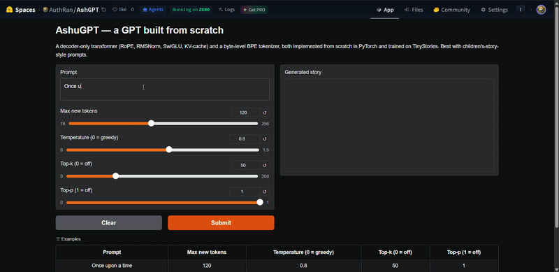
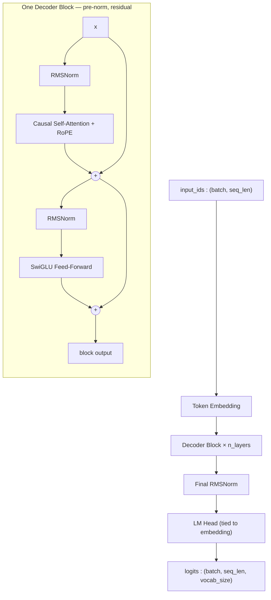
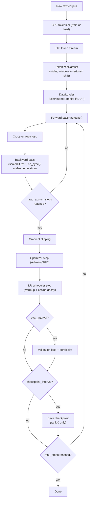
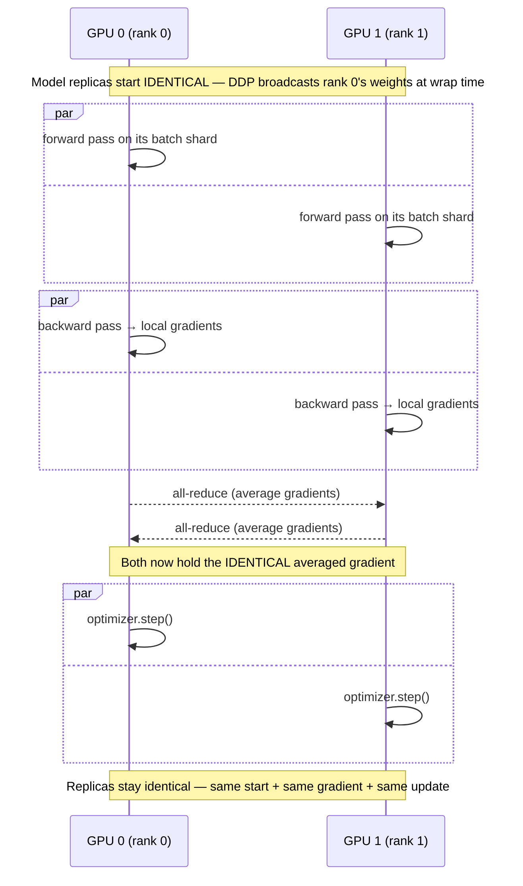

# AshuGPT

**An educational, from-scratch GPT-style decoder-only language model.**
Tokenizer, Transformer architecture (RoPE, RMSNorm, SwiGLU, causal
attention), training loop, distributed training, memory optimization,
autoregressive generation, and an inference API — implemented directly
against PyTorch tensor/autograd primitives, not assembled from
`transformers.AutoModel`. Built as a from-the-ground-up study of the
complete LLM stack, following the trajectory of Sebastian Raschka's
*Build a Large Language Model (From Scratch)*.

<!-- TRAINING-STATUS:START -->

## Live Training Status — `medium` (124M) on FineWeb-Edu

> This section is regenerated by `scripts/update_training_status.py` from the
> run's own artifacts (metrics CSV, checkpoint timestamps, supervisor log) and
> pushed on a schedule, so it reflects the run rather than a claim about it.

**Status:** ✅ **complete** — step **20,000 / 20,000** (100.0%)

```
████████████████████████████████████████  100.0%
```

| | |
|---|---|
| **Model** | `medium` — 123,587,328 parameters |
| **Corpus** | FineWeb-Edu, 5.0B tokens (4.9B train / 100M val) |
| **Training loss** | 3.1920 (learning rate 6.00e-05) |
| **Validation loss** | 3.1583 (perplexity 23.53) at step 20,000 |
| **Tokens seen** | 2.46B (122,880 per step) |
| **Throughput** | 4.91 s/step (25,002 tokens/s) |
| **Hardware** | 1x RTX 2080 Ti (11GB), fp16 + GradScaler |
| **Estimated remaining** | complete |
| **Last updated** | 2026-08-18 06:42 IST |

Full loss curve: [`logs/medium_metrics.csv`](logs/medium_metrics.csv) ·
Run log: [`logs/supervisor.log`](logs/supervisor.log)

<!-- TRAINING-STATUS:END -->

> **Read this before anything else below**: this project has trained real
> models, at real (small) scale, from random initialization. It has never
> trained a billion-parameter model, and it has never trained — or been
> able to load — any external checkpoint like GPT-2's. Every claim in
> this document distinguishes three things that are easy to blur together:
>
> | Claim | Means | True here for |
> |---|---|---|
> | **"I implemented this architecture"** | Code exists that can construct it; weights would be random | `tiny`, `small`, `medium`, `xl_1b` — all four presets |
> | **"I trained this checkpoint"** | Real gradient descent ran, on real data, producing a real checkpoint file | `tiny` and `small` on the small demo corpora in `tests/fixtures/`; `medium` (124M) **currently training** on 5B FineWeb-Edu tokens — see the live status above |
> | **"I loaded this pretrained checkpoint for inference"** | Someone else's trained weights, used without training or fine-tuning them here | **Not true of anything in this repo.** GPT-2's weights were compared against, never loaded successfully — see [§12](#12-pretrained-checkpoints-comparison-not-loading) — and never claimed as trained by this project |

See [§13](#13-provenance-trained--implemented--loaded) for the full,
itemized version of this table.

---

## Live Demo

<p align="center">
  <a href="https://huggingface.co/spaces/AuthRan/AshGPT">
    
  </a>
</p>

<p align="center">
  <b><a href="https://huggingface.co/spaces/AuthRan/AshGPT">▶ Try it live on Hugging Face Spaces</a></b>
</p>

Type a prompt and watch a `small` (~14M-parameter) model, trained from scratch
on TinyStories, complete a story token by token.

The demo runs the exact code in this repo: the from-scratch BPE tokenizer
([§5](#5-tokenization)) feeding the from-scratch transformer
([§3](#3-architecture-overview)), with KV-cached autoregressive decoding
([§10](#10-inference)). The served weights are the `small` preset at training
step 4000 (validation perplexity ≈ 11). The Gradio app and deployment notes
live in [`space/`](space/).

---

## Table of Contents

1. [Motivation](#1-motivation)
2. [What Was Implemented From Scratch](#2-what-was-implemented-from-scratch)
3. [Architecture Overview](#3-architecture-overview)
4. [Model Configuration Presets](#4-model-configuration-presets)
5. [Tokenization](#5-tokenization)
6. [Transformer Mathematics](#6-transformer-mathematics)
7. [Next-Token Prediction & Training Objective](#7-next-token-prediction--training-objective)
8. [Training Pipeline](#8-training-pipeline)
9. [Distributed Training (DDP)](#9-distributed-training-ddp)
10. [Inference](#10-inference)
11. [Scaling to Billion-Parameter Architectures](#11-scaling-to-billion-parameter-architectures)
12. [Pretrained Checkpoints: Comparison, Not Loading](#12-pretrained-checkpoints-comparison-not-loading)
13. [Provenance: Trained / Implemented / Loaded](#13-provenance-trained--implemented--loaded)
14. [Reproducibility & Commands](#14-reproducibility--commands)
15. [Project Structure](#15-project-structure)
16. [Testing](#16-testing)
17. [What's Not Built](#17-whats-not-built)

---

## 1. Motivation

Most practical LLM work today means calling `AutoModelForCausalLM.from_pretrained(...)`
— which is the right call for shipping a product, and the wrong one for
understanding what's actually happening inside a forward pass. AshuGPT
exists to answer, with working code and measured numbers rather than
received wisdom, questions like:

- What does RoPE actually rotate, and why does that make attention
  distance-aware without a learned parameter?
- Why does gradient checkpointing trade compute for memory, and how much
  of each, really, on real hardware?
- What does `DistributedDataParallel` actually synchronize, and when?
- Is mixed precision always a win? (Measured answer, §8.1: **no** — a
  17-44x *slowdown* was measured on CPU hardware without native bf16
  support, the opposite of the textbook claim.)
- Can you just load GPT-2's weights into a differently-designed decoder?
  (Measured answer, §12: **no**, and the reasons are specific, not vague.)

Every non-trivial claim in this document is either **measured** (a real
number from a real run, reproducible via the command shown next to it) or
explicitly marked as an **estimate** with its formula shown. Nothing here
is asserted from memory of how transformers "generally" behave.

## 2. What Was Implemented From Scratch

| Layer | From scratch | Library provides |
|---|---|---|
| Tokenizer (byte-level BPE) | Trainer, encoder/decoder, special tokens, batching | — (no `tiktoken`/`sentencepiece`) |
| Model math (attention, RoPE, RMSNorm, SwiGLU, causal mask) | All of it, in `ashugpt/model/` | PyTorch tensor ops (`matmul`, `softmax`, autograd) — not `torch.nn.MultiheadAttention`, not `transformers` |
| Training loop | Forward/backward/step orchestration, LR schedule, checkpointing | `torch.optim.AdamW`/`SGD` (not reimplemented), `torch.autograd` |
| Mixed precision | Wiring/configuration | `torch.autocast`, `torch.amp.GradScaler` |
| Distributed training | Setup/wrap/rank-zero logic, `no_sync()` gradient-accumulation handling | `torch.distributed`, `torch.nn.parallel.DistributedDataParallel` |
| Sampling (temperature/top-k/top-p) | All of it, in `ashugpt/inference/generate.py` | — |
| KV caching | All of it | — |
| Memory estimation | All of it, in `ashugpt/utils/memory.py` | — |
| Inference API | Routing, validation schemas, service layer | FastAPI/Pydantic/uvicorn (HTTP framework, not model logic) |
| GPT-2 comparison & conversion | All of it, in `ashugpt/inference/pretrained_loader.py` | — (no `transformers.GPT2LMHeadModel` import anywhere) |

The line is deliberate: PyTorch's tensor library, autograd engine, and
`nn.Module` base class are used as infrastructure (nobody hand-writes a
CUDA kernel or a reverse-mode autodiff engine for an educational project
like this), but every *architectural* and *algorithmic* decision — what
gets rotated, what gets normalized how, what gets synchronized when — is
implemented and tested directly in this codebase.

## 3. Architecture Overview



`x = x + Attention(RMSNorm(x))`, then `x = x + SwiGLU(RMSNorm(x))` —
repeated `n_layers` times. No positional-embedding table exists anywhere
in the graph above: position information enters *inside* attention, via
RoPE (§6.2), not as something added to the input.

```python
from ashugpt.config import load_model_config
from ashugpt.model import AshuGPT

config = load_model_config("configs/model/tiny.yaml")
model = AshuGPT(config)
print(model.num_parameters())  # exact count
```

## 4. Model Configuration Presets

| Preset | Layers | `d_model` | Heads | Vocab | Context | Parameters (exact) | Trained here? |
|---|---:|---:|---:|---:|---:|---:|---|
| `tiny` | 4 | 128 | 4 | 50,304 | 256 | 7,292,032 | ✅ Yes — fast-iteration / demo scale |
| `small` | 6 | 384 | 6 | 50,304 | 512 | 29,938,560 | ✅ Yes — the real "trained from scratch" target |
| `medium` | 12 | 768 | 12 | 50,304 | 1,024 | 123,587,328 | ❌ No — shape/forward-pass tested only |
| `xl_1b` | 22 | 2,048 | 32 | 50,304 | 2,048 | 1,233,479,680 | ❌ No — shape-tested only (see §11) |

Every row's parameter count is *exact*, not estimated: `AshuGPT.num_parameters()`
on a real constructed model is tested to match `ModelConfig.approx_param_count()`
(pure shape arithmetic, no model built) precisely, for every preset.
`vocab_size=50,304` is GPT-2's 50,257-token BPE vocabulary padded to the
nearest multiple of 64 (a standard nanoGPT-style convention for GPU tensor
alignment — harmless on CPU, free on GPU).

```python
from ashugpt.config import load_model_config
config = load_model_config("configs/model/small.yaml")
print(config.head_dim, config.approx_param_count())  # 64, 29938560
```

## 5. Tokenization

`ashugpt/tokenizer/bpe_scratch.py` — a byte-level BPE tokenizer built
without any tokenizer library, the same algorithm family GPT-2/GPT-3 use:

1. **Pre-tokenize** with a regex into chunks (words, punctuation runs,
   whitespace) so merges never glue two different words together.
2. **Bytes, not characters, are the base alphabet** — every chunk becomes
   raw UTF-8 bytes, and each of the 256 possible byte values starts as its
   own token. This means *any* Unicode text is representable from the
   start; there is no out-of-vocabulary character.
3. **Training** repeatedly merges the most frequent adjacent token pair
   across the corpus, `vocab_size - 260` times (260 = 4 special tokens +
   256 byte tokens, the minimum possible vocabulary).
4. **Encoding** replays the learned merges, in the order they were
   learned, on new text. **Decoding** concatenates each token's bytes and
   decodes as UTF-8 — lossless, verified by round-trip tests on tricky
   inputs (multi-space runs, mixed Unicode/emoji, tabs/newlines).

Special tokens `<pad>`, `<bos>`, `<eos>`, `<unk>` get fixed ids 0-3.
`<unk>` is reserved but **never actually produced** — byte-level encoding
has no out-of-vocabulary case, proven by a test that encodes text in a
script the tokenizer never saw during training and confirms `unk_id`
never appears in the output.

```
python scripts/train_tokenizer.py --input tests/fixtures/tiny_corpus.txt \
    --vocab-size 2000 --output tokenizer.json
```

```python
from ashugpt.tokenizer import BPETokenizer

tok = BPETokenizer.load("tokenizer.json")
ids = tok.encode("Mia and Rex explored the forest.", add_bos=True, add_eos=True)
tok.decode(ids)  # "Mia and Rex explored the forest."

batch = tok.encode_batch(["short text", "a longer piece of text"], max_length=32)
# batch["input_ids"], batch["attention_mask"] -- ready for a DataLoader,
# right-padded with pad_id, no custom collate_fn needed
```

## 6. Transformer Mathematics

### 6.1 Attention Mechanism

For each token, attention computes a weighted average of *every other
token's* value vector, where the weight comes from how well that token's
query matches each other token's key:

```
Attention(Q, K, V) = softmax( (Q Kᵀ) / √d_head + mask ) V
```

`Q`, `K`, `V` come from three separate, bias-free linear projections of
the same input (`ashugpt/model/attention.py`), split into `n_heads`
independent heads, rotated with RoPE (§6.2), combined via masked
scaled dot-product attention, then merged and projected once more. The
manual formula above is implemented explicitly (`q @ k.transpose(-2,-1)`,
`masked_fill`, `softmax`, `@ v`) as the default — not
`torch.nn.functional.scaled_dot_product_attention` — specifically so the
math stays visible and directly testable. An opt-in fused-kernel path
(`use_efficient_attention=True`) exists too, verified to produce
numerically identical output (§8.3's efficient-attention entry).

### 6.2 RoPE (Rotary Positional Embeddings)

No positional-embedding table exists in this model. Instead, each
query/key vector is **rotated** by an angle proportional to its position,
inside every attention layer:

```
for each dimension pair (i, i + head_dim/2):
    θ_i = position × theta^(-2i / head_dim)
    [x_i', x_{i+d/2}'] = [[cos θ_i, -sin θ_i], [sin θ_i, cos θ_i]] · [x_i, x_{i+d/2}]
```

The key property: `dot(rotate(q, m), rotate(k, n))` depends only on the
*relative* offset `m - n`, not on the absolute positions — proven directly
by a test comparing the same relative offset at two different absolute
position pairs (`(5,2)` and `(40,37)`, both offset 3) and confirming the
dot product matches. Rotation also **preserves vector norm** (it's an
orthogonal transform) — also tested directly.

### 6.3 RMSNorm

```
RMSNorm(x) = (x / sqrt(mean(x², dim=-1) + eps)) × weight
```

Rescales each token's activation vector to unit root-mean-square, then
applies a learned per-dimension scale — unlike LayerNorm, **no
mean-centering and no bias term**. Cheaper, and what LLaMA-family models
use instead of LayerNorm. Computed internally in `float32` regardless of
the input's dtype (squaring activations under bf16/fp16 can lose
precision) — a numerical-stability detail that matters once mixed
precision (§8.1) is in the picture.

### 6.4 SwiGLU

```
SwiGLU(x) = (SiLU(x·W_gate) ⊙ (x·W_up)) · W_down
```

A *gated* feed-forward network: the `gate` branch (via `SiLU(z) =
z·sigmoid(z)`) controls how much of the `up` branch passes through,
elementwise, before the down-projection. Three weight matrices instead of
a plain FFN's two — `d_ff` is sized at roughly `2/3 × 4 × d_model`
(the LLaMA convention) to keep the parameter/FLOP budget comparable to a
non-gated 4×-`d_model` FFN despite the extra matrix.

### 6.5 Causal Masking

```python
def causal_mask(seq_len_q, seq_len_k, offset, device):
    q_positions = arange(seq_len_q) + offset   # absolute position of each query
    k_positions = arange(seq_len_k)            # absolute position of each key
    return k_positions > q_positions            # True = blocked
```

Query position `i` (absolute position `offset + i`, where `offset`
accounts for any already-cached tokens) may attend to key position `j`
iff `j <= offset + i`. With `offset=0` and equal query/key lengths this is
the standard upper-triangular mask; with a nonzero offset (a new token
attending back through a KV cache, §10.1) it correctly allows attending to
every cached position plus itself. **Verified empirically, not just by
inspecting the mask matrix**: changing a *later* token's input content and
confirming every *earlier* token's output is bit-for-bit unchanged — the
only way that's possible is if the earlier positions truly never saw the
later one.

## 7. Next-Token Prediction & Training Objective

Given `"The cat sat down"`, a decoder-only LM is trained so that, at every
position, the prediction from everything up to and including that
position matches whatever token actually came next:

```
input_ids: The  cat  sat        (3 tokens, positions 0, 1, 2)
labels:    cat  sat  down       (3 tokens, positions 0, 1, 2)
```

`labels` is **not** a re-encoding of the same text — it is `input_ids`
shifted one position into the future. Because causal attention already
guarantees `logits[:, t, :]` only saw `input_ids[:, :t+1]` (§6.5),
comparing `logits[:, t, :]` against `labels[:, t]` directly — **with no
further shifting inside the model** — is exactly the next-token
objective. The shift happens once, upstream, when the data pipeline
slices a token stream into overlapping windows:
`input_ids = tokens[i:i+L]`, `labels = tokens[i+1:i+L+1]`
(`ashugpt/data/dataset.py`'s `TokenizedDataset`) — the same convention
nanoGPT uses, deliberately different from Hugging Face's "pass identical
sequences, shift internally" convention.

```python
labels = torch.tensor([[264, 266, 270]])  # already the shifted targets
out = model(input_ids, labels=labels)
out.loss                                   # scalar cross-entropy
out.loss.backward()
```

Padding positions in `labels` should be set to `-100`, which
`F.cross_entropy` ignores by default — no extra masking logic needed.

## 8. Training Pipeline



The training loop (`ashugpt/training/trainer.py`), one iteration, with
every required step visible in the actual code shape:

```python
lr = get_lr(step, config)                                # scheduler step
for group in optimizer.param_groups: group["lr"] = lr

optimizer.zero_grad(set_to_none=True)                     # gradient reset

for _ in range(config.grad_accum_steps):
    with autocast_context(device.type, amp_dtype):         # mixed precision
        output = model(input_ids, labels=labels)           # forward pass
        loss = output.loss / config.grad_accum_steps       # loss calculation
    scaler.scale(loss).backward()                           # backward pass, gradient-scaled if fp16

scaler.unscale_(optimizer)
torch.nn.utils.clip_grad_norm_(model.parameters(), config.grad_clip)  # gradient clipping

scaler.step(optimizer)                                     # optimizer step
scaler.update()
```

`scaler` (`build_grad_scaler`) always exists but is only *enabled* for
`amp_dtype="float16"` — bf16 needs no loss scaling (same exponent range as
fp32), so under bf16 or no AMP, every `scaler.*` call above is a
verified-transparent no-op and the code runs unchanged either way.

**Checkpointing** (`save_checkpoint`/`load_checkpoint`) persists model
weights, optimizer state, and step count via `torch.save`/
`torch.load(weights_only=True)` — not literal safetensors, deliberately: a
*resumable* checkpoint bundles heterogeneous state (tensors + step
counters + optimizer momentum buffers) that a pure-tensor format doesn't
cleanly support, while `weights_only=True` still restricts unpickling to
plain tensors/dicts/numbers, preserving the "no arbitrary code execution"
intent safetensors is about.

**Proof it learns**: `tests/integration/test_train_step.py` trains a tiny
model on a deliberately repetitive synthetic corpus for 150 steps and
asserts the loss drops by more than 75% — in practice, ~5.5 (near
`ln(vocab_size)`, i.e. random guessing) down to well under 0.1.

### 8.1 Mixed Precision

`torch.autocast` runs most ops in bf16/fp16 while keeping numerically
sensitive ones (like softmax accumulation) in fp32 internally
(`ashugpt/training/amp.py`). **Measured, not assumed**: on this project's
CPU-only dev hardware (no native bf16 instructions), bf16 autocast was
**17-44x slower** than fp32, not faster (isolated timing: 134.5s vs. 3.0s
for one forward+backward at scale) — the sharpest lesson in this whole
project: mixed precision's benefit is *hardware-dependent*. Peak memory
did drop 21.3% (bf16 tensors genuinely are smaller), just at a steep time
cost on hardware without the compute support to back it up.

That paragraph used to end by predicting that "on a GPU with tensor cores
… both memory *and* speed would improve." **A GPU arrived (2× RTX 2080 Ti,
2026-08-16) and that prediction was half wrong**, which is worth more than
if it had been right. Measured on the new hardware, 4096×4096 matmul:

| dtype | TFLOP/s | vs fp32 |
|---|---:|---:|
| fp16 | **57.3** | 4.5× |
| fp32 | 12.6 | — |
| TF32 | 13.0 | ~none — Turing has no TF32 |
| **bf16** | **7.7** | **0.6× — slower than fp32** |

The tensor cores are real and fp16 does deliver 4.5×. But these cards are
Turing (sm_75), which has **no native bf16**: bf16 is emulated, 7.4×
slower than fp16 and slower even than plain fp32. So the CPU finding
("bf16 is slow without hardware support") did not go away on a GPU with
tensor cores — it followed the *specific dtype's* hardware support, which
is the sharper version of the lesson.

The trap is that nothing warns you. `torch.cuda.is_bf16_supported()`
returns `True` on these cards, because recent PyTorch counts emulation as
support. Every training preset in this repo defaulted to
`amp_dtype: bfloat16` — correct on CPU and on Ampere+, and silently
several times slower here while looking like an enabled optimization.
`ashugpt/training/amp.py` now checks compute capability directly (native
bf16 starts at 8.0) and warns rather than trusting that flag. The
GPU-ready presets use `amp_dtype: float16` with the `GradScaler` the AMP
module already builds.

Check your actual hardware, not the general claim — and not the
framework's answer to "is this supported?" either.

### 8.2 Gradient Accumulation

Splits a target *effective* batch into `grad_accum_steps` smaller
micro-batches, summing their (pre-divided) losses' gradients before one
optimizer step. **Measured**: `batch_size=1, grad_accum_steps=8` (same
effective batch as `batch_size=8, grad_accum_steps=1`) cut peak RSS by
**47.2%** (757.0MB → 399.9MB) at essentially the same per-step time
(3.44s → 3.64s) — because both scenarios do identical total compute, just
shaped differently in memory.

### 8.3 Gradient Checkpointing

Discards intermediate activations after each block's forward pass and
*recomputes* them during backward instead of storing them
(`torch.utils.checkpoint.checkpoint(block, ..., use_reentrant=False)`,
DDP-safe). Only engaged when there's a backward pass to save memory for
(`self.training`) and no KV cache to reconcile (`kv_caches is None`) —
generation never needs it. **Measured**: **-38.3% peak RSS** (757.0MB →
467.1MB) for a modest +19% per-step time cost (3.44s → 4.11s) — the
single biggest individual-lever memory win measured. Verified *exact*
(not approximate) equivalence first: logits, loss, and every parameter's
gradient match the non-checkpointed run within float32 tolerance.

**Full memory-optimization comparison** (`scripts/benchmark_memory.py`,
peak RSS via `psutil`, each scenario in its own fresh subprocess — 5.4M-param
benchmark model, seq_len=256, CPU):

| scenario | peak RSS (MB) | vs. baseline | s/step |
|---|---:|---:|---:|
| baseline | 757.0 | — | 3.44 |
| gradient_checkpointing | 467.1 | **-38.3%** | 4.11 |
| mixed_precision (bf16) | 595.7 | -21.3% | **59.62** |
| grad_accum_x8 (same effective batch) | 399.9 | **-47.2%** | 3.64 |
| efficient_attention | 624.7 | -17.5% | 3.56 |
| sgd_optimizer | 756.4 | -0.1%* | 3.37 |
| all_combined | 371.5 | **-50.9%** | 66.68 |

\* Optimizer choice (AdamW's 2 state buffers/param vs. SGD's 1 — proven
*exactly* 2x vs. 1x by direct tensor-element counting after a real
optimizer step) gets swamped here because this model's ~41MB of AdamW
state is tiny next to seq_len=256 activation memory. It matters more when
parameter count is large *relative to* activation size — bigger models,
shorter sequences — not the regime this benchmark highlights.

Every optimization above is proven correct (matches the unoptimized path
exactly, or its exact predicted memory multiplier) before any memory
number is trusted — configurable via `TrainConfig`:

```yaml
gradient_checkpointing: true
amp_dtype: bfloat16
grad_accum_steps: 8
use_efficient_attention: true
optimizer: sgd    # or "adamw" (default)
```

```
python scripts/benchmark_memory.py
```

## 9. Distributed Training (DDP)



The all-reduce is triggered automatically by autograd hooks the instant
`loss.backward()` finishes on every rank — no explicit "sync gradients"
call anywhere in `trainer.py`. The one place this needs explicit handling
is **gradient accumulation**: DDP synchronizes on every `.backward()` by
default, which is correct but wasteful mid-accumulation-window. Every
micro-step except the last is wrapped in `model.no_sync()`, so the
all-reduce fires exactly once per optimizer step regardless of
`grad_accum_steps`.

Same command, becomes distributed just by how it's launched:

```
# Single process:
python scripts/train.py --model configs/model/tiny.yaml --train configs/train/tiny_cpu.yaml \
    --tokenizer tokenizer.json --input corpus.txt --checkpoint-dir checkpoints/run1

# 2 processes, one machine:
torchrun --nproc_per_node=2 scripts/train.py --model configs/model/tiny.yaml \
    --train configs/train/tiny_cpu.yaml --tokenizer tokenizer.json --input corpus.txt \
    --checkpoint-dir checkpoints/run1

# 2 nodes x 4 GPUs:
torchrun --nnodes=2 --nproc_per_node=4 --rdzv_id=100 --rdzv_backend=c10d \
    --rdzv_endpoint=<master-node-ip>:29500 scripts/train.py --model ... --train ...
```

`torchrun` sets `RANK`/`LOCAL_RANK`/`WORLD_SIZE`/`MASTER_ADDR`/`MASTER_PORT`;
`setup_distributed()` reads those. Not launched via `torchrun`?
`WORLD_SIZE` is unset, a `world_size=1` `DistributedInfo` comes back
without touching `torch.distributed` at all, and every
`if info.is_distributed:` branch is simply skipped — single-GPU and
multi-GPU are the same code path, not two implementations.

| Requirement | Where |
|---|---|
| Process initialization | `dist.init_process_group(backend=...)` — gloo (CPU) or nccl (GPU) |
| Rank/world-size handling | `RANK`/`WORLD_SIZE`/`LOCAL_RANK` env vars → `DistributedInfo` |
| DDP wrapping | `wrap_model_for_ddp()` |
| DistributedSampler | `shuffle=True`, `set_epoch()` every epoch boundary (an easy-to-forget correctness detail) |
| Device assignment | `nccl` → `cuda:{local_rank}`; `gloo` → `cpu` |
| Synchronization | Automatic on `.backward()`; deferred (not skipped) via `no_sync()` during accumulation |
| Rank-zero-only logging/checkpointing | Gated on `info.is_main_process`; checkpoints always save `unwrap_model(model)` — DDP's own `state_dict()` prefixes every key with `"module."`, which would silently break loading into a plain model later if not unwrapped |
| Process group cleanup | `cleanup_distributed()` in a `finally` block — fires even if training raises |

**Verified with a real 2-process test** (`tests/integration/test_ddp.py`,
gloo backend, two independent OS processes): both ranks converge to
**bit-identical weights** despite training on *disjoint* data shards
(only possible if gradients were genuinely synchronized), and that result
**exactly matches** a single-process mathematical baseline
(`mean(mean_A, mean_B) == mean(A ∪ B)` for equal shard sizes — algebra,
not approximation). Also manually verified end-to-end through the real
CLI: 150-step 2-process run converged correctly (loss ~5.5 → ~0.08,
matching single-process), exactly one checkpoint saved by rank 0. Took
~140s vs. ~10s single-process — expected: gloo/CPU all-reduce overhead
dominates at this tiny scale; DDP pays off when per-step compute is large
relative to fixed communication cost (bigger models/batches, or NCCL/GPU).

Not implementing FSDP or model parallelism.

## 10. Inference

### 10.1 KV Caching

Without caching, generating token *t* re-runs attention over all *t*
earlier tokens *again* — wasted work, since their keys/values never
change once computed. A KV cache remembers them instead:

```python
# First call: the whole prompt at once
output = model(input_ids, kv_caches=None, position_offset=0)
# output.kv_caches[i]: (B, H, P, D) per layer -- K/V for every prompt position

# Every call after: just the ONE new token
output = model(next_token, kv_caches=kv_caches, position_offset=cache_len)
# inside attention: k = cat(cached_k, new_k) -> (B, H, cache_len+1, D)
# the one new query attends over every cached position plus itself
# output.kv_caches[i] grew by 1
```

`position_offset` must equal the absolute position of the input's first
token, so RoPE (§6.2) rotates it correctly. **Verified two ways**: greedy
decoding (no randomness) gives byte-identical tokens whether
`use_cache=True` or `False`; comparing raw logits between one full forward
pass and the equivalent incremental-cached calls shows ~1e-7 max absolute
difference (ordinary float32 op-order noise, not a correctness gap). Real
speedup measured: **1.5-1.7x by 150 generated tokens** at `tiny` scale,
growing with length — exactly the O(n) redundant recomputation removed.

### 10.2 Sampling Methods

```python
for _ in range(max_new_tokens):
    logits = model(generated).logits[:, -1, :]         # 1. run model, 2. final-token logits
    next_tokens = sample_next_token(logits, ...)         # 3. logits -> probabilities -> 4. pick a token
    generated = torch.cat([generated, next_tokens], 1)    # 5. append
    if eos hit for every row: break                        # 6. stop at max length or EOS
```

**logits → temperature → softmax → top-k → top-p**, in the order applied:

- **Logits**: raw, unnormalized scores from `lm_head` — can be negative,
  don't sum to 1.
- **Temperature** divides logits by `T` before softmax. `T<1` sharpens the
  distribution (more repetitive/confident); `T>1` flattens it (more
  diverse). `T=0` is undefined by this formula (division by zero), so
  it's special-cased as pure greedy argmax instead.
- **Softmax**: `exp(logit_i)/Σexp(logit_j)` — a real distribution;
  monotonic, so it preserves ranking while temperature controls peakedness.
- **Top-k**: hard cutoff — keep exactly the `k` highest logits.
- **Top-p (nucleus)**: adaptive cutoff — keep the smallest set of tokens
  whose probabilities sum to ≥`p`, so a confident position keeps few
  candidates and an uncertain one keeps many. Combinable with top-k
  (top-k narrows first, top-p trims further).

Both filters always leave ≥1 token unmasked (top-k by construction;
top-p always keeps the single most-likely token even below threshold), so
softmax can never collapse a row to all `-inf` → NaN. Batched generation
with per-row EOS handling: a finished row is pinned to keep "generating"
`eos_id` (via `torch.where` on a `finished` mask) so the output tensor
stays rectangular without corrupting other rows; `tokenizer.decode()`
strips every special token regardless of position, so no separate
trimming is needed.

```
python -m ashugpt.generate --checkpoint checkpoints/demo/step_150.pt \
    --tokenizer tokenizer.json --prompt "Once upon a time" \
    --max-new-tokens 50 --temperature 0.8 --top-k 50 --top-p 0.9

python -m ashugpt.generate --checkpoint ... --tokenizer ... --prompt "..." --temperature 0.0   # greedy
```

### 10.3 Inference API (FastAPI)

```
python scripts/serve.py --checkpoint checkpoints/demo/step_150.pt --tokenizer tokenizer.json
curl -X POST http://127.0.0.1:8000/generate -H "Content-Type: application/json" \
    -d '{"prompt": "Once upon a time", "max_new_tokens": 50, "temperature": 0.8, "top_k": 50, "top_p": 0.9}'
```

```json
{"generated_text": "Once upon a time...", "tokens_generated": 50, "generation_time": 0.31, "tokens_per_second": 161.3}
```

Real measured output (891K-param demo checkpoint, CPU): single request
20 tokens greedy → `generation_time=0.134s`, `tokens_per_second=149.4`;
5 sequential requests via `scripts/benchmark_server.py` → `mean=167.3 tok/s`.

```
ashugpt/api/
├── schemas.py   -- Pydantic request/response models (pure data contracts)
├── service.py   -- InferenceService: the ONLY file touching ashugpt.model/tokenizer/inference
└── app.py       -- FastAPI routes, HTTP status codes, startup config
```

A `lifespan` handler reads `ASHUGPT_CHECKPOINT`/`ASHUGPT_TOKENIZER` env
vars **once** at process startup and builds one `InferenceService`, stored
on `app.state` — every request afterward reuses it (proven directly: a
test wraps `InferenceService.load` in a call counter and asserts it fires
exactly once across multiple requests). `/generate`'s handler is a plain
`def`, not `async def` — CPU-bound torch inference is blocking work, and
Starlette dispatches sync handlers to a worker thread pool automatically,
keeping the event loop (and `/health`) free; an `async def` doing the same
blocking math would freeze the whole server instead.

**Layered validation/errors**: Pydantic (`422`, structurally invalid
request — empty prompt, negative `max_new_tokens`) → the model's own
runtime checks (`400`, e.g. `prompt_len + max_new_tokens` exceeding
`context_length`, which Pydantic can't know without asking the loaded
model) → catch-all (`500`, never a raw traceback to the client).

| | Training | Inference (this server) |
|---|---|---|
| Gradients | Computed and applied every step | Never — `model.eval()` + `no_grad()` throughout |
| Input | Batches of `(input_ids, labels)` windows | One prompt at a time, no labels, no loss |
| Optimizer/scheduler | Actively stepping | Not constructed at all |
| Memory | Weights + gradients + optimizer state + activations | Weights + a small KV cache only |
| Output | A scalar loss | Sampled token ids, decoded to text |

Every `/generate` call uses `use_cache=True` (§10.1) — the direct reason
`tokens_per_second` stays roughly flat across `max_new_tokens` instead of
degrading; without caching, each additional token costs strictly more
than the last.

## 11. Scaling to Billion-Parameter Architectures

**This project has never trained anything at `medium` or `xl_1b` scale.**
What it *can* do, instantly and without building anything, is report
exactly how big a config is and roughly what training it would cost:

```
python -m ashugpt.inspect_model --config 1b
python -m ashugpt.inspect_model --all
```

```
=== xl_1b ===  [ARCHITECTURE CONFIGURATION -- not a trained model]
Layers:                       22
Hidden dimension:             2048
Attention heads:              32
Vocabulary size:              50,304
Context length:               2048
Parameter count:             1,233,479,680
Weight memory (FP32):        4.934 GB
Weight memory (BF16):        2.467 GB
Gradient memory (FP32):      4.934 GB
Optimizer memory:            9.868 GB
Activation memory (est.):    7.151 GB
Estimated total (training):  26.887 GB
```

`~16 bytes/param` for weights+gradients+AdamW state (1.23B × 16B ≈
19.7GB) plus ~7GB estimated activation memory ≈ 26.7GB — matches the
standard rule of thumb for full-precision Adam training, computed from
this project's own shape formula, not quoted. Weights/gradients/optimizer
state are estimated at **FP32** regardless of `amp_dtype` — because
that's what this project's training loop actually does; `autocast` only
wraps the forward pass, parameters are never permanently downcast (exactly
the finding in §8.1's bf16 measurement). Activations are estimated at
**BF16** by default, dominated by each layer's `O(seq_len²)` attention
score matrix. **Calibration**: sanity-checked against §8.3's real measured
RSS — the estimator came in at roughly a third of the real number, the gap
traced to ~190MB of fixed Python/PyTorch process overhead that doesn't
scale with model size (so accuracy *improves*, not worsens, at GB scale).

Every preset reports in under a second — `estimate_memory()` only calls
`ModelConfig.approx_param_count()` (pure arithmetic); nothing here
constructs an `nn.Module`.

## 12. Pretrained Checkpoints: Comparison, Not Loading

**AshuGPT cannot load GPT-2's public pretrained weights and produce a
working model.** Not "hasn't been tried" — determined, tested, and
demonstrated against GPT-2's real published checkpoint metadata (fetched
live from Hugging Face: `config.json` in full, the safetensors header via
an HTTP range request — no full ~548MB weight download needed, since
architecture compatibility is decided by tensor names/shapes, not values):

```
python scripts/demo_pretrained_loading.py
```

| Aspect | GPT-2 | AshuGPT |
|---|---|---|
| Positional encoding | Learned absolute table (`wpe`), added once | RoPE, applied every layer, parameter-free |
| Normalization | LayerNorm (mean-centered, bias) | RMSNorm (no centering, no bias) |
| Feed-forward | Plain 2-matrix GELU MLP, with bias | Gated 3-matrix SwiGLU, no bias |
| Attention QKV | One combined `c_attn`, `Conv1D` (transposed) layout, with bias | Separate `q/k/v_proj`, `nn.Linear` layout, no bias |
| Vocabulary | 50,257, GPT-2's own BPE merges | Independently-trained BPE, even at matching `vocab_size` |

**Two independent, fundamental incompatibilities** (not fixable by any
renaming/reshaping):

1. **Positional encoding.** GPT-2's attention weights were trained
   assuming position arrives as an additive embedding *before* the first
   layer. AshuGPT's attention unconditionally *rotates* Q/K via RoPE
   inside every layer — a computation GPT-2's weights never saw, and
   AshuGPT has no flag to disable. Different algorithm, not a rename.
2. **Feed-forward gating.** AshuGPT's `gate_proj` has no counterpart in
   GPT-2's plain MLP *at all* — it would be left at random initialization,
   making the result a random-plus-GPT-2 hybrid.

**Concrete proof this isn't a rounding error**: building AshuGPT at
GPT-2's exact shape gives **151,862,784 parameters**, not GPT-2's actual
~124M — the ~28M gap is `gate_proj`, a matrix that structurally does not
exist in GPT-2.

What genuinely *is* solvable — implemented, tested, numerically verified —
is splitting `c_attn` into Q/K/V, undoing `Conv1D`'s transpose, and mapping
embeddings/norms:

```python
from ashugpt.inference.pretrained_loader import load_gpt2_checkpoint, IncompatibleArchitectureError

try:
    model, report = load_gpt2_checkpoint(gpt2_state_dict)   # strict=True by default
except IncompatibleArchitectureError as e:
    print(e)   # explains exactly why, lists every missing/unexpected key
```

Real result against the live-fetched checkpoint metadata: **75 tensors**
mapped (embeddings, norms, attention Q/K/V/O across 12 layers), **36
missing** (every `gate_proj`/`up_proj`/`down_proj`), **110 unexpected**
(`wpe.weight`, every bias, every GELU-MLP weight, the static causal-mask
buffer GPT-2 stores as `h.{i}.attn.bias`). `load_gpt2_checkpoint(strict=True)`
— the default — **raises `IncompatibleArchitectureError`** rather than
returning a model that looks loaded but silently produces wrong output.

## 13. Provenance: Trained / Implemented / Loaded

The full version of the table at the top of this document:

1. **"I implemented this architecture."** True of everything in
   `ashugpt/model/`. Building any preset (`tiny` through `xl_1b`) produces
   a real `nn.Module` with randomly-initialized weights — nothing has
   learned anything yet.
2. **"I trained this checkpoint."** True only of checkpoints actually
   produced by `ashugpt/training/trainer.py` — real gradient descent, real
   data, a real file in the gitignored `checkpoints/` directory. True at
   `tiny`/`small` scale on the small demo corpora in `tests/fixtures/`, and
   — as of this branch — at `medium` (124M) scale on 5B FineWeb-Edu tokens,
   a run still in progress on a single RTX 2080 Ti. That run is what §11's
   measured constraints were working toward; the live status block at the
   top of this document is generated from its own metrics, not asserted by
   hand. Still **never true of GPT-2's weights**, and still not true at
   `xl_1b` scale.
3. **"I loaded this publicly available pretrained checkpoint for
   inference."** Would be true if a checkpoint's *own* architecture were
   reimplemented and its weights genuinely loaded for inference-only use
   (a `pretrained/` directory, kept separate from self-trained
   `checkpoints/`). **Not true of anything in this repo** — §12 showed
   that scope needs GPT-2's *own* architecture reimplemented alongside
   AshuGPT's, not a conversion into AshuGPT's, since conversion is
   provably impossible. `ashugpt/model/` and
   `ashugpt/inference/pretrained_loader.py` stay in separate modules on
   purpose: the custom implementation never imports or depends on any
   external model implementation, and nothing here imports
   `transformers.GPT2LMHeadModel` or any other library's model class —
   only raw `config.json`/safetensors-header metadata, fetched by hand.

## 14. Reproducibility & Commands

**Setup**

```
python -m venv .venv
.venv\Scripts\activate            # Windows; `source .venv/bin/activate` on Linux/Mac
pip install -e .                  # torch, pyyaml, fastapi, uvicorn
pip install -r requirements.txt   # + pytest, psutil, httpx (dev/test only)
```

**Seeding**: `TrainConfig.seed` is passed to `torch.manual_seed()` before
model construction and before the training loop starts; `DistributedSampler`
uses its own explicit `seed` parameter so every rank agrees on the same
shuffle before partitioning it. This gives same-seed/same-hardware runs
consistent behavior — bit-for-bit reproducibility across *different*
hardware/thread-counts/PyTorch versions isn't claimed (floating-point
summation order isn't guaranteed identical across those), and
checkpoint-resume reproduces the *loss trajectory*, not an exact RNG
replay of the interrupted run (a deliberate simplification — see
`ashugpt/training/checkpoint.py`).

**Train a tokenizer**

```
python scripts/train_tokenizer.py --input <corpus.txt> --vocab-size 2000 --output tokenizer.json
```

**Train a model**

```
python scripts/train.py --model configs/model/small.yaml --train configs/train/tiny_cpu.yaml \
    --tokenizer tokenizer.json --input <corpus.txt> --checkpoint-dir checkpoints/run1

# Distributed (see §9):
torchrun --nproc_per_node=2 scripts/train.py --model ... --train ... --tokenizer ... --input ... \
    --checkpoint-dir checkpoints/run1

# Resume:
python scripts/train.py --model ... --train ... --tokenizer ... --input ... \
    --checkpoint-dir checkpoints/run1 --resume-from checkpoints/run1/step_100.pt
```

Quick pipeline sanity-check (seconds, not minutes) against the bundled
tiny synthetic corpus:

```
python scripts/train_tokenizer.py --input tests/fixtures/synthetic_corpus.txt --vocab-size 300 --output tokenizer.json
python scripts/train.py --model configs/model/tiny.yaml --train configs/train/synthetic_demo.yaml \
    --tokenizer tokenizer.json --input tests/fixtures/synthetic_corpus.txt --checkpoint-dir checkpoints/demo
```

**Evaluate**

```
python scripts/evaluate.py --checkpoint checkpoints/demo/step_150.pt --tokenizer tokenizer.json \
    --input <corpus.txt> --seq-len 64
```

**Generate**

```
python -m ashugpt.generate --checkpoint checkpoints/demo/step_150.pt --tokenizer tokenizer.json \
    --prompt "Once upon a time" --max-new-tokens 50 --temperature 0.8 --top-k 50 --top-p 0.9
```

**Serve**

```
python scripts/serve.py --checkpoint checkpoints/demo/step_150.pt --tokenizer tokenizer.json --port 8000
python scripts/benchmark_server.py --url http://127.0.0.1:8000 --requests 10 --max-new-tokens 50
```

**Inspect a config / estimate memory**

```
python -m ashugpt.inspect_model --config 1b
```

**Compare against GPT-2 / memory benchmark**

```
python scripts/demo_pretrained_loading.py
python scripts/benchmark_memory.py
```

## 15. Project Structure

```
authLLM/
├── SPEC.md                    # full design spec + honest milestone-by-milestone log
├── README.md                  # this file
├── pyproject.toml             # package metadata (torch, pyyaml, fastapi, uvicorn)
├── requirements.txt           # + pytest, psutil, httpx (dev/test only)
├── configs/
│   ├── model/                 # tiny / small / medium / xl_1b presets (§4)
│   └── train/                 # tiny_cpu.yaml (real corpus), synthetic_demo.yaml (fast sanity check)
├── scripts/                   # CLI entry points (train_tokenizer, train, evaluate, serve, benchmark_*, demo_pretrained_loading)
├── ashugpt/                   # the installable package
│   ├── generate.py             # CLI: python -m ashugpt.generate
│   ├── inspect_model.py        # CLI: python -m ashugpt.inspect_model
│   ├── config.py                # ModelConfig + TrainConfig
│   ├── api/                     # FastAPI server (§10.3) — separate from model code
│   ├── model/                   # architecture: norm, rope, attention, feedforward, block, gpt (§6)
│   ├── tokenizer/                # from-scratch BPE (§5)
│   ├── data/                     # tokenized-dataset loading/chunking (§7)
│   ├── training/                 # optim, amp, checkpoint, ddp, trainer (§8-9)
│   ├── eval/                     # perplexity (§8)
│   ├── inference/                # generate.py (§10), pretrained_loader.py (§12)
│   └── utils/                    # memory.py, the memory estimator (§11)
└── tests/
    ├── fixtures/                 # tiny_corpus.txt, synthetic_corpus.txt
    ├── unit/                     # one file per component
    └── integration/              # test_train_step.py, test_ddp.py — slower, real end-to-end proofs
```

## 16. Testing

```
pytest                    # everything (210 tests)
pytest tests/unit          # fast, run constantly
pytest tests/integration   # slower — real training run + real 2-process DDP run
```

Every architectural component (RMSNorm, RoPE, attention, SwiGLU, causal
masking, KV cache) is tested against a *known property*, not just "it
runs": exact numerical equivalence with a hand-computed reference,
provable invariants (rotation preserves norm, causal masking provably
blocks future tokens), or exact expected memory multipliers. Every memory
or speed claim in this document has a `scripts/benchmark_*.py` or test
behind the specific number quoted.

## 17. What's Not Built

See [SPEC.md](SPEC.md) for the full milestone-by-milestone log, including
honest notes on where an original plan changed after something was
actually measured.

Still not built: **FSDP/model parallelism** (and so `xl_1b` remains a
shape-verified config — 1.23B parameters need ~20GB for
weights+gradients+AdamW state against 22.6GB across two 11.3GB cards with
no NVLink, which is not a real training run), and a **browser frontend**
for the inference API.

Built on 2026-08-16, when GPUs replaced the CPU-only constraint:

- **On-disk streaming data pipeline** — `scripts/prepare_data.py` streams a
  corpus, tokenizes it across processes, and writes uint16 shards;
  `ShardedTokenDataset` memory-maps them. uint16 is what makes it fit: a
  50259-entry vocabulary costs 2 bytes/token instead of int64's 8, so 5B
  tokens is 10GB on disk rather than 40GB, and resident memory stays flat
  regardless of corpus size.
- **Production tokenizer** — `TiktokenBPETokenizer`, the last unbuilt piece
  of SPEC's "hybrid tokenizer" plan. The from-scratch BPE remains the
  tested pedagogical path; it just cannot train a 50k-merge vocab over a
  multi-GB corpus in reasonable time.
- **Grouped-query attention** — `n_kv_heads < n_heads` now works instead of
  raising `NotImplementedError`. The KV *cache* stores the unexpanded
  heads, which is the saving GQA exists for: cache memory scales with
  `n_kv_heads`, so halving K/V heads halves what a long generation holds.
- **Window striding** — datasets took every starting position, so
  consecutive training examples shared `seq_len - 1` of `seq_len` tokens
  and one "epoch" revisited the same text `seq_len` times. Sharded
  datasets now default to disjoint windows.
