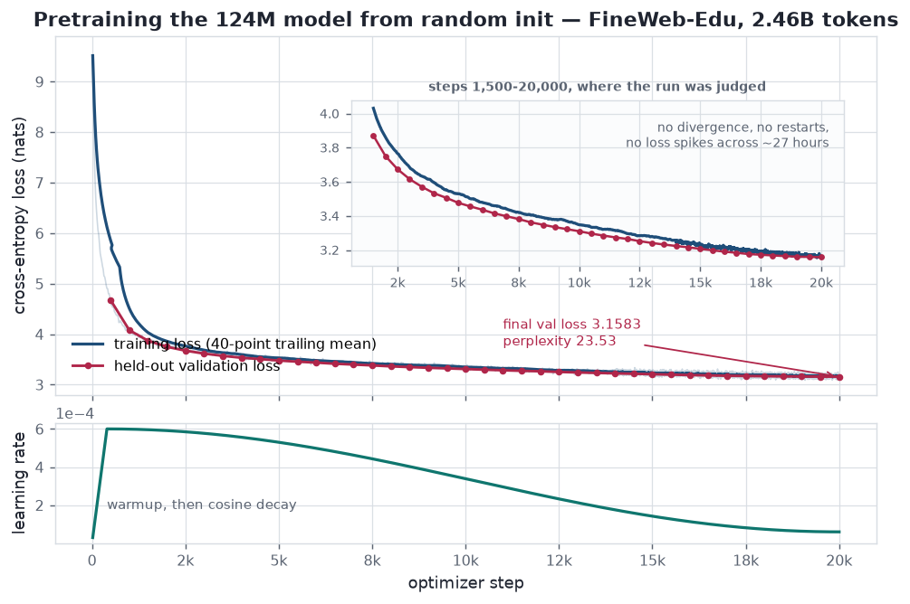
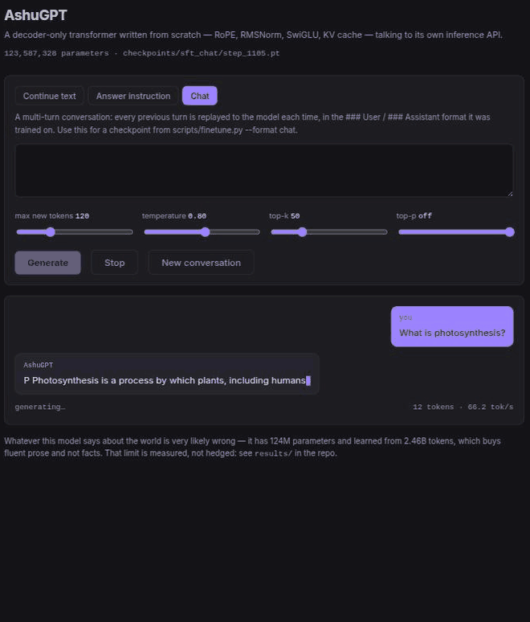
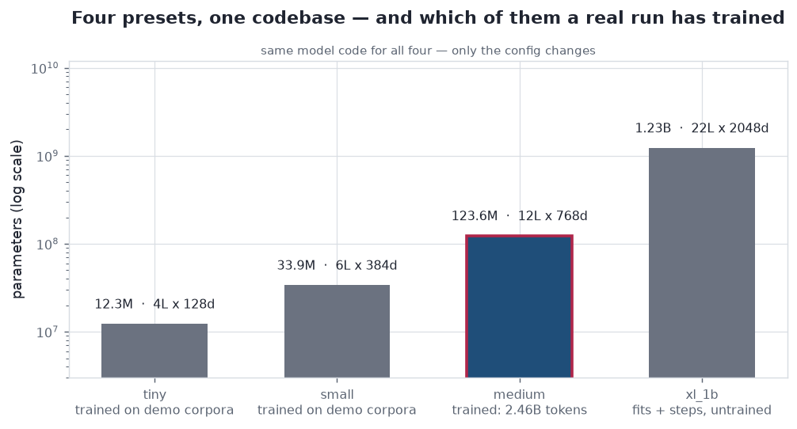
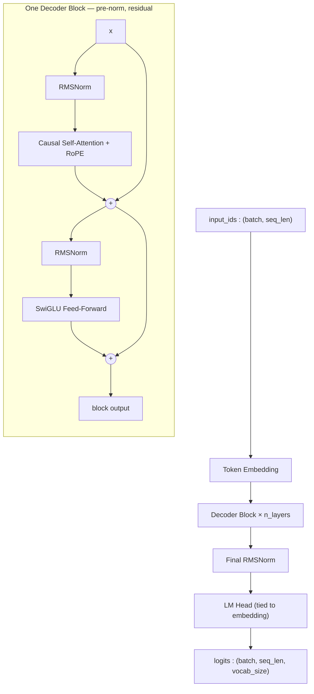
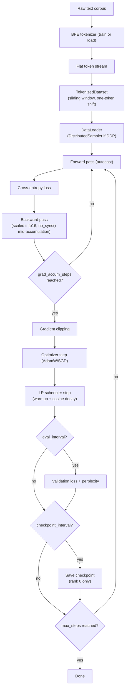
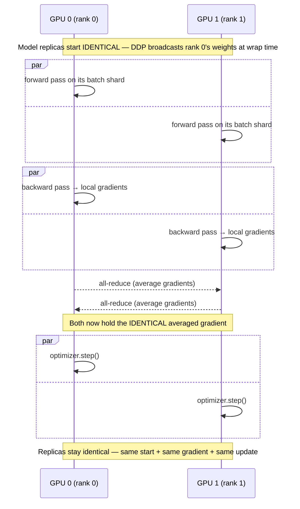
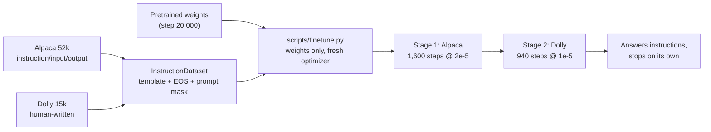
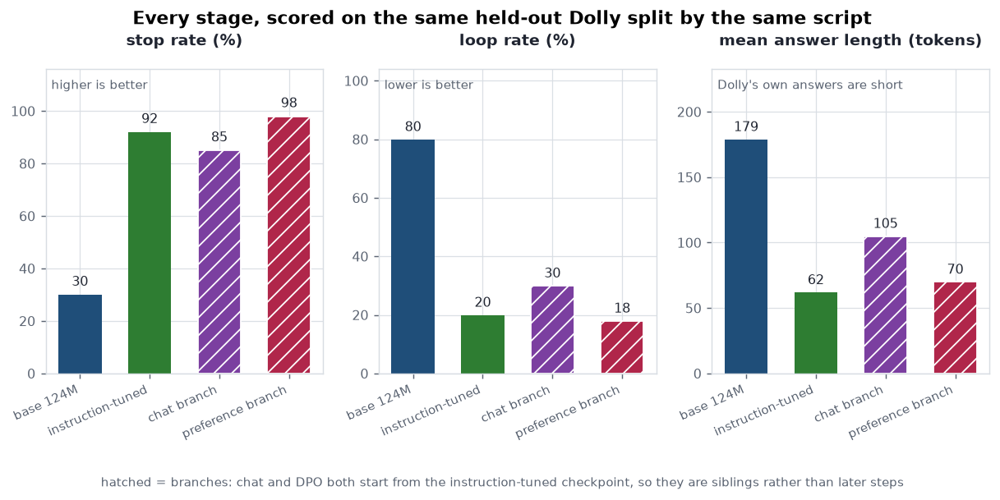
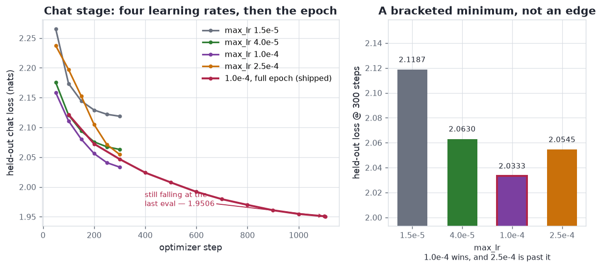
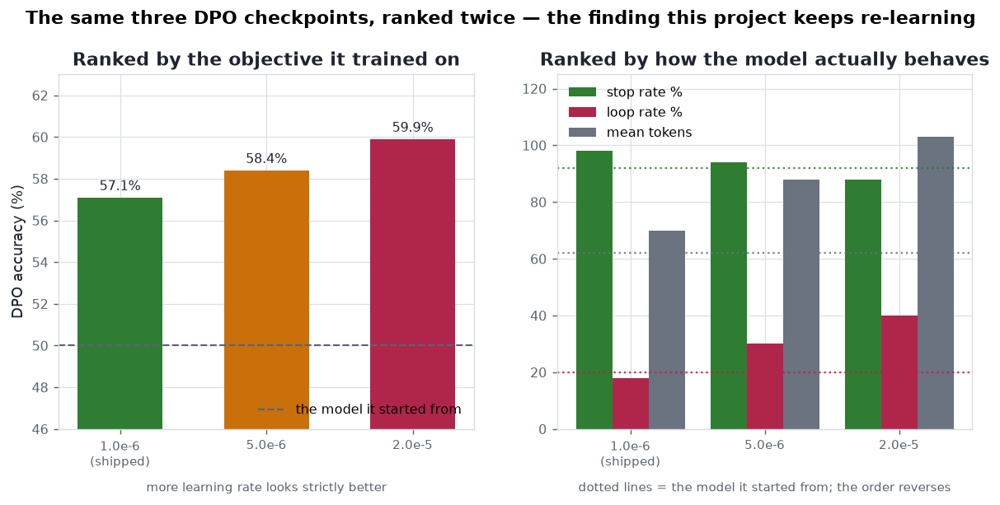

<div align="center">

# AshuGPT

**A GPT-style decoder-only LLM built from scratch in PyTorch — tokenizer to browser frontend.**

[](https://github.com/AuthRan/AuthLLM/actions/workflows/tests.yml)
[](pyproject.toml)
[](https://pytorch.org)
[](LICENSE)

[**▶ Live demo**](https://huggingface.co/spaces/AuthRan/AshGPT) ·
[**What it writes**](results/) ·
[**Build log**](learning/) ·
[**How to run it**](#15-reproducibility--commands) ·
[**What is not built**](#18-whats-not-built)

</div>

<div align="center">

| | |
|---|---|
| **Trained here** | `medium` — 123,587,328 params, 2.46B tokens of FineWeb-Edu, 20,000 steps |
| **Validation** | loss 3.1583 · perplexity 23.53 |
| **Stages** | pretrain → instruction tune → **chat** *and* **preference (DPO)** |
| **Hardware** | 2x RTX 2080 Ti · ~27 h for the pretraining run |
| **Tests** | 437, CPU-only, run on every push |

</div>

Tokenizer, Transformer architecture (RoPE, RMSNorm, SwiGLU, causal
attention), training loop, distributed training (DDP and FSDP), memory
optimization, instruction tuning, preference tuning with DPO, autoregressive
generation, and a streaming inference API with a browser frontend —
implemented directly against PyTorch tensor/autograd primitives, not assembled
from `transformers.AutoModel`. Built as a from-the-ground-up study of the
complete LLM stack, following the trajectory of Sebastian Raschka's
*Build a Large Language Model (From Scratch)*.

<!-- TRAINING-STATUS:START -->

## Training Run — `medium` (124M) on FineWeb-Edu

> This section was generated by `scripts/update_training_status.py` from
> the run's own artifacts (metrics CSV, checkpoint timestamps, supervisor
> log), so it reports the run rather than asserting a claim about it.

**Status:** ✅ **complete** — step **20,000 / 20,000** (100.0%)

```
████████████████████████████████████████  100.0%
```

| | |
|---|---|
| **Model** | `medium` — 123,587,328 parameters |
| **Corpus** | FineWeb-Edu, 5.0B tokens (4.9B train / 100M val) |
| **Training loss** | 3.1920 (learning rate 6.00e-05) |
| **Validation loss** | 3.1583 (perplexity 23.53) at step 20,000 |
| **Tokens seen** | 2.46B (122,880 per step) |
| **Throughput** | 4.91 s/step (25,002 tokens/s) |
| **Hardware** | 1x RTX 2080 Ti (11GB), fp16 + GradScaler |
| **Finished** | 2026-08-18 06:39 IST |
| **Last updated** | 2026-08-19 19:49 IST |

Full loss curve: [`logs/medium_metrics.csv`](logs/medium_metrics.csv) ·
Run log: [`logs/supervisor.log`](logs/supervisor.log)

<!-- TRAINING-STATUS:END -->

<p align="center">
  
</p>

<p align="center">
  <sub>Drawn from <a href="logs/medium_metrics.csv"><code>logs/medium_metrics.csv</code></a>
  by <a href="scripts/plot_results.py"><code>scripts/plot_results.py</code></a> — every figure in
  this README is built from a log in this tree, never from a remembered number.</sub>
</p>

**What the model actually writes**: [`results/`](results/) — unedited samples
from the finished checkpoint, with notes on what it learned and what it didn't.
**How the run went**: [`learning/`](learning/) — the build, the failures, and
what fixed them.

> **Read this before anything else below**: this project has trained real
> models, at real (small) scale, from random initialization. It has never
> trained a billion-parameter model, and it has never trained — or been
> able to load — any external checkpoint like GPT-2's. Every claim in
> this document distinguishes three things that are easy to blur together:
>
> | Claim | Means | True here for |
> |---|---|---|
> | **"I implemented this architecture"** | Code exists that can construct it; weights would be random | `tiny`, `small`, `medium`, `xl_1b` — all four presets |
> | **"I trained this checkpoint"** | Real gradient descent ran, on real data, producing a real checkpoint file | `tiny` and `small` on the small demo corpora in `tests/fixtures/`; `medium` (124M) **trained to completion** on FineWeb-Edu — 20,000 steps, 2.46B tokens, final validation perplexity 23.53 — see the status block above, then **instruction-tuned** on Alpaca and Dolly ([§10](#10-instruction-tuning)), **chat-tuned** on UltraChat ([§10.7](#107-multi-turn-chat--a-conversation-not-a-question)) and **preference-tuned** on HH-RLHF with DPO ([§10.8](#108-preference-tuning--the-first-stage-that-is-shown-a-bad-answer)) |
> | **"I loaded this pretrained checkpoint for inference"** | Someone else's trained weights, used without training or fine-tuning them here | **Not true of anything in this repo.** GPT-2's weights were compared against, never loaded successfully — see [§13](#13-pretrained-checkpoints-comparison-not-loading) — and never claimed as trained by this project |

See [§14](#14-provenance-trained--implemented--loaded) for the full,
itemized version of this table.

---

## Live Demo

<p align="center">
  
</p>

<p align="center">
  <b><a href="https://huggingface.co/spaces/AuthRan/AshGPT">▶ Try the base model live on Hugging Face Spaces</a></b>
</p>

That is the `medium` (124M-parameter) model — pretrained from random
initialization on 2.46B tokens of FineWeb-Edu, then instruction-tuned, then
chat-tuned ([§10.7](#107-multi-turn-chat--a-conversation-not-a-question)) —
holding a two-turn conversation and streaming it token by token at ~80 tok/s
on one 2080 Ti. The second question ("can you explain that more simply?")
never names the subject: the model keeps it because every prior turn is
replayed to it in the `### User:` / `### Assistant:` format it was trained on.

Everything in that recording is this repo's own code: the GPT-2 tiktoken
vocabulary the weights were fitted to ([§5](#5-tokenization)), the
from-scratch transformer ([§3](#3-architecture-overview)), KV-cached decoding
([§11](#11-inference)), the FastAPI server and its dependency-free frontend
([§11.3](#113-inference-api-fastapi)). Reproduce it with:

```
python scripts/serve.py --checkpoint checkpoints/sft_chat/step_1105.pt \
    --tokenizer tokenizer_gpt2.json --format chat
# then open http://127.0.0.1:8000 -- --format chat is what makes the page
# open on the Chat tab rather than on raw continuation
```

**Two things that recording is not.** It is not the Hugging Face Space: that
link serves the **base** checkpoint, which continues text and does not answer
questions, and the chat weights have not been deployed there. And it is not a
model that knows things — the answer above is fluent and partly wrong, which
is what 124M parameters and 2.46B tokens buy. The limits are measured rather
than hedged: stop rate, loop rate and answer length for every stage are in
[§10](#10-instruction-tuning), and the loop the second answer nearly falls
into is the 40% loop rate
[§10.7](#107-multi-turn-chat--a-conversation-not-a-question) reports.

The older base-model GIF is still in [`resources/demo.gif`](resources/demo.gif),
and the Gradio app behind the Space lives in [`space/`](space/).

---

## Table of Contents

0. [The whole pipeline, end to end](#the-whole-pipeline-end-to-end)
0. [How this got here](#how-this-got-here) — the month, in order
1. [Motivation](#1-motivation)
2. [What Was Implemented From Scratch](#2-what-was-implemented-from-scratch)
3. [Architecture Overview](#3-architecture-overview)
4. [Model Configuration Presets](#4-model-configuration-presets)
5. [Tokenization](#5-tokenization)
6. [Transformer Mathematics](#6-transformer-mathematics)
7. [Next-Token Prediction & Training Objective](#7-next-token-prediction--training-objective)
8. [Training Pipeline](#8-training-pipeline)
9. [Distributed Training (DDP)](#9-distributed-training-ddp)
10. [Instruction Tuning](#10-instruction-tuning)
11. [Inference](#11-inference)
12. [Scaling to Billion-Parameter Architectures](#12-scaling-to-billion-parameter-architectures)
13. [Pretrained Checkpoints: Comparison, Not Loading](#13-pretrained-checkpoints-comparison-not-loading)
14. [Provenance: Trained / Implemented / Loaded](#14-provenance-trained--implemented--loaded)
15. [Reproducibility & Commands](#15-reproducibility--commands)
16. [Project Structure](#16-project-structure)
17. [Testing](#17-testing)
18. [What's Not Built](#18-whats-not-built)

---

## The whole pipeline, end to end

Every box below is code in this repository, and every arrow is a run that
happened on the two 2080 Tis under my desk. Nothing here starts from someone
else's weights — the leftmost box is random initialization.

```
  BPE tokenizer                 the transformer                 4 size presets
  from scratch      ────────>   from scratch        ────────>   one codebase
  (§5)                          RoPE · RMSNorm                  tiny → xl_1b
                                SwiGLU · KV cache               (§3, §4)
                                (§3, §6)
                                                                     │
        ┌────────────────────────────────────────────────────────────┘
        v
  ┌───────────────┐   2.46B tokens of FineWeb-Edu, 20,000 steps, ~27 h
  │ PRETRAIN 124M │   random init → val perplexity 23.53
  └───────┬───────┘   (§8, the figure above)
          │
          v
  ┌────────────────────┐  Alpaca 52k → Dolly 15k, prompt-masked, packed
  │ INSTRUCTION TUNING │  stop rate 30% → 92%, loop rate 80% → 20%
  └───────┬────────────┘  (§10, §10.6)
          │
          ├──────────────────────────┐         two branches from one
          v                          v         checkpoint, not a chain
  ┌───────────────┐          ┌────────────────┐
  │ CHAT (§10.7)  │          │ DPO   (§10.8)  │
  │ UltraChat     │          │ HH-RLHF pairs  │
  │ multi-turn    │          │ first stage    │
  │ −0.79 nats    │          │ shown a *bad*  │
  │ largest move  │          │ answer         │
  │ in the project│          │ 50% → 57.1%    │
  └───────┬───────┘          └────────┬───────┘
          │                           │
          └─────────────┬─────────────┘
                        v
              ┌──────────────────┐
              │ SERVE  (§11)     │  FastAPI + streaming web UI,
              │ KV-cached decode │  ~80 tok/s on one 2080 Ti
              └──────────────────┘  (the GIF at the top)
```

<p align="center">
  
</p>

<p align="center">
  <sub>Parameter counts read from <a href="configs/model/"><code>configs/model/*.yaml</code></a> at draw time, by the same <code>approx_param_count()</code> §4 quotes — the bars cannot disagree with the configs. Only <code>medium</code> has been trained here.</sub>
</p>

The same model code builds all four presets; only the config changes. One of
them has been trained to completion, and this README is careful about which
([§14](#14-provenance-trained--implemented--loaded)).

---

## How this got here

98 commits over one month, 2026-07-23 to 2026-08-23, in the order it actually
happened. Nothing below is reconstructed: each row links to what was written
down at the time, and the milestone-by-milestone log with the full detail —
including every place a plan changed after something was measured — is
[SPEC.md](SPEC.md).

| When | What happened | Written up in |
|---|---|---|
| **Jul 23** | The architecture, in a day. From-scratch byte-level BPE, RMSNorm, RoPE, SwiGLU, causal attention, the assembled model, KV-cached generation, the memory estimator, a FastAPI server, and a GPT-2 loader that **refuses to succeed** rather than pretending the weights fit. CPU only; nothing trained past toy scale. | [SPEC M0–M15](SPEC.md#milestone-roadmap-implementation-order) |
| **Jul 27–28** | Packaged and put somewhere public: MIT license, a data pipeline that could survive a multi-GB corpus, and a Hugging Face Space. | [`space/`](space/) |
| **Aug 17–19** | **The run.** `medium`, 124M parameters, 2.46B tokens of FineWeb-Edu, 20,000 steps, ~27 hours on one 2080 Ti, final validation perplexity **23.53**. It took five failed launches, an OOM, a reboot that killed everything, and a status reporter that published a confidently wrong ETA. | [Where we started](learning/01-where-we-started.md) · [What we did](learning/02-what-we-did-and-why.md) · [**What went wrong**](learning/03-challenges.md) · [How it turned out](learning/04-results.md) |
| **Aug 19–20** | Teaching it to *answer* rather than continue: Alpaca, then Dolly. 29 minutes of GPU against pretraining's 27 hours — and the first time a metric that looked like it measured instruction-following peaked on the checkpoint you least want. | [Teaching it to answer](learning/05-instruction-tuning.md) · [instruction-tuning.md](results/instruction-tuning.md) |
| **Aug 20** | ~89% of both fine-tuning stages was padding. Packing the window recovered it: **4.4x** the supervised throughput — and a throughput change turned out to be a schedule change. | [Packing the window](learning/06-packing-the-window.md) |
| **Aug 20** | `xl_1b` sharded under FSDP so it takes real optimizer steps at 2.04GB/GPU; a dependency-free browser frontend; and a chat format that makes a training document a conversation. | [§12](#12-scaling-to-billion-parameter-architectures) · [§11.3](#113-inference-api-fastapi) |
| **Aug 21** | **Preference tuning** — the first stage ever shown a *bad* answer. DPO learned exactly what it was asked to, and almost none of that was what was wanted: what it was really ranking by was answer length. | [Teaching it to prefer](learning/07-preference-tuning.md) · [preference-tuning.md](results/preference-tuning.md) |
| **Aug 21–22** | The chat stage swept, trained and scored — the largest single-stage move in the project (0.79 nats). Two of its measurements corrected claims this README was making. | [Holding a conversation](learning/08-holding-a-conversation.md) · [chat-tuning.md](results/chat-tuning.md) |
| **Aug 22** | The length-normalized DPO variant, which **does not fix what it was built for** — because the shortcut was partly in the ruler. Then the first figures, drawn from the logs. | [preference-tuning.md](results/preference-tuning.md) |
| **Aug 23** | Guards against the rot: figures checked against the tables they were drawn from, commands checked against the tree. Then a repetition penalty, and the sweep saying how far to turn it. | [repetition-penalty.md](results/repetition-penalty.md) · [§18](#18-whats-not-built) |

**The thread running through it.** Six times now, the metric closest to the
training objective has ranked checkpoints backwards against the metric that
matters — in early stopping, in packing, in DPO's learning rate, in the chat
sweep, and most recently in how far to turn a repetition penalty. That pattern
is the most useful thing this project found, and every instance of it is
written down rather than quietly dropped, including the ones that cost a
result worth keeping.

---

## 1. Motivation

Most practical LLM work today means calling `AutoModelForCausalLM.from_pretrained(...)`
— which is the right call for shipping a product, and the wrong one for
understanding what's actually happening inside a forward pass. AshuGPT
exists to answer, with working code and measured numbers rather than
received wisdom, questions like:

- What does RoPE actually rotate, and why does that make attention
  distance-aware without a learned parameter?
- Why does gradient checkpointing trade compute for memory, and how much
  of each, really, on real hardware?
- What does `DistributedDataParallel` actually synchronize, and when?
- Is mixed precision always a win? (Measured answer, §8.1: **no** — a
  17-44x *slowdown* was measured on CPU hardware without native bf16
  support, the opposite of the textbook claim.)
- Can you just load GPT-2's weights into a differently-designed decoder?
  (Measured answer, §13: **no**, and the reasons are specific, not vague.)

Every non-trivial claim in this document is either **measured** (a real
number from a real run, reproducible via the command shown next to it) or
explicitly marked as an **estimate** with its formula shown. Nothing here
is asserted from memory of how transformers "generally" behave.

## 2. What Was Implemented From Scratch

| Layer | From scratch | Library provides |
|---|---|---|
| Tokenizer (byte-level BPE) | Trainer, encoder/decoder, special tokens, batching | — (no `tiktoken`/`sentencepiece`) |
| Model math (attention, RoPE, RMSNorm, SwiGLU, causal mask) | All of it, in `ashugpt/model/` | PyTorch tensor ops (`matmul`, `softmax`, autograd) — not `torch.nn.MultiheadAttention`, not `transformers` |
| Training loop | Forward/backward/step orchestration, LR schedule, checkpointing | `torch.optim.AdamW`/`SGD` (not reimplemented), `torch.autograd` |
| Mixed precision | Wiring/configuration | `torch.autocast`, `torch.amp.GradScaler` |
| Distributed training | Setup/wrap/rank-zero logic, `no_sync()` gradient-accumulation handling | `torch.distributed`, `torch.nn.parallel.DistributedDataParallel` |
| Sampling (temperature/top-k/top-p) | All of it, in `ashugpt/inference/generate.py` | — |
| KV caching | All of it | — |
| Memory estimation | All of it, in `ashugpt/utils/memory.py` | — |
| Inference API | Routing, validation schemas, service layer | FastAPI/Pydantic/uvicorn (HTTP framework, not model logic) |
| GPT-2 comparison & conversion | All of it, in `ashugpt/inference/pretrained_loader.py` | — (no `transformers.GPT2LMHeadModel` import anywhere) |

The line is deliberate: PyTorch's tensor library, autograd engine, and
`nn.Module` base class are used as infrastructure (nobody hand-writes a
CUDA kernel or a reverse-mode autodiff engine for an educational project
like this), but every *architectural* and *algorithmic* decision — what
gets rotated, what gets normalized how, what gets synchronized when — is
implemented and tested directly in this codebase.

## 3. Architecture Overview



`x = x + Attention(RMSNorm(x))`, then `x = x + SwiGLU(RMSNorm(x))` —
repeated `n_layers` times. No positional-embedding table exists anywhere
in the graph above: position information enters *inside* attention, via
RoPE (§6.2), not as something added to the input.

```python
from ashugpt.config import load_model_config
from ashugpt.model import AshuGPT

config = load_model_config("configs/model/tiny.yaml")
model = AshuGPT(config)
print(model.num_parameters())  # exact count
```

## 4. Model Configuration Presets

| Preset | Layers | `d_model` | Heads | Vocab | Context | Parameters (exact) | Trained here? |
|---|---:|---:|---:|---:|---:|---:|---|
| `tiny` | 4 | 128 | 4 | 50,304 | 256 | 7,292,032 | ✅ Yes — fast-iteration / demo scale |
| `small` | 6 | 384 | 6 | 50,304 | 512 | 29,938,560 | ✅ Yes — the real "trained from scratch" target |
| `medium` | 12 | 768 | 12 | 50,304 | 1,024 | 123,587,328 | ✅ Yes — trained to completion: 20,000 steps, 2.46B tokens of FineWeb-Edu ([§8](#8-training-pipeline)) |
| `xl_1b` | 22 | 2,048 | 32 | 50,304 | 2,048 | 1,233,479,680 | ❌ No — but it shards and takes real optimizer steps under FSDP ([§12](#12-scaling-to-billion-parameter-architectures)) |

Every row's parameter count is *exact*, not estimated: `AshuGPT.num_parameters()`
on a real constructed model is tested to match `ModelConfig.approx_param_count()`
(pure shape arithmetic, no model built) precisely, for every preset.
`vocab_size=50,304` is GPT-2's 50,257-token BPE vocabulary padded to the
nearest multiple of 64 (a standard nanoGPT-style convention for GPU tensor
alignment — harmless on CPU, free on GPU).

```python
from ashugpt.config import load_model_config
config = load_model_config("configs/model/small.yaml")
print(config.head_dim, config.approx_param_count())  # 64, 29938560
```

## 5. Tokenization

<details>
<summary><b>Expand</b> — GPT-2 BPE via tiktoken, the from-scratch BPE beside it, and why both exist</summary>

`ashugpt/tokenizer/bpe_scratch.py` — a byte-level BPE tokenizer built
without any tokenizer library, the same algorithm family GPT-2/GPT-3 use:

1. **Pre-tokenize** with a regex into chunks (words, punctuation runs,
   whitespace) so merges never glue two different words together.
2. **Bytes, not characters, are the base alphabet** — every chunk becomes
   raw UTF-8 bytes, and each of the 256 possible byte values starts as its
   own token. This means *any* Unicode text is representable from the
   start; there is no out-of-vocabulary character.
3. **Training** repeatedly merges the most frequent adjacent token pair
   across the corpus, `vocab_size - 260` times (260 = 4 special tokens +
   256 byte tokens, the minimum possible vocabulary).
4. **Encoding** replays the learned merges, in the order they were
   learned, on new text. **Decoding** concatenates each token's bytes and
   decodes as UTF-8 — lossless, verified by round-trip tests on tricky
   inputs (multi-space runs, mixed Unicode/emoji, tabs/newlines).

Special tokens `<pad>`, `<bos>`, `<eos>`, `<unk>` get fixed ids 0-3.
`<unk>` is reserved but **never actually produced** — byte-level encoding
has no out-of-vocabulary case, proven by a test that encodes text in a
script the tokenizer never saw during training and confirms `unk_id`
never appears in the output.

```
python scripts/train_tokenizer.py --input tests/fixtures/tiny_corpus.txt \
    --vocab-size 2000 --output tokenizer.json
```

```python
from ashugpt.tokenizer import BPETokenizer

tok = BPETokenizer.load("tokenizer.json")
ids = tok.encode("Mia and Rex explored the forest.", add_bos=True, add_eos=True)
tok.decode(ids)  # "Mia and Rex explored the forest."

batch = tok.encode_batch(["short text", "a longer piece of text"], max_length=32)
# batch["input_ids"], batch["attention_mask"] -- ready for a DataLoader,
# right-padded with pad_id, no custom collate_fn needed
```

</details>

---

## 6. Transformer Mathematics

<details>
<summary><b>Expand</b> — attention, RoPE, RMSNorm, SwiGLU and causal masking — the derivations</summary>

### 6.1 Attention Mechanism

For each token, attention computes a weighted average of *every other
token's* value vector, where the weight comes from how well that token's
query matches each other token's key:

```
Attention(Q, K, V) = softmax( (Q Kᵀ) / √d_head + mask ) V
```

`Q`, `K`, `V` come from three separate, bias-free linear projections of
the same input (`ashugpt/model/attention.py`), split into `n_heads`
independent heads, rotated with RoPE (§6.2), combined via masked
scaled dot-product attention, then merged and projected once more. The
manual formula above is implemented explicitly (`q @ k.transpose(-2,-1)`,
`masked_fill`, `softmax`, `@ v`) as the default — not
`torch.nn.functional.scaled_dot_product_attention` — specifically so the
math stays visible and directly testable. An opt-in fused-kernel path
(`use_efficient_attention=True`) exists too, verified to produce
numerically identical output (§8.3's efficient-attention entry).

### 6.2 RoPE (Rotary Positional Embeddings)

No positional-embedding table exists in this model. Instead, each
query/key vector is **rotated** by an angle proportional to its position,
inside every attention layer:

```
for each dimension pair (i, i + head_dim/2):
    θ_i = position × theta^(-2i / head_dim)
    [x_i', x_{i+d/2}'] = [[cos θ_i, -sin θ_i], [sin θ_i, cos θ_i]] · [x_i, x_{i+d/2}]
```

The key property: `dot(rotate(q, m), rotate(k, n))` depends only on the
*relative* offset `m - n`, not on the absolute positions — proven directly
by a test comparing the same relative offset at two different absolute
position pairs (`(5,2)` and `(40,37)`, both offset 3) and confirming the
dot product matches. Rotation also **preserves vector norm** (it's an
orthogonal transform) — also tested directly.

### 6.3 RMSNorm

```
RMSNorm(x) = (x / sqrt(mean(x², dim=-1) + eps)) × weight
```

Rescales each token's activation vector to unit root-mean-square, then
applies a learned per-dimension scale — unlike LayerNorm, **no
mean-centering and no bias term**. Cheaper, and what LLaMA-family models
use instead of LayerNorm. Computed internally in `float32` regardless of
the input's dtype (squaring activations under bf16/fp16 can lose
precision) — a numerical-stability detail that matters once mixed
precision (§8.1) is in the picture.

### 6.4 SwiGLU

```
SwiGLU(x) = (SiLU(x·W_gate) ⊙ (x·W_up)) · W_down
```

A *gated* feed-forward network: the `gate` branch (via `SiLU(z) =
z·sigmoid(z)`) controls how much of the `up` branch passes through,
elementwise, before the down-projection. Three weight matrices instead of
a plain FFN's two — `d_ff` is sized at roughly `2/3 × 4 × d_model`
(the LLaMA convention) to keep the parameter/FLOP budget comparable to a
non-gated 4×-`d_model` FFN despite the extra matrix.

### 6.5 Causal Masking

```python
def causal_mask(seq_len_q, seq_len_k, offset, device):
    q_positions = arange(seq_len_q) + offset   # absolute position of each query
    k_positions = arange(seq_len_k)            # absolute position of each key
    return k_positions > q_positions            # True = blocked
```

Query position `i` (absolute position `offset + i`, where `offset`
accounts for any already-cached tokens) may attend to key position `j`
iff `j <= offset + i`. With `offset=0` and equal query/key lengths this is
the standard upper-triangular mask; with a nonzero offset (a new token
attending back through a KV cache, §11.1) it correctly allows attending to
every cached position plus itself. **Verified empirically, not just by
inspecting the mask matrix**: changing a *later* token's input content and
confirming every *earlier* token's output is bit-for-bit unchanged — the
only way that's possible is if the earlier positions truly never saw the
later one.

</details>

---

## 7. Next-Token Prediction & Training Objective

<details>
<summary><b>Expand</b> — what the loss actually is, and what a perplexity of 23.53 means</summary>

Given `"The cat sat down"`, a decoder-only LM is trained so that, at every
position, the prediction from everything up to and including that
position matches whatever token actually came next:

```
input_ids: The  cat  sat        (3 tokens, positions 0, 1, 2)
labels:    cat  sat  down       (3 tokens, positions 0, 1, 2)
```

`labels` is **not** a re-encoding of the same text — it is `input_ids`
shifted one position into the future. Because causal attention already
guarantees `logits[:, t, :]` only saw `input_ids[:, :t+1]` (§6.5),
comparing `logits[:, t, :]` against `labels[:, t]` directly — **with no
further shifting inside the model** — is exactly the next-token
objective. The shift happens once, upstream, when the data pipeline
slices a token stream into overlapping windows:
`input_ids = tokens[i:i+L]`, `labels = tokens[i+1:i+L+1]`
(`ashugpt/data/dataset.py`'s `TokenizedDataset`) — the same convention
nanoGPT uses, deliberately different from Hugging Face's "pass identical
sequences, shift internally" convention.

```python
labels = torch.tensor([[264, 266, 270]])  # already the shifted targets
out = model(input_ids, labels=labels)
out.loss                                   # scalar cross-entropy
out.loss.backward()
```

Padding positions in `labels` should be set to `-100`, which
`F.cross_entropy` ignores by default — no extra masking logic needed.

</details>

---

## 8. Training Pipeline



The training loop (`ashugpt/training/trainer.py`), one iteration, with
every required step visible in the actual code shape:

```python
lr = get_lr(step, config)                                # scheduler step
for group in optimizer.param_groups: group["lr"] = lr

optimizer.zero_grad(set_to_none=True)                     # gradient reset

for _ in range(config.grad_accum_steps):
    with autocast_context(device.type, amp_dtype):         # mixed precision
        output = model(input_ids, labels=labels)           # forward pass
        loss = output.loss / config.grad_accum_steps       # loss calculation
    scaler.scale(loss).backward()                           # backward pass, gradient-scaled if fp16

scaler.unscale_(optimizer)
torch.nn.utils.clip_grad_norm_(model.parameters(), config.grad_clip)  # gradient clipping

scaler.step(optimizer)                                     # optimizer step
scaler.update()
```

`scaler` (`build_grad_scaler`) always exists but is only *enabled* for
`amp_dtype="float16"` — bf16 needs no loss scaling (same exponent range as
fp32), so under bf16 or no AMP, every `scaler.*` call above is a
verified-transparent no-op and the code runs unchanged either way.

**Checkpointing** (`save_checkpoint`/`load_checkpoint`) persists model
weights, optimizer state, and step count via `torch.save`/
`torch.load(weights_only=True)` — not literal safetensors, deliberately: a
*resumable* checkpoint bundles heterogeneous state (tensors + step
counters + optimizer momentum buffers) that a pure-tensor format doesn't
cleanly support, while `weights_only=True` still restricts unpickling to
plain tensors/dicts/numbers, preserving the "no arbitrary code execution"
intent safetensors is about.

**Proof it learns**: `tests/integration/test_train_step.py` trains a tiny
model on a deliberately repetitive synthetic corpus for 150 steps and
asserts the loss drops by more than 75% — in practice, ~5.5 (near
`ln(vocab_size)`, i.e. random guessing) down to well under 0.1.

### 8.1 Mixed Precision

`torch.autocast` runs most ops in bf16/fp16 while keeping numerically
sensitive ones (like softmax accumulation) in fp32 internally
(`ashugpt/training/amp.py`). **Measured, not assumed**: on this project's
CPU-only dev hardware (no native bf16 instructions), bf16 autocast was
**17-44x slower** than fp32, not faster (isolated timing: 134.5s vs. 3.0s
for one forward+backward at scale) — the sharpest lesson in this whole
project: mixed precision's benefit is *hardware-dependent*. Peak memory
did drop 21.3% (bf16 tensors genuinely are smaller), just at a steep time
cost on hardware without the compute support to back it up.

That paragraph used to end by predicting that "on a GPU with tensor cores
… both memory *and* speed would improve." **A GPU arrived (2× RTX 2080 Ti,
2026-08-16) and that prediction was half wrong**, which is worth more than
if it had been right. Measured on the new hardware, 4096×4096 matmul:

| dtype | TFLOP/s | vs fp32 |
|---|---:|---:|
| fp16 | **57.3** | 4.5× |
| fp32 | 12.6 | — |
| TF32 | 13.0 | ~none — Turing has no TF32 |
| **bf16** | **7.7** | **0.6× — slower than fp32** |

The tensor cores are real and fp16 does deliver 4.5×. But these cards are
Turing (sm_75), which has **no native bf16**: bf16 is emulated, 7.4×
slower than fp16 and slower even than plain fp32. So the CPU finding
("bf16 is slow without hardware support") did not go away on a GPU with
tensor cores — it followed the *specific dtype's* hardware support, which
is the sharper version of the lesson.

The trap is that nothing warns you. `torch.cuda.is_bf16_supported()`
returns `True` on these cards, because recent PyTorch counts emulation as
support. Every training preset in this repo defaulted to
`amp_dtype: bfloat16` — correct on CPU and on Ampere+, and silently
several times slower here while looking like an enabled optimization.
`ashugpt/training/amp.py` now checks compute capability directly (native
bf16 starts at 8.0) and warns rather than trusting that flag. The
GPU-ready presets use `amp_dtype: float16` with the `GradScaler` the AMP
module already builds.

Check your actual hardware, not the general claim — and not the
framework's answer to "is this supported?" either.

### 8.2 Gradient Accumulation

Splits a target *effective* batch into `grad_accum_steps` smaller
micro-batches, summing their (pre-divided) losses' gradients before one
optimizer step. **Measured**: `batch_size=1, grad_accum_steps=8` (same
effective batch as `batch_size=8, grad_accum_steps=1`) cut peak RSS by
**47.2%** (757.0MB → 399.9MB) at essentially the same per-step time
(3.44s → 3.64s) — because both scenarios do identical total compute, just
shaped differently in memory.

### 8.3 Gradient Checkpointing

Discards intermediate activations after each block's forward pass and
*recomputes* them during backward instead of storing them
(`torch.utils.checkpoint.checkpoint(block, ..., use_reentrant=False)`,
DDP-safe). Only engaged when there's a backward pass to save memory for
(`self.training`) and no KV cache to reconcile (`kv_caches is None`) —
generation never needs it. **Measured**: **-38.3% peak RSS** (757.0MB →
467.1MB) for a modest +19% per-step time cost (3.44s → 4.11s) — the
single biggest individual-lever memory win measured. Verified *exact*
(not approximate) equivalence first: logits, loss, and every parameter's
gradient match the non-checkpointed run within float32 tolerance.

**Full memory-optimization comparison** (`scripts/benchmark_memory.py`,
peak RSS via `psutil`, each scenario in its own fresh subprocess — 5.4M-param
benchmark model, seq_len=256, CPU):

| scenario | peak RSS (MB) | vs. baseline | s/step |
|---|---:|---:|---:|
| baseline | 757.0 | — | 3.44 |
| gradient_checkpointing | 467.1 | **-38.3%** | 4.11 |
| mixed_precision (bf16) | 595.7 | -21.3% | **59.62** |
| grad_accum_x8 (same effective batch) | 399.9 | **-47.2%** | 3.64 |
| efficient_attention | 624.7 | -17.5% | 3.56 |
| sgd_optimizer | 756.4 | -0.1%* | 3.37 |
| all_combined | 371.5 | **-50.9%** | 66.68 |

\* Optimizer choice (AdamW's 2 state buffers/param vs. SGD's 1 — proven
*exactly* 2x vs. 1x by direct tensor-element counting after a real
optimizer step) gets swamped here because this model's ~41MB of AdamW
state is tiny next to seq_len=256 activation memory. It matters more when
parameter count is large *relative to* activation size — bigger models,
shorter sequences — not the regime this benchmark highlights.

Every optimization above is proven correct (matches the unoptimized path
exactly, or its exact predicted memory multiplier) before any memory
number is trusted — configurable via `TrainConfig`:

```yaml
gradient_checkpointing: true
amp_dtype: bfloat16
grad_accum_steps: 8
use_efficient_attention: true
optimizer: sgd    # or "adamw" (default)
```

```
python scripts/benchmark_memory.py
```

## 9. Distributed Training (DDP)

<details>
<summary><b>Expand</b> — gradient synchronization, rank-zero logging, and the launch commands</summary>



The all-reduce is triggered automatically by autograd hooks the instant
`loss.backward()` finishes on every rank — no explicit "sync gradients"
call anywhere in `trainer.py`. The one place this needs explicit handling
is **gradient accumulation**: DDP synchronizes on every `.backward()` by
default, which is correct but wasteful mid-accumulation-window. Every
micro-step except the last is wrapped in `model.no_sync()`, so the
all-reduce fires exactly once per optimizer step regardless of
`grad_accum_steps`.

Same command, becomes distributed just by how it's launched:

```
# Single process:
python scripts/train.py --model configs/model/tiny.yaml --train configs/train/tiny_cpu.yaml \
    --tokenizer tokenizer.json --input corpus.txt --checkpoint-dir checkpoints/run1

# 2 processes, one machine:
torchrun --nproc_per_node=2 scripts/train.py --model configs/model/tiny.yaml \
    --train configs/train/tiny_cpu.yaml --tokenizer tokenizer.json --input corpus.txt \
    --checkpoint-dir checkpoints/run1

# 2 nodes x 4 GPUs:
torchrun --nnodes=2 --nproc_per_node=4 --rdzv_id=100 --rdzv_backend=c10d \
    --rdzv_endpoint=<master-node-ip>:29500 scripts/train.py --model ... --train ...
```

`torchrun` sets `RANK`/`LOCAL_RANK`/`WORLD_SIZE`/`MASTER_ADDR`/`MASTER_PORT`;
`setup_distributed()` reads those. Not launched via `torchrun`?
`WORLD_SIZE` is unset, a `world_size=1` `DistributedInfo` comes back
without touching `torch.distributed` at all, and every
`if info.is_distributed:` branch is simply skipped — single-GPU and
multi-GPU are the same code path, not two implementations.

| Requirement | Where |
|---|---|
| Process initialization | `dist.init_process_group(backend=...)` — gloo (CPU) or nccl (GPU) |
| Rank/world-size handling | `RANK`/`WORLD_SIZE`/`LOCAL_RANK` env vars → `DistributedInfo` |
| DDP wrapping | `wrap_model_for_ddp()` |
| DistributedSampler | `shuffle=True`, `set_epoch()` every epoch boundary (an easy-to-forget correctness detail) |
| Device assignment | `nccl` → `cuda:{local_rank}`; `gloo` → `cpu` |
| Synchronization | Automatic on `.backward()`; deferred (not skipped) via `no_sync()` during accumulation |
| Rank-zero-only logging/checkpointing | Gated on `info.is_main_process`; checkpoints always save `unwrap_model(model)` — DDP's own `state_dict()` prefixes every key with `"module."`, which would silently break loading into a plain model later if not unwrapped |
| Process group cleanup | `cleanup_distributed()` in a `finally` block — fires even if training raises |

**Verified with a real 2-process test** (`tests/integration/test_ddp.py`,
gloo backend, two independent OS processes): both ranks converge to
**bit-identical weights** despite training on *disjoint* data shards
(only possible if gradients were genuinely synchronized), and that result
**exactly matches** a single-process mathematical baseline
(`mean(mean_A, mean_B) == mean(A ∪ B)` for equal shard sizes — algebra,
not approximation). Also manually verified end-to-end through the real
CLI: 150-step 2-process run converged correctly (loss ~5.5 → ~0.08,
matching single-process), exactly one checkpoint saved by rank 0. Took
~140s vs. ~10s single-process — expected: gloo/CPU all-reduce overhead
dominates at this tiny scale; DDP pays off when per-step compute is large
relative to fixed communication cost (bigger models/batches, or NCCL/GPU).

FSDP came later, when `xl_1b` needed to train on cards that cannot each
hold it — see [§12](#12-scaling-to-billion-parameter-architectures).

</details>

---

## 10. Instruction Tuning

The 124M pretrained model continues text. Handed "Write a tribute to my high
school swim coach" inside the instruction template below, it answered:

> Describe some actions that would be easy to perform for the swim coach.
> ### Refine:

It did not write a bad tribute — it wrote *another instruction*. A document
containing one instruction usually contains more of them, so more of them is
the likeliest continuation, and nothing in 2.46B tokens of FineWeb-Edu ever
taught it that an instruction is a thing to *answer* or that a response is a
thing that *ends*.

Instruction tuning teaches both, without changing the model, the loss
function, or the optimizer. The objective is still next-token prediction.
What changes is which tokens are targets.



### 10.1 Prompt Masking — the one idea that makes this work

Every example becomes one document: a fixed template, the instruction, then
the response, then `<|endoftext|>`.

```
Below is an instruction that describes a task. Write a response that
appropriately completes the request.

### Instruction:
{instruction}

### Response:
{output}<|endoftext|>
```

Trained naively, next-token prediction over that document teaches the model
to produce *all* of it — including the instruction. That is a real failure
mode, not a theoretical one: a model trained to predict instruction tokens
learns to invent plausible questions, which is precisely the behaviour a
model meant to answer them must not have.

The fix costs one line and no change to the model
(`ashugpt/data/instruction.py`):

```python
labels[: n_prompt - 1] = IGNORE_INDEX   # -100
```

`F.cross_entropy` skips `ignore_index=-100` by default, so masked positions
contribute no gradient at all. The prompt is still *read* — it is in
`input_ids`, the attention sees every token of it — it is simply never a
target. The model learns "given this instruction, produce this response",
not "produce this instruction and then this response".

The `- 1` is the subtle part, and it comes from the one-token shift this
repo uses everywhere: `labels[t]` is the token that should follow
`input_ids[t]`. The first position whose *target* is a response token is
therefore `t = n_prompt - 1`, not `t = n_prompt`. Off by one in the safe
direction and the first response token is never learned; off by one the
other way and the model gets one token of the instruction as a target.

Two smaller decisions in the same file:

- **Every response ends with EOS.** This is what a stop button is made of.
  The base model has no concept of finishing — it was trained on a stream
  where documents were separated but never *terminated* as a thing to
  predict. Supervising EOS at the end of every response is the entire
  mechanism behind "the model stops on its own", and it is the change that
  shows up most sharply in the measurements below.
- **Over-length examples are dropped, not truncated.** A truncated example
  ends mid-sentence with no EOS, which teaches the model to stop abruptly at
  exactly 512 tokens. Dropping costs data — 0.1% of Alpaca, but 6.5% of
  Dolly, whose human-written context fields are long — and that is the
  cheaper mistake.

### 10.2 Why `scripts/finetune.py` is not `scripts/train.py`

Same trainer, same loop, three deliberate differences.

**Weights only, from the checkpoint.** A fine-tune is a new run, not a
resumption:

```python
checkpoint = torch.load(args.init_from, map_location="cpu", weights_only=True)
model.load_state_dict(checkpoint["model_state_dict"])
```

Loading the optimizer state too would carry AdamW moment estimates fitted to
6e-4-scale updates into a 2e-5 run, and the saved step count would drop this
run at the tail of a cosine schedule it never took part in.

**A learning rate ~30x lower.** Pretraining ran at 6e-4 from random
initialization, where large steps are what you want. This stage starts from
weights that already encode English and only needs to change behaviour;
2e-5 is the standard SFT range at this size. An order of magnitude higher
and the model forgets how to write while it learns the format.

**Whole padded examples, not windows.** There is no stride and no sliding
window: an instruction pair is an indivisible unit. Padding to a fixed 512
keeps the tensor shape identical to pretraining, so the measured 6.01GB
peak carries over unchanged.

### 10.3 The two stages that ran

| | Stage 1 | Stage 2 |
|---|---|---|
| Data | Alpaca 52k (machine-generated) | Dolly 15k (human-written) |
| Usable after the 512-token filter | 51,906 (0.1% dropped) | 14,034 (6.5% dropped) |
| Starts from | `checkpoints/medium/step_20000.pt` | stage 1's final checkpoint, step 1,600 |
| Steps | 1,600 (~1 epoch, chosen by sweep) | 940 (~2 epochs, chosen by sweep) |
| Max LR | 2.0e-5 | 1.0e-5 |
| Tokens/step | 16,384 (8 x 4 accum x 512) | 16,384 |
| Supervised tokens | 3.0M | 2.0M |
| Wall clock, 1x 2080 Ti | 18 min | 11 min |
| Config | [`configs/train/sft_alpaca.yaml`](configs/train/sft_alpaca.yaml) | [`configs/train/sft_dolly.yaml`](configs/train/sft_dolly.yaml) |

Both step counts were measured rather than chosen: the first versions of these
configs ran 4,875 and 470 steps, and both were wrong in opposite directions.
The runs behind those numbers are kept in `configs/train/sft_alpaca_3epoch.yaml`,
`sft_dolly_1epoch.yaml`, `sft_dolly_2epoch.yaml` and `sft_dolly_3epoch.yaml`
with their logs, because the arguments that produced them are more useful
sitting next to the curves that refuted them than deleted.

Note the gap between "tokens/step" and "supervised tokens". Padding every
example to a fixed 512 keeps the tensor shape identical to pretraining — which
is why the 6.01GB memory measurement carried over untouched — but Alpaca
examples average 113 tokens, of which 58 are response. Per optimizer step,
about 22% of the 16,384 positions are real tokens and about 11% produce
gradient. Roughly 89% of the compute in these stages is padding and masked
prompt. That is what sequence packing recovers — 4.40x the supervised
throughput for 1.02x the per-step cost, and a better model at the end of the
pipeline; the mechanism and the measurements are [§10.6](#106-sequence-packing--the-89-that-was-padding).
The two stages above ship unpacked because they are the runs the rest of this
section's numbers came from.

Throughput is 1.47 optimizer steps/s, or ~24,100 token-positions/s — within
4% of the 25,002 tok/s the pretraining run measured at the same batch shape,
which is the expected result given the forward/backward cost is set by tensor
shapes that did not change.

**Both stages ran on one card, not two.** GPU 1 on this machine is thermally
throttled, and DDP runs at the slower card's pace ([§9](#9-distributed-training-ddp)).

### 10.4 What it changed, measured

`scripts/eval_instruction_following.py` scores checkpoints on held-out
instruction data — 300 Dolly examples and 1,039 Alpaca ones, reconstructed
from each fine-tune's own seed and split rather than stored, so they are
examples no stage of training ever saw. Held-out loss is computed with the
prompt masked exactly as in training, so it scores prediction of the
*response* only. The behavioural columns come from 40 real sampled
generations per checkpoint (temperature 0.8, top-k 50, 200-token cap).

<p align="center">
  
</p>

<p align="center">
  <sub>Every stage on the one split they share, scored by the same script. The last two bars
  are hatched because they are <b>branches, not steps</b>: chat and DPO both start from the
  instruction-tuned checkpoint, so drawing them end to end would claim a four-stage pipeline
  this project never ran.</sub>
</p>

Every checkpoint that ran, scored the same way:

| checkpoint | Dolly loss | Alpaca loss | mean | stop rate | mean tokens | loop rate |
| --- | ---: | ---: | ---: | ---: | ---: | ---: |
| `base` — pretrained, step 20,000 | 3.0580 | 2.5338 | 2.7959 | 30% | 179 | 80% |
| 3-epoch Alpaca, step 500 | 2.9049 | 2.0973 | 2.5011 | 98% | 58 | 15% |
| 3-epoch Alpaca, step 1,500 | 2.9506 | 2.0568 | 2.5037 | 100% | 50 | 10% |
| 3-epoch Alpaca, step 4,500 | 3.0844 | 2.0752 | 2.5798 | 100% | 51 | 0% |
| **stage 1** — 1-epoch Alpaca, step 1,600 | 2.9145 | **2.0512** | 2.4829 | 100% | 47 | 15% |
| Dolly 1 epoch, off step 1,500 | 2.8183 | 2.1211 | 2.4697 | 98% | 44 | 12% |
| Dolly 2 epochs, off step 1,500 | 2.7988 | 2.1311 | 2.4650 | 100% | 52 | 15% |
| Dolly 3 epochs, off step 1,500 | 2.7921 | 2.1427 | 2.4674 | 100% | 52 | 18% |
| **stage 2** — Dolly 2 epochs, off step 1,600 | **2.7707** | 2.1365 | **2.4536** | 98% | 52 | 15% |

Loss columns are comparable *down* a column, never across: Alpaca's
machine-generated responses are far more predictable than Dolly's
human-written ones, which is why the base model scores half a nat better on
one than the other before any tuning happens at all.

**Stopping is learned almost immediately.** 30% → 98% within the first 500
optimizer steps, with mean answer length dropping from 179 tokens (i.e.
running to the cap) to 58. It is the easiest thing in the data to fit: every
example ends with `<|endoftext|>` in the same position after the same
template. The base model's 30% is not intent — FineWeb-Edu separates
documents with that token, so it emits one whenever it decides its
hallucinated document is over, which is why that 30% comes paired with an 80%
loop rate.

**The behavioural metrics and the loss disagree, and the loss is right.** By
stop rate and loop rate, the 3-epoch Alpaca run's step 4,500 is the best model
in the table: always stops, never loops, the only 0% loop rate anywhere. By
held-out loss it is *worse than the base model it started from* on Dolly
(3.0844 vs 3.0580). Three epochs bought a model that reproduces the shape of
an Alpaca answer perfectly and generalizes to another instruction set worse
than the raw pretrained weights do. Selecting on the metrics that look like
they measure instruction following would have picked exactly the wrong
checkpoint.

**A short schedule beats the same step of a long one.** The 3-epoch run's best
checkpoint is step 1,500 — one epoch, near enough. Re-running the stage as a
1,600-step schedule that actually finishes gives a *better* model than that
checkpoint on both held-out sets (2.0512 vs 2.0568, 2.9145 vs 2.9506), for a
third of the compute. Step 1,500 of the long run sits mid-cosine at lr
~1.7e-5 and never receives the annealing that does the last of the work.
"Train long, keep the best checkpoint" and "train exactly as long as you
need" are not the same experiment, and the second one won here.

That difference compounds: running stage 2 from the 1,600-step checkpoint
instead of the long run's step 1,500 is worth 0.028 nats at the end of stage
2 (2.7707 vs 2.7988) for identical stage-2 settings.

**Stage 2 does not make the model better — it moves where it is good.** Read
the three "off step 1,500" Dolly rows in order. Each extra epoch improves
Dolly held-out loss by a little and degrades Alpaca held-out loss by almost
exactly as much: one epoch to three is −0.026 on Dolly and +0.022 on Alpaca.
That is not a model getting better at following instructions, it is a model
sliding from one instruction distribution toward another, and a single
held-out set cannot show it. `sft_dolly.yaml` ships 940 steps because that is
where the mean of the two bottoms out — the least arbitrary stopping point
available once the trade is visible.

**The one-epoch prediction for stage 2 was wrong, and the sweep says so.**
The original `sft_dolly.yaml` argued from the Alpaca stage — which overfit
inside a single pass — that a second pass over a set a quarter the size would
overfit harder. Dolly's validation loss instead fell at every single eval.
Three runs, each a complete cosine cycle down to `min_lr` so their endpoints
are comparable:

| schedule | steps | best val loss | at step | wall clock |
|---|---:|---:|---:|---:|
| 1 epoch | 470 | 2.8237 | 470 (still falling) | 5 min |
| 2 epochs | 940 | 2.8038 | 900 | 11 min |
| 3 epochs | 1,410 | **2.7969** | 1,300 | 16 min |

The curve finally flattens in the third epoch — 1,300 to 1,410 moves it by
+0.0002, the first increase anywhere in the sweep — so three epochs is where
this stage stops paying. But the returns collapse well before that: epoch two
buys 0.0199 nats, epoch three buys 0.0069. At half the learning rate of stage
1, on a set a quarter the size, this model simply does not overfit Dolly the
way it overfits Alpaca, and the reasoning that predicted it would was an
analogy, not a measurement.

### 10.5 What instruction tuning did not do

It taught the model to answer. It did not teach it to know anything.

> **What are brambles?** — *the shipped stage-2 model*
> Brambles, also known as plasticizers, are chemical compounds that are added
> to a mixture of non-cemented polymers. They are also an essential part of a
> good manufacturing process.

Right length, right register, right confident encyclopaedic cadence,
completely invented. That is the same limit [§13](#13-pretrained-checkpoints-comparison-not-loading)
and [`results/`](results/) describe for the base model, and 5.0M supervised
tokens does not move it: facts live in the pretrained weights, and fine-tuning
changes how they come out, not how many there are.

Also not built at the time: no RLHF, no DPO, no reward model, no multi-turn
chat format, and no model-judged evaluation. The numbers above are the ones
that can be computed exactly from a held-out split; nothing here scores
helpfulness. Two of those have since been built —
[§10.7](#107-multi-turn-chat--a-conversation-not-a-question) is the chat
format and [§10.8](#108-preference-tuning--the-first-stage-that-is-shown-a-bad-answer)
is preference tuning, which is the first stage in this pipeline that is ever
shown a *bad* answer.

What *was* built after this section's runs finished is sequence packing, which
attacks the cost of the two stages rather than what they teach — and, less
expectedly, ends the pipeline in a better place than it started. That is
[§10.6](#106-sequence-packing--the-89-that-was-padding).

### 10.6 Sequence packing — the 89% that was padding

§10.3's arithmetic is the whole motivation: an Alpaca example averages 113
tokens, gets padded out to a 512-token window on its own, and only ~58 of
those tokens are supervised. Forward and backward cost is set by the tensor
shape, not by how much of it is real, so roughly 89% of both fine-tuning
stages was GPU time spent computing gradients that the mask threw away or
attention over padding.

`PackedInstructionDataset` (`ashugpt/data/instruction.py`) fills the window
instead — whole examples laid end to end until the next one does not fit —
behind `TrainConfig.pack_sequences`, off by default. Two extra tensors ride
along with `input_ids` and `labels` to describe the seams:

| tensor | what it says | what breaks without it |
|---|---|---|
| `segment_ids` | which packed example each position belongs to | example 2 attends to example 1 — conditioning on context that never exists at inference |
| `position_ids` | position *within* its own example, restarting at 0 | RoPE rotates every example after the first to positions training never otherwise uses |

`segment_ids` becomes a block-diagonal mask (`segment_causal_mask` in
`ashugpt/model/attention.py`) — a position may attend to another only if it is
not in the future *and* they belong to the same example:

```python
blocked[b, i, j] = (j > i) or (segment_ids[b, i] != segment_ids[b, j])
```

With both tensors, a packed example is mathematically identical to the same
example run alone: same attention pattern, same RoPE positions, same masked
labels. The only thing that changed is how many ride along in one forward pass.

Three details that are easy to get wrong and hard to notice:

- **The one-token shift is applied per example, not per window.** An example
  of L tokens occupies L−1 positions. Shifting the packed window as a whole
  would make the last position of one example predict the first token of the
  next — exactly the cross-example leakage the mask exists to prevent.
- **Padding gets its own segment id (`-1`), not "no segment".** A row that
  could attend to nothing at all would softmax over an all-`-inf` score row and
  produce NaN, which poisons the entire batch's gradient even though the padded
  positions' labels are masked out of the loss. Padded rows attend to
  themselves.
- **Validation stays unpacked in both modes.** A packed batch holds ~9x the
  supervised tokens, so packing the val set would silently reweight held-out
  loss out of comparability with every run already logged.

**Both failure modes still train.** A model with the mask left off, or with
RoPE positions running across the whole window, converges and logs a
believable loss curve — that is precisely what makes them dangerous. So the
central test in `tests/unit/test_packed_instruction_dataset.py` runs a real
model over a packed window and over each example alone and demands the logits
match, with a negative control asserting they diverge when the mask is
removed. Two more paths could have differed silently and are now covered:
gradient checkpointing passes the packing arguments through
`torch.utils.checkpoint` as keywords (so a recomputed forward could have used
plain causal attention while the original used the block-diagonal mask — the
test asserts exact gradient equivalence with the lever on and off), and an
integration test runs the real trainer over packed batches end to end.

**Which examples share a window** is best-fit-decreasing bin packing: largest
first into the tightest bin that still fits, so awkward long examples get
placed while there is still room to choose. Bin packing is NP-hard;
best-fit-decreasing lands within a few percent of optimal, which is more than
enough against a 22%-full baseline. Bookkeeping is a sorted list of remaining
capacities searched with `bisect`, keeping it O(n log n) — a naive scan of
every open bin per example is tens of millions of Python-level comparisons at
Alpaca's size.

| dataset | usable examples | windows | per window | positions filled |
|---|---:|---:|---:|---:|
| Alpaca | 50,868 | 11,220 | 4.5 | 98.8% |
| Dolly | 13,756 | 4,341 | 3.2 | 99.3% |

**What it costs per step, measured** (`scripts/benchmark_packing.py`, medium
model, batch 8 x seq 512, fp16, fused attention):

| | ms/step | supervised tokens/step | supervised tokens/s | peak |
|---|---:|---:|---:|---:|
| unpacked | 160 | 472 | 2,945 | — |
| packed | 163 | 2,111 | 12,953 | +0.07GB |

4.40x the supervised throughput for 1.02x the per-step cost. That ratio is the
number worth benchmarking rather than asserting: "fewer windows" is
arithmetic, but packing swaps one shared `(seq, seq)` causal mask for a
per-example `(batch, 1, seq, seq)` block-diagonal one, which has to be built,
materialized in the autocast dtype, and broadcast against every head. It turns
out to be nearly free; it did not have to be.

```
python scripts/benchmark_packing.py --data data/sft/alpaca.jsonl
```

#### The learning rate does not survive packing

A packed step carries 4.5x the supervised tokens of an unpacked one, so a
config's step count and learning rate cannot be inherited — which is why
packing ships as separate configs rather than a flag flipped on the old ones.
One epoch of Alpaca is now ~350 steps rather than 1,600, and at the inherited
2e-5, packing is *worse* than not packing (2.0912 against 2.0745 in-training
val): the throughput win is real and the quality regresses, purely because the
schedule was silently rescaled underneath.

Swept at step 350, with two unpacked controls run at the same learning rates
to rule out the obvious confound — that packing's gains were really a badly
tuned baseline being fixed:

| max_lr | packed (350 steps) | unpacked (1,600 steps) |
|---|---:|---:|
| 2.0e-5 | 2.0912 | **2.0745** (shipped stage 1) |
| 3.0e-5 | 2.0678 | 2.0720 |
| 4.2e-5 | 2.0505 | — |
| 6.0e-5 | 2.0352 | 2.0973 |
| 9.0e-5 | 2.0217 | — |
| 1.5e-4 | **2.0175** | — |

The controls rule it out: unpacked peaks at 3e-5 and has turned by 6e-5, so
the 2e-5 the stage shipped was about right. Packed keeps improving to 1.5e-4.
The two optima sit ~5x apart against a 4.53x batch ratio — **linear** scaling,
not the square-root rule that is the usual first guess and would have stopped
less than halfway.

#### Stage 1's own held-out loss picks the wrong checkpoint

That sweep column keeps falling to 1.5e-4. Feed each checkpoint into the
identical, unchanged stage 2 and the ranking inverts. Scored by
`scripts/eval_instruction_following.py` on both held-out sets, directly
comparable to the table in §10.4:

| stage 1 | Dolly | Alpaca | mean |
|---|---:|---:|---:|
| packed 3.0e-5 | **2.8809** | 2.0431 | 2.4620 |
| packed 9.0e-5 | 2.9230 | 1.9993 | 2.4612 |
| packed 1.5e-4 | 2.9690 | **1.9958** | 2.4824 |
| unpacked 2.0e-5 (shipped) | 2.9145 | 2.0512 | 2.4829 |

| final model, after the identical 940-step stage 2 | Dolly | Alpaca | mean |
|---|---:|---:|---:|
| from packed 3.0e-5 | **2.7444** | 2.1237 | 2.4341 |
| from packed 9.0e-5 | 2.7755 | 2.0768 | **2.4261** |
| from unpacked 2.0e-5 — the shipped pipeline | 2.7707 | 2.1365 | 2.4536 |

Rank the three stage-1 checkpoints that were carried through stage 2 by their
own Alpaca held-out loss — 9.0e-5 (1.9993), then 3.0e-5 (2.0431), then
unpacked (2.0512) — and the final models rank exactly backwards on Dolly:
**the best stage 1 by that metric produces the worst final model.** The 1.5e-4
checkpoint scores better still at stage 1 (1.9958, the lowest Alpaca loss
anywhere in this project) and was never carried forward, because it is already
the worst row in the table above on Dolly, which is the leading indicator
Alpaca's own split cannot supply.

Past ~3e-5 the extra learning rate stops teaching instruction-following and
starts driving the model into Alpaca's specific distribution — which Alpaca's
own held-out set is structurally unable to see, because it is drawn from that
same distribution.

That is the third instance of the same shape in this project, after the
behavioural metrics in §10.4 and after early stopping in §10.4's short-schedule
result: **the metric that is closest to the thing you are training on is the
one least able to tell you whether the stage was good for the pipeline it
feeds.**

Both packed pipelines beat the unpacked one. Between them the split is real,
not a settled question, so both configs ship with their numbers:
[`sft_alpaca_packed.yaml`](configs/train/sft_alpaca_packed.yaml) at 3.0e-5 is
the one to reach for first — it gives the best Dolly held-out loss anything in
this repo has reached (2.7444), and Dolly is the distribution stage 2 exists
to fit — while
[`sft_alpaca_packed_9e5.yaml`](configs/train/sft_alpaca_packed_9e5.yaml) wins
the mean of the two, which is the tiebreak `sft_dolly.yaml` already uses. The
catch is that all of 9.0e-5's edge on the mean is Alpaca loss that stage 2 did
not wash out, which is either a better-preserved model or merely one that
stage 2 moved less — the relocation effect from §10.4 rather than a real gain.
Both readings fit the numbers, so the trade is stated rather than hidden
behind a single default.

One epoch of stage 1 now costs **4.5 minutes instead of 18**, and ends the
pipeline in a better place than the schedule it replaces.

**A note on `--loss-batches`.** Every number in §10.4 and §10.6 is run with
`--loss-batches 34`, not the flag's default of 40. The flag silently changes
which subset "held-out loss" means: at 40 the same base model scores 3.0653 on
Dolly and 2.5711 on Alpaca instead of the published 3.0580 and 2.5338. Both
anchors reproduce exactly at 34, which is what makes every row above
comparable to every row in §10.4.

### 10.7 Multi-turn chat — a conversation, not a question

Everything above answers exactly one question. The template has one
instruction slot and one response slot and no place to put what was said
before, so a model trained on it has no reason to treat the text above its
answer as its own words, and no reason to expect anything to follow. That is
not a missing feature so much as a missing *format*:
[`ashugpt/data/chat.py`](ashugpt/data/chat.py) changes what a training
document contains, and nothing else about training changes at all —
`scripts/finetune.py --format chat` runs the same loop, the same optimizer,
the same masking rule.

Two decisions carry it.

**Every assistant turn is supervised; everything else is masked.** That is
[§10.1](#101-prompt-masking--the-one-idea-that-makes-this-work)'s rule applied
per turn instead of once. A conversation with three assistant turns
contributes three supervised spans to one document; the user's words are in
`input_ids`, attention reads all of them, and the model is never asked to
produce them.

**`<|endoftext|>` ends a turn, not the document.** In single-turn tuning the
EOS after the response is the last token of the example, so "stop talking" and
"the document is over" are the same event and the model cannot tell them
apart. A conversation holds several, each followed by more conversation, so
the token comes to mean *my turn is finished* — which is the whole reason a
chat model stops instead of cheerfully writing the user's next message too.

Roles are plain text (`### User:` / `### Assistant:`), not new special tokens.
A real role token would be unambiguous and impossible for user text to forge,
but adding one means growing the vocabulary, which means a randomly
initialized embedding row in a model whose other 50,257 rows carry 2.46B
tokens of training. The markers cost a handful of tokens per turn instead;
the price is that user content could contain one, so `Turn` refuses such
content outright and the sampler cuts the model's answer at any marker it
emits.

**Long conversations are cut at a turn boundary** — not dropped, and not cut
mid-sentence. Dropping would discard most of the corpus, and cutting mid-answer
teaches the model to stop dead at the window edge, the exact failure
`InstructionDataset` drops examples to avoid. Every surviving example is a
well-formed conversation that ends on a complete answer.

That last decision is why this stage runs at `seq_len` 1024 when every other
fine-tuning config here uses 512. Measured over the 19,600-conversation
training split of UltraChat 200k (`scripts/prepare_chat_data.py`, at most 8
turns each):

| seq_len | usable | dropped | supervised | mean assistant turns | ≥2 answers |
|---:|---:|---:|---:|---:|---:|
| 512 | 10,203 | 9,397 | 50.7% | 1.45 | 36% |
| 768 | 15,149 | 4,451 | 54.1% | 1.84 | 60% |
| 1024 | 17,672 | 1,928 | 54.4% | 2.20 | 77% |

At 512 the corpus is barely multi-turn: 48% of conversations do not fit even
their first answer, and the average survivor carries 1.45 assistant turns,
which is a single-turn dataset with extra steps. Training a multi-turn model
on that would have produced a believable loss curve and no new behaviour.

The supervised fraction is the other number worth reading. Instruction tuning
supervised ~11% of every step ([§10.3](#103-the-two-stages-that-ran)); here
the assistant does most of the talking and 54% of each window produces
gradient. So this stage is not padding-bound, and
[§10.6](#106-sequence-packing--the-89-that-was-padding)'s 4.4x is not
available to win — which is why packing is not wired up for conversations.

#### The learning rate, swept rather than argued

This config used to carry 4.0e-5, reasoned by analogy: a step here supervises
~8,900 tokens against the Dolly stage's ~1,850, so scale that stage's 1.0e-5 by
the ratio. §10.6 spent a whole sweep refuting exactly that move, so this one
was swept too — four points, 300 steps each, complete cosine cycles
(`logs/sft_chat_lr*.csv`), scored by
[`scripts/eval_chat.py`](scripts/eval_chat.py):

| max_lr | steps | held-out loss | stop rate | mean tokens | loop rate |
|---|---:|---:|---:|---:|---:|
| 1.5e-5 | 300 | 2.1187 | 88% | 211 | 48% |
| 4.0e-5 | 300 | 2.0630 | 88% | 183 | **30%** |
| 1.0e-4 | 300 | 2.0333 | **98%** | 182 | 35% |
| 2.5e-4 | 300 | 2.0545 | **100%** | 153 | 38% |
| **1.0e-4** | **1,105** (one epoch, shipped) | **1.9506** | 90% | 195 | 40% |
| *the model this starts from* | — | *2.8262* | *100%* | *57* | *5%* |
| *the human-written answers* | — | — | — | *222* | *15%* |

<p align="center">
  
</p>

<p align="center">
  <sub>Drawn from <a href="logs/"><code>logs/sft_chat_lr*.csv</code></a> and <a href="logs/sft_chat.csv"><code>logs/sft_chat.csv</code></a>. The minimum is bracketed rather than at an edge, which is the only reason the sweep is worth reporting.</sub>
</p>

1.0e-4 — 2.5x the value argued for — takes the best held-out loss of the sweep
with the best stop rate, and 2.5e-4 is past the optimum on both loss and answer
length, which is what makes this a bracketed minimum rather than the top of a
range I happened to pick.

The full epoch at that rate is what ships, and unlike the preference stage
(§10.8, where a longer run bought nothing outside its own objective) it is a
real improvement: 0.08 nats of held-out loss on top of the 300-step run, a
monotone curve that was still falling at the last eval, and answers that land
closest of anything here to the 222-token length the data actually has. It
costs 8 points of stop rate — three generations in forty — and 5 of loop rate.
Held-out loss overall falls **0.79 nats**, 2.8262 → 1.9506, the largest
single-stage move anywhere in this project, which is what you would expect of a
model that had never seen this document format at all.

#### Read the last two rows before the last two columns

Both of those bottom rows are there because the first version of this table was
wrong in a way nothing in it could show.

**The generation cap.** `eval_chat.py` initially reused the single-turn eval's
200-token cap, and reported that chat training had *broken* stopping: 100%
before, 57-65% after. UltraChat's held-out answers average 296 tokens and 71%
of them exceed 200. At that cap "stop rate" is not measuring whether a model
finishes its turn, it is measuring whether it writes answers shorter than most
real ones — which the instruction-tuned model passes by answering a 222-token
question in 57 tokens. At a 400-token cap the same checkpoints stop 88-100% of
the time.

**Loop rate scales with length.** It counts a repeated ten-token window
anywhere in a generation, so an answer four times longer gets four times the
chances. 15% of the *human-written* UltraChat answers trip it; 0% of Dolly's
59-token ones do. The chat models' 30-48% is genuinely elevated, and it is not
the 10x jump that comparing against the untuned model's 5% suggests.

**Turn leak rate is 0% everywhere**, before and after — which refutes the
prediction this section was originally built on. The instruction-tuned model
does not run past its turn and write the user's next message; it emits EOS
promptly, because that is exactly what one-answer-per-document taught it. Its
failure on a conversation is subtler: it answers as though the dialogue were a
one-shot prompt. What this stage buys is answering at the length and in the
register a conversation calls for, which is a smaller claim than the one the
format's design implies, and it is the one the numbers support.

#### What it costs the model that already worked

Same held-out Dolly split, same script and settings as every row in §10.4:

| checkpoint | Dolly held-out loss | stop rate | mean tokens | loop rate |
| --- | ---: | ---: | ---: | ---: |
| `sft` — before chat training | **2.7444** | 92% | **62** | **20%** |
| chat, 1.5e-5, 300 steps | 2.8244 | 80% | 102 | 28% |
| chat, 4.0e-5, 300 steps | 2.8530 | 75% | 109 | 38% |
| chat, 1.0e-4, 300 steps | 2.9178 | 88% | 97 | 22% |
| chat, 1.0e-4, one epoch — shipped | 3.0139 | 85% | 105 | 30% |

0.08 to 0.27 nats, and single-turn answers 50-70% longer. That is §10.4's
relocation effect again — a stage does not make the model better, it moves
where the model is good — and here it comes with a dose: the epoch that gains
0.08 nats of chat loss over the 300-step run gives back 0.10 nats of Dolly
loss. More chat training buys more chat and costs more of what came before, at
roughly one for one.

Whether that is a cost or the point depends on which distribution you meant to
serve, and unlike everything else in this section, that question has no
measurement attached to it.

Full narrative in [`results/chat-tuning.md`](results/chat-tuning.md).


### 10.8 Preference tuning — the first stage that is shown a bad answer

Every stage above learns by imitation. §10 shows the model good answers,
§10.7's format would show it good conversations, and cross-entropy can carry
exactly one instruction: *be more like this*. Nothing in that pipeline can say one answer
is better than another, because no training example ever contains two.

A preference example does: one prompt, two answers, and a human's judgement
of which is better. The textbook way to learn from it is RLHF — fit a reward
model to the judgements, then optimize the policy against that reward with
PPO, which means four models and a reinforcement-learning loop.
[Direct Preference Optimization](https://arxiv.org/abs/2305.18290) observes
that the optimal policy for that objective has a closed form, and substituting
it back collapses the whole apparatus into a *classification* loss over pairs:

```
L = -log sigmoid( beta * [ (log pi(chosen)  - log ref(chosen))
                         - (log pi(rejected) - log ref(rejected)) ] )
```

No reward model, no sampling, no rollouts — two forward passes and a
backward. Read the bracket as a margin. `log pi(y) - log ref(y)` is how much
more likely the policy has made answer `y` than a frozen copy of where
training started did: an *implicit reward*, never fitted, only measured. The
loss pushes it up for the chosen answer and down for the rejected one, and
sigmoid means it stops caring once the margin is comfortably positive rather
than pushing forever.

**The frozen reference is why this does not collapse.** Nothing in "make
chosen more likely than rejected" forbids wrecking the model on the way —
assigning both answers near-zero probability satisfies the ranking perfectly
well. Anchoring each term to the model the run started from makes the
objective about *changes* in likelihood, so drifting away costs something on
both sides of the comparison. That is the job KL regularization does in RLHF,
arrived at by algebra instead of by adding a penalty term. `beta` sets how
much drift is tolerated: 0.1 here, the usual starting point.

#### What the implementation had to get right

Three things, each of which fails silently rather than loudly:

**Log-probabilities are summed over the response, not averaged.** The
quantity in the objective is `log pi(y|x)` for a whole sequence, which is a
sum. Averaging is a different (defensible, much-debated) algorithm, and the
difference shows up as a slow drift toward short answers rather than as an
error.

**`log_softmax` runs in fp32 even under fp16 autocast.** These are sums of a
few hundred log-probabilities each around -2 to -10, and the entire training
signal is the *difference* between two such sums. fp16 carries ~3 decimal
digits at those magnitudes, so computing the difference there would leave a
gradient made mostly of rounding.

**The reference model must never move, in two senses** — no gradients, and
permanently in `eval()` mode. `DPOModel.train()` overrides `nn.Module.train()`
to keep it that way, because the moment the reference drifts, the implicit
reward is measured against a moving baseline and the objective stops meaning
what the derivation says it means. A run with a leaking reference still shows
a falling loss and a rising accuracy. That is what the test suite is for.

#### Why it reuses the pretraining loop verbatim

`DPOModel` wraps the policy and the reference and presents them as one model
whose `forward()` returns a loss, so `train()` — the LR schedule, gradient
accumulation, mixed precision, CSV logging, checkpointing, resume — is reused
without a line changed. A preference example is `(2, seq_len)` with chosen on
row 0, so a batch is `(batch, 2, seq_len)` and is still just "input_ids and
labels" to the DataLoader and the trainer; the wrapper flattens it into one
`(2 * batch, seq_len)` forward pass, which is also the efficient thing to do.
`state_dict()` deliberately returns the *policy's*, so what a DPO run writes
to disk is an ordinary checkpoint that inference, evaluation and any later
fine-tune can load without knowing it came from a preference run.

The one thing that could not be reused is the validation metric. Perplexity
is `exp(cross-entropy)`, and a ranking loss exponentiates to a confident
number between 1 and 2 that describes nothing, so `evaluate()` now reports
perplexity only for a model whose loss is a cross-entropy and the column is
written empty otherwise. What replaces it is
[`ashugpt/eval/preference.py`](ashugpt/eval/preference.py): held-out loss,
**ranking accuracy**, and the **reward margin**, plus the chosen and rejected
rewards separately — because the failure mode they diagnose is invisible in
the difference. A healthy run pushes the chosen reward up; a run quietly
destroying the model pushes both down and the rejected one down faster, which
reads as progress in the margin and as damage in the samples.


#### What it did, measured

What ships is 400 steps at 1.0e-6 over HH-RLHF, 32 pairs per step, about
fifteen minutes on one 2080 Ti. A full epoch (1,495 steps) was also run and is
the reason the shipped schedule is short — that comparison is two sections
down.

Held-out DPO loss falls monotonically in both, 0.6931 → 0.6491 over the full
epoch and still inching down at the end (`logs/dpo_hh.csv`). Scored on
HH-RLHF's own **test** split — 2,574 pairs, conversations nothing in either run
ever saw, by `scripts/eval_preference.py`:

| checkpoint | raw accuracy | chosen shorter | chosen longer | per-token accuracy | DPO accuracy | margin |
| --- | ---: | ---: | ---: | ---: | ---: | ---: |
| `sft` — where this starts | 46.3% | 92.8% | 8.3% | 54.3% | 50.0% | +0.0000 |
| **DPO, 400 steps** (shipped) | 46.4% | 92.9% | 8.4% | 55.2% | 57.1% | +0.0505 |
| full epoch, step 598 | 46.5% | 92.8% | 8.6% | 55.7% | 57.3% | +0.0792 |
| full epoch, step 1,196 | 46.5% | 92.8% | 8.6% | 55.7% | 58.4% | +0.0921 |
| full epoch, step 1,495 | 46.5% | 92.8% | 8.6% | 55.7% | 58.4% | +0.0935 |

**DPO accuracy** — the quantity the run optimizes, "does the policy prefer the
chosen answer *more than the reference did*" — goes from 50% (where it starts
by construction, the policy being the reference) to 57.1%, and to 58.4% if the
run is allowed a full epoch — on a split it never saw. The objective is
learned and it generalizes.

**Raw accuracy** — the same question asked of the model alone, with no
reference in it — goes from 46.3% to 46.4%, and to 46.5% with the extra 1,095
steps.

Those are not in conflict; they are two different questions, and only the first
one is what DPO optimizes. But the second is the one that means "this model
prefers better answers", and it moved by two tenths of a point.

#### The length column is the whole story

Split raw accuracy by which side is longer and the model stops being mysterious:

- chosen answer **shorter** than rejected → ranked first **92.8%** of the time
- chosen answer **longer** → **8.3%**

That is not a preference model, it is a ruler. Summed log-probabilities are all
negative, so each extra token costs another 2-3 nats and an answer eight tokens
longer starts ~20 nats behind — far more than any plausible difference in
content. HH-RLHF's chosen answers average 80 tokens against the rejected
answers' 73, so the shortcut is available, and the base model takes it every
time. DPO moved those two numbers to 92.9% and 8.4%. It did not touch the
length prior at all.

What it *did* move is per-token accuracy, 54.3% → 55.2%: real ranking by
content, and about a tenth of what the headline number suggested. It reaches
55.7% over a full epoch and then stops — flat from step 598 onward while the
margin keeps growing, which is divergence from the reference rather than skill.

#### Both rewards go down, which is the number to watch

The implicit rewards are `beta` times how much more likely the policy has made
each answer than the reference did. At the end of the full epoch:

```
chosen -0.2509    rejected -0.3729    margin +0.1220
```

Both negative. At beta = 0.1 that says the policy made the answers a human
*preferred* about 12x less likely than the model it started from, and the
rejected ones about 45x less likely. The margin is positive, the loss is
falling, and what is actually happening is that the model is retreating from
both answers and retreating from one faster. In the margin alone — the only
thing the loss sees — that is invisible, which is why
`ashugpt/eval/preference.py` reports the two halves separately.

At the sweep's most aggressive setting the same numbers read -0.6595 and
-0.8270: a 700x retreat from the preferred answers. That run is also the one
that damaged the model, and the next section is how that showed up.

#### And then the same trap as §10.6, wearing different clothes

Three learning rates, 400 steps each, each a complete cosine cycle so the
endpoints compare fairly (`logs/dpo_hh_lr*.csv`). Every preference metric ranks
them 2.0e-5 > 5.0e-6 > 1.0e-6. Then the same instruction-following eval §10.4
uses, on the same held-out Dolly split, directly comparable to every row there:

| checkpoint | Dolly held-out loss | stop rate | mean tokens | loop rate |
| --- | ---: | ---: | ---: | ---: |
| `sft` — where DPO starts | **2.7444** | 92% | 62 | 20% |
| DPO, 1.0e-6 | 2.7504 | **98%** | 70 | **18%** |
| DPO, 5.0e-6 | 2.7661 | **98%** | 79 | 22% |
| DPO, 2.0e-5 | 2.8008 | 88% | 103 | 40% |

The ranking inverts completely. **2.0e-5 — first on every preference metric —
is the only checkpoint in the sweep that is worse than the model it started
from on every behavioural one.** Its held-out DPO loss also sat *above* its own
starting value from step 50 to step 250 and only came back because the cosine
annealed the learning rate to nothing; the endpoint is real, but it is the
endpoint of a run that spent most of its length damaging the model.

1.0e-6 — weakest margin, lowest DPO accuracy, the least impressive run in the
sweep — is the only one that improves anything, and is what
[`configs/train/dpo_hh.yaml`](configs/train/dpo_hh.yaml) ships.

<p align="center">
  
</p>

<p align="center">
  <sub>The same three checkpoints ranked twice, from <a href="results/preference_eval_sweep.md"><code>preference_eval_sweep.md</code></a> and <a href="results/instruction_eval_dpo_sweep.md"><code>instruction_eval_dpo_sweep.md</code></a>. More learning rate wins the objective and loses on behaviour.</sub>
</p>

This is the fourth time in this project that the metric closest to the training
objective has ordered checkpoints backwards, after the behavioural metrics in
[§10.4](#104-what-it-changed-measured), early stopping in the same section, and
stage 1's own held-out loss in
[§10.6](#106-sequence-packing--the-89-that-was-padding). At this point it
should be the default assumption rather than a recurring surprise: **a
preference run cannot be scored on the preference objective.**

The full narrative, with the samples, is in
[`results/preference-tuning.md`](results/preference-tuning.md).

#### The full epoch, and why it is not what ships

The shipped run is 400 steps — 27% of an epoch. A full 1,495-step cycle at the
same learning rate was run to check whether that was leaving anything on the
table (`logs/dpo_hh.csv`), and its held-out DPO loss falls the whole way and
never turns up, which is normally the shape that argues for training longer.

Everything else disagrees:

| | DPO accuracy | per-token accuracy | Dolly loss | stop rate | mean tokens | loop rate |
| --- | ---: | ---: | ---: | ---: | ---: | ---: |
| `sft` | 50.0% | 54.3% | **2.7444** | 92% | **62** | 20% |
| 400 steps (shipped) | 57.1% | 55.2% | 2.7504 | **98%** | 70 | **18%** |
| 1,495 steps | **58.4%** | **55.7%** | 2.7595 | **98%** | 77 | 25% |

The extra 1,095 steps — 3.7x the compute — buy 1.3 points of the metric being
optimized, 0.5 points of ranking-by-content that arrives by step 598 and then
stops, and a slow drift the wrong way on everything behavioural: answers keep
lengthening, and the loop rate ends above the untuned baseline.

Those behavioural gaps are small, and loop rate comes off 40 sampled
generations, so the honest claim is not "the long run is worse" but "the long
run shows no benefit outside the objective it was trained on, at 3.7x the
cost". That is enough to ship the short one.

#### The length-normalized variant, which was supposed to fix this

"The length column is the whole story" above says the model is a ruler and
that DPO did not touch it. The obvious repair is to stop summing
log-probabilities and start averaging them: divide each sequence by its own
supervised-token count, and the length term drops out of the objective. It is
one branch in `DPOModel.forward` (`length_normalized=True`), and it is a
change of algorithm rather than a scaling detail — the implicit reward it
defines is a different quantity.

That also means `beta` does not carry over. Normalizing divides every term by
~80 tokens, so the margins are ~80x smaller and 0.1 would be an ~80x weaker
pull. Two points were run, 400 steps each, identical to the shipped run in
every other respect: **8.0**, which is 0.1 × 80 and restores the gradient's
size (`configs/train/dpo_hh_ln80.yaml`), and **1.0**, a deliberately gentler
10x correction (`dpo_hh_ln10.yaml`), on the reasoning that a matched beta
restores the size but not the shape, and two points bracket which mattered.

All four checkpoints are then scored by one common ruler — the *standard*,
un-normalized objective at beta 0.1 against the same frozen SFT reference, so
this table compares weights rather than objectives:

| checkpoint | raw accuracy | chosen shorter | chosen longer | per-token accuracy | DPO accuracy |
| --- | ---: | ---: | ---: | ---: | ---: |
| `sft` | 46.3% | 92.8% | 8.3% | 54.3% | 50.0% |
| standard, beta 0.1 | 46.4% | 92.9% | 8.4% | 55.2% | 57.1% |
| length-normalized, beta 1.0 | **46.5%** | 93.1% | 8.4% | **55.9%** | 56.5% |
| length-normalized, beta 8.0 | **46.5%** | 93.0% | 8.4% | 54.9% | **57.9%** |

**It did not fix the shortcut.** Raw accuracy moves 46.3% → 46.5%, and the
split that diagnosed the problem — 92.8% when the chosen answer is shorter,
8.3% when it is longer — ends at 93.0% and 8.4%. That is the same ruler,
marginally more so, after training with the length term removed from the
objective entirely.

The reason is worth more than the experiment. Raw ranking accuracy scores a
model by the summed log-probability it assigns a sequence, and that sum is
negative and grows with length no matter what the weights are. Removing the
length term from the *training objective* changes which direction the weights
move; it cannot change the fact that the *metric* charges 2-3 nats a token.
So the shortcut lives in the measurement at least as much as in the model, and
no amount of training under any objective was going to move that column. What
moves it is scoring differently, which is what the per-token column already
does — and that reframes §10.8's own "DPO did not touch the length prior" a
little, because part of what that sentence was reporting is a property of
summed log-probabilities rather than a finding about the weights.

Read that column instead and the variant did do something: 55.9% against
standard DPO's 55.2%, off an SFT baseline of 54.3%. Ranking by content
improved about 1.8x as much as standard DPO managed, which is a real effect
and a small one.

The two betas split, and they split the way this project keeps splitting.
beta 8.0 wins the trained objective (57.9% DPO accuracy, the best of the four)
and is the *worst* of the three tuned checkpoints at ranking by content
(54.9%, below standard DPO). beta 1.0 is the reverse: best per-token accuracy,
lowest DPO accuracy. The metric closest to what the run optimized ranks them
in the reverse of the order that matters — the fifth time in this project,
after the two in [§10.4](#104-what-it-changed-measured), stage 1's held-out
loss in [§10.6](#106-sequence-packing--the-89-that-was-padding), and this
section's own learning-rate sweep.

Behaviour on the single-turn distribution, same script and settings as §10.4:

| checkpoint | Dolly held-out loss | stop rate | mean tokens | loop rate |
| --- | ---: | ---: | ---: | ---: |
| `sft` | **2.7444** | 92% | **62** | 20% |
| standard, beta 0.1 | 2.7504 | **98%** | 70 | **18%** |
| length-normalized, beta 1.0 | 2.7561 | 88% | 86 | **18%** |
| length-normalized, beta 8.0 | 2.7459 | **98%** | 58 | 22% |

beta 1.0 — the one that ranks content best — is also the one that damages
the model most: 88% stop rate against the SFT model's 92%, and answers 39%
longer.
beta 8.0 costs 0.0015 nats, which is nothing, and is the only checkpoint here
whose answers get *shorter*. Holding the policy near the reference is what
keeps the model intact, and that is beta doing its job rather than length
normalization doing anything.

**Nothing here ships.** `configs/train/dpo_hh.yaml` is still the default: the
variant was run to fix a specific diagnosed failure, it did not fix it, and
the metric it did improve moved 0.7 points at the cost of either behaviour
(beta 1.0) or content ranking (beta 8.0). Both configs are in the tree so the
runs reproduce, and both implicit rewards still go negative under
normalization at both betas — the KL retreat two subsections up is a separate
problem, and this variant does not touch it either.

## 11. Inference

### 11.1 KV Caching

Without caching, generating token *t* re-runs attention over all *t*
earlier tokens *again* — wasted work, since their keys/values never
change once computed. A KV cache remembers them instead:

```python
# First call: the whole prompt at once
output = model(input_ids, kv_caches=None, position_offset=0)
# output.kv_caches[i]: (B, H, P, D) per layer -- K/V for every prompt position

# Every call after: just the ONE new token
output = model(next_token, kv_caches=kv_caches, position_offset=cache_len)
# inside attention: k = cat(cached_k, new_k) -> (B, H, cache_len+1, D)
# the one new query attends over every cached position plus itself
# output.kv_caches[i] grew by 1
```

`position_offset` must equal the absolute position of the input's first
token, so RoPE (§6.2) rotates it correctly. **Verified two ways**: greedy
decoding (no randomness) gives byte-identical tokens whether
`use_cache=True` or `False`; comparing raw logits between one full forward
pass and the equivalent incremental-cached calls shows ~1e-7 max absolute
difference (ordinary float32 op-order noise, not a correctness gap). Real
speedup measured: **1.5-1.7x by 150 generated tokens** at `tiny` scale,
growing with length — exactly the O(n) redundant recomputation removed.

### 11.2 Sampling Methods

```python
for _ in range(max_new_tokens):
    logits = model(generated).logits[:, -1, :]         # 1. run model, 2. final-token logits
    next_tokens = sample_next_token(logits, ...)         # 3. logits -> probabilities -> 4. pick a token
    generated = torch.cat([generated, next_tokens], 1)    # 5. append
    if eos hit for every row: break                        # 6. stop at max length or EOS
```

**logits → temperature → softmax → top-k → top-p**, in the order applied:

- **Logits**: raw, unnormalized scores from `lm_head` — can be negative,
  don't sum to 1.
- **Temperature** divides logits by `T` before softmax. `T<1` sharpens the
  distribution (more repetitive/confident); `T>1` flattens it (more
  diverse). `T=0` is undefined by this formula (division by zero), so
  it's special-cased as pure greedy argmax instead.
- **Softmax**: `exp(logit_i)/Σexp(logit_j)` — a real distribution;
  monotonic, so it preserves ranking while temperature controls peakedness.
- **Top-k**: hard cutoff — keep exactly the `k` highest logits.
- **Top-p (nucleus)**: adaptive cutoff — keep the smallest set of tokens
  whose probabilities sum to ≥`p`, so a confident position keeps few
  candidates and an uncertain one keeps many. Combinable with top-k
  (top-k narrows first, top-p trims further).
- **Repetition penalty**: the only one of these with a memory. Every token
  already in the context has its logit divided by the penalty if positive and
  multiplied if negative (Keskar et al. 2019) — the asymmetry matters, since
  dividing a negative logit would raise it toward zero and make a
  disfavoured token *more* likely. `1.0` is off and is the default
  everywhere, so every number published here stays comparable.

**What the penalty is worth, measured.** Loop rate is 18–40% for every
checkpoint in [§10](#10-instruction-tuning) and no training stage addressed
it, because none could: a model does not loop from bad training, it loops
because nothing at sampling time can see it already said this. On the
instruction-tuned checkpoint, same split and settings as §10.4:

| repetition penalty | stop rate | mean tokens | loop rate |
| --- | ---: | ---: | ---: |
| 1.0 (off) | 92% | **62** | 20% |
| **1.1** | **98%** | 74 | 8% |
| 1.2 | 88% | 102 | **0%** |
| 1.5 | 48% | 154 | **0%** |

Held-out loss is 2.7444 on every row — teacher-forced loss never samples, so
the metric this project usually reaches for cannot see this change at all.
1.1 is the only setting that improves both stop rate and loop rate. Past it
the pattern this repo keeps re-learning shows up again: loop rate reaches 0%
and *stays* there while stopping collapses, because the tokens a model needs
in order to end are common, therefore repeated, therefore penalised. At 1.5 it
never loops and stops less than half the time. Narrative and the full sweep:
[`results/repetition-penalty.md`](results/repetition-penalty.md).

Both filters always leave ≥1 token unmasked (top-k by construction;
top-p always keeps the single most-likely token even below threshold), so
softmax can never collapse a row to all `-inf` → NaN. Batched generation
with per-row EOS handling: a finished row is pinned to keep "generating"
`eos_id` (via `torch.where` on a `finished` mask) so the output tensor
stays rectangular without corrupting other rows; `tokenizer.decode()`
strips every special token regardless of position, so no separate
trimming is needed.

```
python -m ashugpt.generate --checkpoint checkpoints/demo/step_150.pt \
    --tokenizer tokenizer.json --prompt "Once upon a time" \
    --max-new-tokens 50 --temperature 0.8 --top-k 50 --top-p 0.9

python -m ashugpt.generate --checkpoint ... --tokenizer ... --prompt "..." --temperature 0.0   # greedy
```

### 11.3 Inference API (FastAPI)

```
# --format tells the frontend which tab to open on: base (the default,
# continuation), instruct, or chat. Nothing in a checkpoint records it.
python scripts/serve.py --checkpoint checkpoints/demo/step_150.pt --tokenizer tokenizer.json --format base
curl -X POST http://127.0.0.1:8000/generate -H "Content-Type: application/json" \
    -d '{"prompt": "Once upon a time", "max_new_tokens": 50, "temperature": 0.8, "top_k": 50, "top_p": 0.9}'
```

```json
{"generated_text": "Once upon a time...", "tokens_generated": 50, "generation_time": 0.31, "tokens_per_second": 161.3}
```

Real measured output (891K-param demo checkpoint, CPU): single request
20 tokens greedy → `generation_time=0.134s`, `tokens_per_second=149.4`;
5 sequential requests via `scripts/benchmark_server.py` → `mean=167.3 tok/s`.

```
ashugpt/api/
├── schemas.py   -- Pydantic request/response models (pure data contracts)
├── service.py   -- InferenceService: the ONLY file touching ashugpt.model/tokenizer/inference
├── static/      -- index.html, the browser frontend
└── app.py       -- FastAPI routes, HTTP status codes, startup config
```

**The browser frontend** is `ashugpt/api/static/index.html`, served at `/`:
a prompt box, sampling controls, a switch between continuing text and
answering an instruction through the §10 template, and tokens appearing as
they decode. One file, no build step, no framework, and no external requests
— a test asserts the last part, because a single CDN `<script>` would make a
demo that is supposed to run from a checkout depend on someone else's uptime.

Streaming is why `/generate/stream` exists alongside `/generate`, and why the
sampling loop had to become a generator. `generate_stream()` is that loop and
`generate()` is it concatenated, rather than a second copy of sampling, EOS
handling and cache bookkeeping that would have to stay in agreement by hand;
a test asserts both paths produce identical tokens from one seed.

A `lifespan` handler reads `ASHUGPT_CHECKPOINT`/`ASHUGPT_TOKENIZER` env
vars **once** at process startup and builds one `InferenceService`, stored
on `app.state` — every request afterward reuses it (proven directly: a
test wraps `InferenceService.load` in a call counter and asserts it fires
exactly once across multiple requests). `/generate`'s handler is a plain
`def`, not `async def` — CPU-bound torch inference is blocking work, and
Starlette dispatches sync handlers to a worker thread pool automatically,
keeping the event loop (and `/health`) free; an `async def` doing the same
blocking math would freeze the whole server instead.

**Layered validation/errors**: Pydantic (`422`, structurally invalid
request — empty prompt, negative `max_new_tokens`) → the model's own
runtime checks (`400`, e.g. `prompt_len + max_new_tokens` exceeding
`context_length`, which Pydantic can't know without asking the loaded
model) → catch-all (`500`, never a raw traceback to the client).

| | Training | Inference (this server) |
|---|---|---|
| Gradients | Computed and applied every step | Never — `model.eval()` + `no_grad()` throughout |
| Input | Batches of `(input_ids, labels)` windows | One prompt at a time, no labels, no loss |
| Optimizer/scheduler | Actively stepping | Not constructed at all |
| Memory | Weights + gradients + optimizer state + activations | Weights + a small KV cache only |
| Output | A scalar loss | Sampled token ids, decoded to text |

Every `/generate` call uses `use_cache=True` (§11.1) — the direct reason
`tokens_per_second` stays roughly flat across `max_new_tokens` instead of
degrading; without caching, each additional token costs strictly more
than the last.

## 12. Scaling to Billion-Parameter Architectures

This section was written when the largest thing this project had trained was
a ~14M-parameter toy on a CPU. Both of its premises have since changed:
`medium` was trained for real — 124M parameters over 2.46B tokens of
FineWeb-Edu, 27 hours on one RTX 2080 Ti ([§10](#10-instruction-tuning),
[`results/`](results/)) — and `xl_1b` takes real optimizer steps under FSDP
with CPU offload, on the same two 11GB cards that cannot hold it under DDP.
Neither has changed what the section is *for*: reporting exactly how big a
config is, and roughly what training it would cost, before spending a GPU-day
finding out.

**`xl_1b` has still never been trained to convergence** — it fits, it steps
(§12.1 has the measurements), and nobody has paid for the run. The gap is
larger than the step times suggest: 6.6 s/step is measured at batch 1, which
is 1,024 tokens per step across both cards, against the 122,880 tokens/step the
124M run actually trained at. Matching that throughput is not a matter of
waiting longer on this hardware; the offloading that makes the model fit is
what puts the tokens/second out of reach.

```
python -m ashugpt.inspect_model --config 1b
python -m ashugpt.inspect_model --all
```

```
=== xl_1b ===  [ARCHITECTURE CONFIGURATION -- not a trained model]
Layers:                       22
Hidden dimension:             2048
Attention heads:              32
Vocabulary size:              50,304
Context length:               2048
Parameter count:             1,233,479,680
Weight memory (FP32):        4.934 GB
Weight memory (BF16):        2.467 GB
Gradient memory (FP32):      4.934 GB
Optimizer memory:            9.868 GB
Activation memory (est.):    7.151 GB
Estimated total (training):  26.887 GB
```

`~16 bytes/param` for weights+gradients+AdamW state (1.23B × 16B ≈
19.7GB) plus ~7GB estimated activation memory ≈ 26.7GB — matches the
standard rule of thumb for full-precision Adam training, computed from
this project's own shape formula, not quoted. Weights/gradients/optimizer
state are estimated at **FP32** regardless of `amp_dtype` — because
that's what this project's training loop actually does; `autocast` only
wraps the forward pass, parameters are never permanently downcast (exactly
the finding in §8.1's bf16 measurement). Activations are estimated at
**BF16** by default, dominated by each layer's `O(seq_len²)` attention
score matrix. **Calibration**: sanity-checked against §8.3's real measured
RSS — the estimator came in at roughly a third of the real number, the gap
traced to ~190MB of fixed Python/PyTorch process overhead that doesn't
scale with model size (so accuracy *improves*, not worsens, at GB scale).

Every preset reports in under a second — `estimate_memory()` only calls
`ModelConfig.approx_param_count()` (pure arithmetic); nothing here
constructs an `nn.Module`.

### 12.1 Sharding: what makes `xl_1b` step at all

DDP answers "how fast can I train a model that fits". It replicates the whole
model on every GPU, so two cards give you two copies of a 26.9GB memory
requirement and not one bigger card. FSDP answers the other question — it
shards parameters, gradients and optimizer state across ranks, all-gathering
each layer's parameters only for as long as that layer's forward or backward
takes.

Measured by [`scripts/benchmark_fsdp.py`](scripts/benchmark_fsdp.py) on two
RTX 2080 Tis (11.3GB each, no NVLink), batch 1 × seq 512, three real optimizer
steps after a warmup — full log in
[`logs/benchmark_fsdp.log`](logs/benchmark_fsdp.log):

| model | strategy | peak GB/GPU | reserved GB | s/step |
|---|---|---:|---:|---:|
| `medium` | ddp | 3.83 | 4.08 | 0.17 |
| `medium` | fsdp | 1.67 | 2.68 | 0.17 |
| `medium` | fsdp + cpu-offload | 0.97 | 1.72 | 0.65 |
| `xl_1b` | ddp | — | — | **OOM** |
| `xl_1b` | fsdp | — | — | **OOM** |
| `xl_1b` | fsdp + gradient checkpointing | — | — | **OOM** |
| `xl_1b` | fsdp + cpu-offload + gc | **2.04** | 4.11 | 6.61 |
| `xl_1b` | fsdp + cpu-offload + gc, batch 2 | 2.33 | 4.81 | 6.68 |

The `medium` rows are the mechanism working as advertised: 2.3x less memory per
GPU at identical step time, because the all-gather overlaps with compute that
was going to happen anyway. The `xl_1b` rows are the point. Sharding alone is
not enough — 1.23B parameters split two ways is still 2.5GB of fp32 weights
plus gradients plus 9.9GB of AdamW state, and the OOM arrives while gathering a
layer. What makes it fit is **cpu-offload**: parameters and optimizer state
live in host RAM and stream to the GPU a layer at a time, which costs roughly
10x the step time and turns "does not fit" into 2.04GB/GPU. Doubling the batch
costs 0.29GB and 0.07 s/step, which is what you would expect when the resident
weights, not the activations, are the binding constraint.

An OOM is reported as a row rather than raised as a crash, because "this does
not fit" is precisely what the table exists to establish.

The trainer reaches all of this through `TrainConfig`: `parallel: "fsdp"` and
`fsdp_cpu_offload: true`. A checkpoint written by a sharded run is gathered to
plain, full, CPU tensors before it is saved
([`ashugpt/training/fsdp.py`](ashugpt/training/fsdp.py)), so what lands on disk
does not record how many GPUs produced it and `load_model_for_inference` never
learns the difference.

## 13. Pretrained Checkpoints: Comparison, Not Loading

<details>
<summary><b>Expand</b> — why GPT-2's weights cannot be loaded into this architecture, verified rather than assumed</summary>

**AshuGPT cannot load GPT-2's public pretrained weights and produce a
working model.** Not "hasn't been tried" — determined, tested, and
demonstrated against GPT-2's real published checkpoint metadata (fetched
live from Hugging Face: `config.json` in full, the safetensors header via
an HTTP range request — no full ~548MB weight download needed, since
architecture compatibility is decided by tensor names/shapes, not values):

```
python scripts/demo_pretrained_loading.py
```

| Aspect | GPT-2 | AshuGPT |
|---|---|---|
| Positional encoding | Learned absolute table (`wpe`), added once | RoPE, applied every layer, parameter-free |
| Normalization | LayerNorm (mean-centered, bias) | RMSNorm (no centering, no bias) |
| Feed-forward | Plain 2-matrix GELU MLP, with bias | Gated 3-matrix SwiGLU, no bias |
| Attention QKV | One combined `c_attn`, `Conv1D` (transposed) layout, with bias | Separate `q/k/v_proj`, `nn.Linear` layout, no bias |
| Vocabulary | 50,257, GPT-2's own BPE merges | Independently-trained BPE, even at matching `vocab_size` |

**Two independent, fundamental incompatibilities** (not fixable by any
renaming/reshaping):

1. **Positional encoding.** GPT-2's attention weights were trained
   assuming position arrives as an additive embedding *before* the first
   layer. AshuGPT's attention unconditionally *rotates* Q/K via RoPE
   inside every layer — a computation GPT-2's weights never saw, and
   AshuGPT has no flag to disable. Different algorithm, not a rename.
2. **Feed-forward gating.** AshuGPT's `gate_proj` has no counterpart in
   GPT-2's plain MLP *at all* — it would be left at random initialization,
   making the result a random-plus-GPT-2 hybrid.

**Concrete proof this isn't a rounding error**: building AshuGPT at
GPT-2's exact shape gives **151,862,784 parameters**, not GPT-2's actual
~124M — the ~28M gap is `gate_proj`, a matrix that structurally does not
exist in GPT-2.

What genuinely *is* solvable — implemented, tested, numerically verified —
is splitting `c_attn` into Q/K/V, undoing `Conv1D`'s transpose, and mapping
embeddings/norms:

```python
from ashugpt.inference.pretrained_loader import load_gpt2_checkpoint, IncompatibleArchitectureError

try:
    model, report = load_gpt2_checkpoint(gpt2_state_dict)   # strict=True by default
except IncompatibleArchitectureError as e:
    print(e)   # explains exactly why, lists every missing/unexpected key
```

Real result against the live-fetched checkpoint metadata: **75 tensors**
mapped (embeddings, norms, attention Q/K/V/O across 12 layers), **36
missing** (every `gate_proj`/`up_proj`/`down_proj`), **110 unexpected**
(`wpe.weight`, every bias, every GELU-MLP weight, the static causal-mask
buffer GPT-2 stores as `h.{i}.attn.bias`). `load_gpt2_checkpoint(strict=True)`
— the default — **raises `IncompatibleArchitectureError`** rather than
returning a model that looks loaded but silently produces wrong output.

</details>

---

## 14. Provenance: Trained / Implemented / Loaded

The full version of the table at the top of this document:

1. **"I implemented this architecture."** True of everything in
   `ashugpt/model/`. Building any preset (`tiny` through `xl_1b`) produces
   a real `nn.Module` with randomly-initialized weights — nothing has
   learned anything yet.
2. **"I trained this checkpoint."** True only of checkpoints actually
   produced by `ashugpt/training/trainer.py` — real gradient descent, real
   data, a real file in the gitignored `checkpoints/` directory. True at
   `tiny`/`small` scale on the small demo corpora in `tests/fixtures/`, and
   — as of this branch — at `medium` (124M) scale on FineWeb-Edu: a
   completed 20,000-step run on a single RTX 2080 Ti, which consumed 2.46B
   of the prepared 5B-token corpus and ended at validation loss 3.1583
   (perplexity 23.53). That run is what §12's measured constraints were
   working toward; the status block at the top of this document is
   generated from its own metrics, not asserted by hand. Also true of the
   instruction-tuned checkpoints ([§10](#10-instruction-tuning)): the same
   trainer, the same gradient descent, started from this project's own
   pretrained weights rather than anyone else's, on the public Alpaca and
   Dolly instruction sets, and of the chat-tuned one on UltraChat. And of the
   preference-tuned checkpoint
   ([§10.8](#108-preference-tuning--the-first-stage-that-is-shown-a-bad-answer)),
   which is the same trainer again, started from this project's own
   instruction-tuned weights, on the public HH-RLHF preference pairs — the
   labels are Anthropic's, the gradients are this project's. Still **never
   true of GPT-2's weights**, and still not true at `xl_1b` scale — that
   config now takes real optimizer steps under FSDP
   ([§12](#12-scaling-to-billion-parameter-architectures)), which is a
   different claim from having been trained.
3. **"I loaded this publicly available pretrained checkpoint for
   inference."** Would be true if a checkpoint's *own* architecture were
   reimplemented and its weights genuinely loaded for inference-only use
   (a `pretrained/` directory, kept separate from self-trained
   `checkpoints/`). **Not true of anything in this repo** — §13 showed
   that scope needs GPT-2's *own* architecture reimplemented alongside
   AshuGPT's, not a conversion into AshuGPT's, since conversion is
   provably impossible. `ashugpt/model/` and
   `ashugpt/inference/pretrained_loader.py` stay in separate modules on
   purpose: the custom implementation never imports or depends on any
   external model implementation, and nothing here imports
   `transformers.GPT2LMHeadModel` or any other library's model class —
   only raw `config.json`/safetensors-header metadata, fetched by hand.

## 15. Reproducibility & Commands

**Setup**

```
python -m venv .venv
.venv\Scripts\activate            # Windows; `source .venv/bin/activate` on Linux/Mac
pip install -e .                  # torch, pyyaml, fastapi, uvicorn -- enough to build and serve a model
pip install -r requirements.txt   # + tiktoken, datasets, pytest, psutil, httpx
```

`pip install -e .` alone is the inference-shaped install: it builds models,
loads checkpoints and runs the API. Reproducing anything in §10 needs the two
extras `requirements.txt` pulls in — `tiktoken`, the production tokenizer every
real run in this repo uses (§5), and `datasets`, which only
`scripts/prepare_*_data.py` imports. The test suite needs `tiktoken` too, since
the instruction, chat and preference datasets are tested against the real
vocabulary rather than a stub.

**Seeding**: `TrainConfig.seed` is passed to `torch.manual_seed()` before
model construction and before the training loop starts; `DistributedSampler`
uses its own explicit `seed` parameter so every rank agrees on the same
shuffle before partitioning it. This gives same-seed/same-hardware runs
consistent behavior — bit-for-bit reproducibility across *different*
hardware/thread-counts/PyTorch versions isn't claimed (floating-point
summation order isn't guaranteed identical across those), and
checkpoint-resume reproduces the *loss trajectory*, not an exact RNG
replay of the interrupted run (a deliberate simplification — see
`ashugpt/training/checkpoint.py`).

**Train a tokenizer**

```
python scripts/train_tokenizer.py --input <corpus.txt> --vocab-size 2000 --output tokenizer.json
```

**Train a model**

```
python scripts/train.py --model configs/model/small.yaml --train configs/train/tiny_cpu.yaml \
    --tokenizer tokenizer.json --input <corpus.txt> --checkpoint-dir checkpoints/run1

# Distributed (see §9):
torchrun --nproc_per_node=2 scripts/train.py --model ... --train ... --tokenizer ... --input ... \
    --checkpoint-dir checkpoints/run1

# Resume:
python scripts/train.py --model ... --train ... --tokenizer ... --input ... \
    --checkpoint-dir checkpoints/run1 --resume-from checkpoints/run1/step_100.pt
```

Quick pipeline sanity-check (seconds, not minutes) against the bundled
tiny synthetic corpus:

```
python scripts/train_tokenizer.py --input tests/fixtures/synthetic_corpus.txt --vocab-size 300 --output tokenizer.json
python scripts/train.py --model configs/model/tiny.yaml --train configs/train/synthetic_demo.yaml \
    --tokenizer tokenizer.json --input tests/fixtures/synthetic_corpus.txt --checkpoint-dir checkpoints/demo
```

**Instruction fine-tune** (see [§10](#10-instruction-tuning))

```
python scripts/prepare_instruction_data.py --dataset alpaca --output data/sft/alpaca.jsonl
python scripts/prepare_instruction_data.py --dataset dolly  --output data/sft/dolly.jsonl

# Stage 1 -- from the pretrained base model:
python scripts/finetune.py --model configs/model/medium.yaml --train configs/train/sft_alpaca.yaml \
    --init-from checkpoints/medium/step_20000.pt --data data/sft/alpaca.jsonl \
    --checkpoint-dir checkpoints/sft_alpaca --log-path logs/sft_alpaca.csv

# Stage 2 -- from stage 1's final checkpoint:
python scripts/finetune.py --model configs/model/medium.yaml --train configs/train/sft_dolly.yaml \
    --init-from checkpoints/sft_alpaca/step_1600.pt --data data/sft/dolly.jsonl \
    --checkpoint-dir checkpoints/sft_dolly --log-path logs/sft_dolly.csv
```

The packed stage 1 ([§10.6](#106-sequence-packing--the-89-that-was-padding))
is the same command against a different config -- same data, same one epoch,
350 steps instead of 1,600 -- and stage 2 is unchanged apart from where it
starts:

```
python scripts/finetune.py --model configs/model/medium.yaml --train configs/train/sft_alpaca_packed.yaml \
    --init-from checkpoints/medium/step_20000.pt --data data/sft/alpaca.jsonl \
    --checkpoint-dir checkpoints/sft_alpaca_packed --log-path logs/sft_alpaca_packed_30.csv

python scripts/finetune.py --model configs/model/medium.yaml --train configs/train/sft_dolly.yaml \
    --init-from checkpoints/sft_alpaca_packed/step_350.pt --data data/sft/dolly.jsonl \
    --checkpoint-dir checkpoints/sft_dolly_packed3e5 --log-path logs/sft_dolly_from_packed_30.csv

# What packing costs per step, on whichever set you point it at:
python scripts/benchmark_packing.py --data data/sft/alpaca.jsonl
```

**Multi-turn chat** ([§10.7](#107-multi-turn-chat--a-conversation-not-a-question)) —
same script, a different `--format`, because multi-turn is a change of what a
training document contains and not of how training works:

```
python scripts/prepare_chat_data.py --output data/sft/ultrachat.jsonl --limit 20000

python scripts/finetune.py --model configs/model/medium.yaml --train configs/train/sft_chat.yaml \
    --format chat --init-from checkpoints/sft_dolly_packed3e5/step_940.pt \
    --data data/sft/ultrachat.jsonl \
    --checkpoint-dir checkpoints/sft_chat --log-path logs/sft_chat.csv
```

**Preference tune** ([§10.8](#108-preference-tuning--the-first-stage-that-is-shown-a-bad-answer)) —
a different script, because the objective compares two answers instead of
imitating one, and needs a frozen copy of where it started:

```
python scripts/prepare_preference_data.py --dataset hh --output data/preference/hh.jsonl
python scripts/prepare_preference_data.py --dataset hh --split test \
    --output data/preference/hh_test.jsonl

python scripts/preference_tune.py --model configs/model/medium.yaml \
    --train configs/train/dpo_hh.yaml \
    --init-from checkpoints/sft_dolly_packed3e5/step_940.pt \
    --data data/preference/hh.jsonl \
    --checkpoint-dir checkpoints/dpo_hh --log-path logs/dpo_hh.csv

# Ranking accuracy on the source's own test split, against the SFT model it
# started from -- the reference must be the same for every column:
python scripts/eval_preference.py --data data/preference/hh_test.jsonl \
    --reference checkpoints/sft_dolly_packed3e5/step_940.pt \
    --checkpoint sft=checkpoints/sft_dolly_packed3e5/step_940.pt \
    --checkpoint dpo=checkpoints/dpo_hh/step_400.pt \
    --output results/preference_eval_hh.md
```

The length-normalized variant ([§10.8](#108-preference-tuning--the-first-stage-that-is-shown-a-bad-answer))
is the same command against `configs/train/dpo_hh_ln80.yaml` (beta 8.0) or
`dpo_hh_ln10.yaml` (beta 1.0); `results/preference-tuning.md` has the scoring
pass that puts all four checkpoints under one ruler.

An instruction-tuned checkpoint must be prompted through the same template it
was trained on, which `scripts/sample.py --instruct` does:

```
python scripts/sample.py --instruct --checkpoint checkpoints/sft_dolly/step_940.pt \
    "Explain why the sky is blue"
```

**Evaluate**

```
python scripts/evaluate.py --checkpoint checkpoints/demo/step_150.pt --tokenizer tokenizer.json \
    --input <corpus.txt> --seq-len 64

# Instruction following: held-out loss, stop rate, answer length, loop rate
python scripts/eval_instruction_following.py --data data/sft/dolly.jsonl \
    --checkpoint base=checkpoints/medium/step_20000.pt \
    --checkpoint tuned=checkpoints/sft_dolly/step_940.pt \
    --loss-batches 34 \
    --output results/instruction_eval_dolly.md
```

`--loss-batches 34` is not the default (40) and matters: the flag changes
which subset "held-out loss" is averaged over, so a report run at 40 is not
comparable to the tables in [§10.4](#104-what-it-changed-measured) or
[§10.6](#106-sequence-packing--the-89-that-was-padding). Every published
number here uses 34.

**Generate**

```
python -m ashugpt.generate --checkpoint checkpoints/demo/step_150.pt --tokenizer tokenizer.json \
    --prompt "Once upon a time" --max-new-tokens 50 --temperature 0.8 --top-k 50 --top-p 0.9
```

**Serve**

```
python scripts/serve.py --checkpoint checkpoints/demo/step_150.pt --tokenizer tokenizer.json --port 8000
python scripts/benchmark_server.py --url http://127.0.0.1:8000 --requests 10 --max-new-tokens 50
```

**Inspect a config / estimate memory**

```
python -m ashugpt.inspect_model --config 1b
```

**Compare against GPT-2 / memory benchmark**

```
python scripts/demo_pretrained_loading.py
python scripts/benchmark_memory.py
```

## 16. Project Structure

<details>
<summary><b>Expand</b> — the directory tree, annotated</summary>

```
authLLM/
├── SPEC.md                    # full design spec + honest milestone-by-milestone log
├── README.md                  # this file
├── pyproject.toml             # package metadata (torch, pyyaml, fastapi, uvicorn)
├── requirements.txt           # + pytest, psutil, httpx (dev/test only)
├── configs/
│   ├── model/                 # tiny / small / medium / xl_1b presets (§4)
│   └── train/                 # pretraining presets + sft_alpaca / sft_dolly fine-tuning presets (§10), packed and not (§10.6), sft_chat (§10.7), dpo_hh + dpo_hh_ln* (§10.8)
├── scripts/                   # CLI entry points, in pipeline order:
│                              #   prepare_data / prepare_instruction_data / prepare_chat_data / prepare_preference_data
│                              #   train_tokenizer → train → finetune (--format instruction|chat) → preference_tune
│                              #   evaluate (perplexity) · eval_instruction_following (§10.4) · eval_chat (§10.7) · eval_preference (§10.8)
│                              #   sample · serve · benchmark_{memory,packing,fsdp,server} · demo_pretrained_loading
├── logs/                      # metrics CSVs and run logs for every real training run
├── results/                   # unedited samples + what the model did and didn't learn
├── learning/                  # the build diary: what broke, what fixed it
├── space/                     # the Hugging Face Space (Gradio app + deployment notes)
├── ashugpt/                   # the installable package
│   ├── generate.py             # CLI: python -m ashugpt.generate
│   ├── inspect_model.py        # CLI: python -m ashugpt.inspect_model
│   ├── config.py                # ModelConfig + TrainConfig
│   ├── api/                     # FastAPI server (§11.3) — separate from model code
│   ├── model/                   # architecture: norm, rope, attention, feedforward, block, gpt (§6)
│   ├── tokenizer/                # from-scratch BPE (§5)
│   ├── data/                     # tokenized-dataset loading/chunking (§7), instruction.py (§10.1, §10.6), chat.py (§10.7), preference.py (§10.8)
│   ├── training/                 # optim, amp, checkpoint, ddp, trainer (§8-9), dpo.py (§10.8)
│   ├── eval/                     # perplexity (§8), generation.py (behavioural checks), preference.py (§10.8)
│   ├── inference/                # generate.py (§11), pretrained_loader.py (§13)
│   └── utils/                    # memory.py, the memory estimator (§12)
└── tests/
    ├── fixtures/                 # tiny_corpus.txt, synthetic_corpus.txt
    ├── unit/                     # one file per component
    └── integration/              # test_train_step.py, test_ddp.py — slower, real end-to-end proofs
```

</details>

---

## 17. Testing

<details>
<summary><b>Expand</b> — what the 437 tests actually assert</summary>

```
pytest                    # everything
pytest tests/unit          # fast, run constantly
pytest tests/integration   # slower — real training run + real 2-process DDP run
```

Every push runs the whole suite on a GitHub runner
([`.github/workflows/tests.yml`](.github/workflows/tests.yml)) — from a clean
checkout, on CPU, with nothing installed but what `pyproject.toml` and
`requirements.txt` declare. That last part is the point: `tiktoken` and
`datasets` went undeclared for months because they happened to be present
locally, and no amount of local green could have caught it. The integration
tests run there too; they launch real multi-process runs over gloo rather than
NCCL, so a GPU-less runner is a supported configuration rather than a degraded
one.

Every architectural component (RMSNorm, RoPE, attention, SwiGLU, causal
masking, KV cache) is tested against a *known property*, not just "it
runs": exact numerical equivalence with a hand-computed reference,
provable invariants (rotation preserves norm, causal masking provably
blocks future tokens), or exact expected memory multipliers. Every memory
or speed claim in this document has a `scripts/benchmark_*.py` or test
behind the specific number quoted.

</details>

---

## 18. What's Not Built

See [SPEC.md](SPEC.md) for the full milestone-by-milestone log, including
honest notes on where an original plan changed after something was
actually measured.

Still not built:

- **RLHF proper** — no reward model and no PPO. Preference learning here is
  DPO ([§10.8](#108-preference-tuning--the-first-stage-that-is-shown-a-bad-answer)),
  which reaches the same objective without either, and that is a deliberate
  stopping point rather than a step on the way to one.
- **Model-judged evaluation.** Everything reported in §10 is computable
  exactly from a held-out split — loss, stop rate, answer length, loop rate,
  preference ranking. Nothing here scores helpfulness or correctness, and the
  samples make it very clear that fluent format and correct content are
  separate axes.
- **A trained `xl_1b`.** It fits and it steps, under FSDP with CPU offload
  ([§12](#12-scaling-to-billion-parameter-architectures)); nobody has paid for
  the run.

Built on 2026-08-23:

- **A repetition penalty, and the sweep that says how far to turn it.** Every
  checkpoint here loops — 18% to 40% — and no training stage addressed it,
  because none could: a model loops when nothing at sampling time can see it
  already said this. `temperature`, `top_k` and `top_p` have no memory;
  `apply_repetition_penalty` does ([§11.2](#112-sampling-methods)). On the
  instruction-tuned checkpoint it takes loop rate 20% → 8% while stop rate
  goes 92% → 98%, at 1.1 — the only setting that improves both. Turned
  further it reaches 0% looping and stays there while stopping collapses to
  48%, for the sixth instance of this project's recurring pattern. Off by
  default everywhere measured, so nothing published changes.
- **The page opens in the format its checkpoint was trained on.** It always
  started on "Continue text", so serving the chat checkpoint and typing a
  question got the model continuing the question instead of answering it —
  the model doing exactly what it was asked, and looking broken for it.
  Nothing in a checkpoint records what it was fine-tuned on, so
  `scripts/serve.py --format {base,instruct,chat}` declares it, `/health`
  reports it, and the page follows.

- **A check that the commands in the docs describe runs that could happen.**
  `test_doc_links.py` checked every markdown link and nothing checked the
  commands, which is the part a reader copies. It found one: section 15's
  preference-tuning block trained with `configs/train/dpo_hh.yaml`, whose
  `max_steps` is 400, and then evaluated `checkpoints/dpo_hh/step_1495.pt` —
  a checkpoint that config cannot produce, and the *full epoch*, the run
  [§10.8](#108-preference-tuning--the-first-stage-that-is-shown-a-bad-answer)
  measured and explicitly declined to ship.
  [`results/preference-tuning.md`](results/preference-tuning.md) gave the same
  block as `step_400.pt`, so the two documents disagreed about where the
  headline preference numbers came from. No file was missing and no link was
  dead, which is why nothing caught it. `tests/unit/test_doc_commands.py`
  checks both halves now: that a command naming a tracked file names one that
  exists, and that a cited `step_N.pt` is a step the config in the same block
  actually reaches. The second comparison is against the config rather than
  the file because `checkpoints/` is gitignored — it does not exist in the
  clean checkout CI runs from.


- **A check that the figures agree with the measurements.** The five figures
  shipped the day before with no tests behind them — `ashugpt/viz/` was the
  only module under `ashugpt/` with none — and two of them were already
  drawing numbers nothing had measured.
  [§10.8](#108-preference-tuning--the-first-stage-that-is-shown-a-bad-answer)'s
  figure put the 5.0e-6 DPO checkpoint at 94% stop / 30% loop / 88 tokens
  against a measured 98% / 22% / 79, and the preset ladder put `tiny` and
  `small` at 12.3M and 33.9M against configs saying 7,292,032 and 29,938,560.
  Both are corrected and redrawn; the preset bars are now read from
  `configs/model/*.yaml` rather than typed, because a derivable number that
  is typed by hand is a number that drifts. `tests/unit/test_viz_figures.py`
  reads the same `results/*.md` tables the scoring scripts wrote and asserts
  the rest still agree, so the next edit to either side fails there rather
  than in a picture nobody re-reads. A third bug never reached a figure:
  `load_log` dropped a blank perplexity instead of padding it, so
  `val_perplexity[i]` stopped meaning `val_steps[i]` in all six DPO logs.

Built on 2026-08-22:

- **The length-normalized DPO variant**, which the preference stage's own
  "what I would do differently" had called for. It was aimed at the length
  shortcut in [§10.8](#108-preference-tuning--the-first-stage-that-is-shown-a-bad-answer)
  and it does not fix it — raw ranking accuracy moves 46.3% → 46.5% — because
  that metric scores a *summed* log-probability, which grows with length
  whatever the weights do. The shortcut was partly in the ruler, so no
  objective could have moved that column. Nothing from it ships; both configs
  are in the tree so the two runs reproduce.

Built on 2026-08-21:

- **A chat model.** The multi-turn format shipped the day before with a config
  and tests and no run behind it. Its learning rate is swept now, the epoch is
  trained, and the stage moves held-out chat loss 0.79 nats — the largest
  single-stage move in the project
  ([§10.7](#107-multi-turn-chat--a-conversation-not-a-question)). Two of its
  measurements corrected claims this README was making: the generation cap the
  evaluation inherited was shorter than 71% of the answers it was scoring, and
  the turn-leak failure the whole format was designed against does not occur in
  either model.
- **Preference tuning** — the item that used to head this list. Every stage
  before it learns by imitation and cannot be told that one answer is better
  than another. DPO can: `ashugpt/training/dpo.py` is the loss and the frozen
  reference, `ashugpt/data/preference.py` is the paired data, and the run
  reuses the ordinary training loop whole
  ([§10.8](#108-preference-tuning--the-first-stage-that-is-shown-a-bad-answer)).

Built on 2026-08-20:

- **FSDP / model parallelism** — `xl_1b` used to be a shape-verified config,
  because 1.23B parameters need ~20GB for weights+gradients+AdamW state
  against two 11.3GB cards with no NVLink. Sharded across both, with
  parameters and optimizer state offloaded to host RAM, it takes real
  optimizer steps at 2.04GB/GPU
  ([§12](#12-scaling-to-billion-parameter-architectures)).
- **A browser frontend** for the inference API — one file, no build step, no
  external requests, streaming tokens as they decode
  ([§11.3](#113-inference-api-fastapi)).
- **Multi-turn chat format** — conversation history, a system turn, role
  markers, and every assistant turn supervised
  ([§10.7](#107-multi-turn-chat--a-conversation-not-a-question)).

Also built on 2026-08-20, after §10's runs had already shipped:

- **Sequence packing** — the item that used to head this list. Every
  instruction example was padded to its own 512-token window, so ~89% of both
  fine-tuning stages produced no gradient. `PackedInstructionDataset` fills
  the window instead, with attention blocked at the boundaries and RoPE
  positions restarting per example: 4.40x the supervised throughput for 1.02x
  the per-step cost, one epoch of stage 1 in 4.5 minutes instead of 18, and a
  better model at the end of the pipeline than the schedule it replaces
  ([§10.6](#106-sequence-packing--the-89-that-was-padding)).

Built on 2026-08-16, when GPUs replaced the CPU-only constraint:

- **On-disk streaming data pipeline** — `scripts/prepare_data.py` streams a
  corpus, tokenizes it across processes, and writes uint16 shards;
  `ShardedTokenDataset` memory-maps them. uint16 is what makes it fit: a
  50259-entry vocabulary costs 2 bytes/token instead of int64's 8, so 5B
  tokens is 10GB on disk rather than 40GB, and resident memory stays flat
  regardless of corpus size.
- **Production tokenizer** — `TiktokenBPETokenizer`, the last unbuilt piece
  of SPEC's "hybrid tokenizer" plan. The from-scratch BPE remains the
  tested pedagogical path; it just cannot train a 50k-merge vocab over a
  multi-GB corpus in reasonable time.
- **Grouped-query attention** — `n_kv_heads < n_heads` now works instead of
  raising `NotImplementedError`. The KV *cache* stores the unexpanded
  heads, which is the saving GQA exists for: cache memory scales with
  `n_kv_heads`, so halving K/V heads halves what a long generation holds.
- **Window striding** — datasets took every starting position, so
  consecutive training examples shared `seq_len - 1` of `seq_len` tokens
  and one "epoch" revisited the same text `seq_len` times. Sharded
  datasets now default to disjoint windows.
