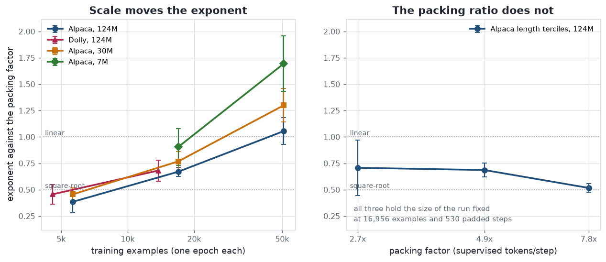
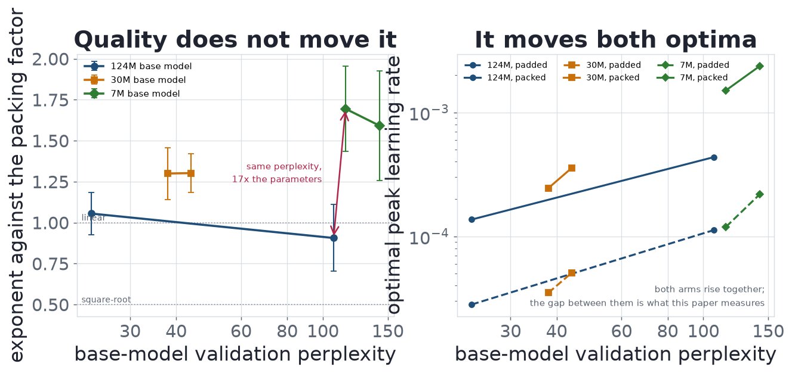
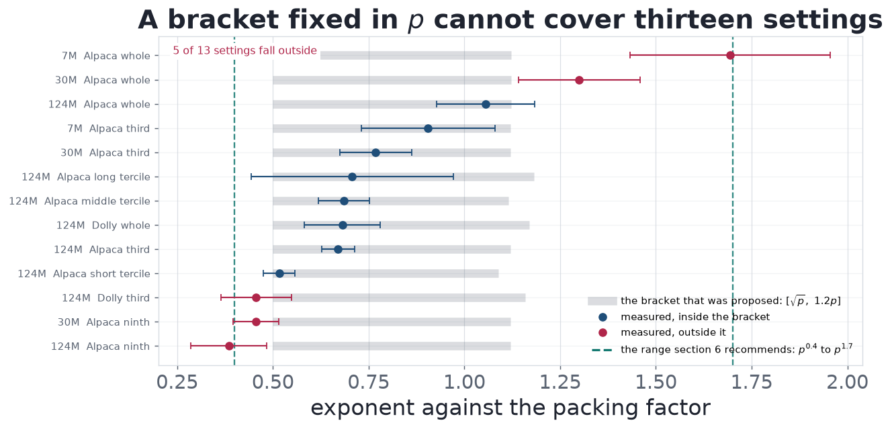
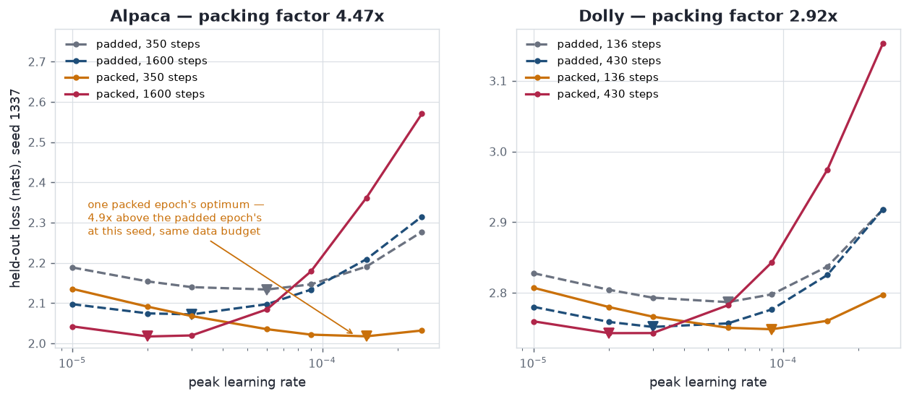
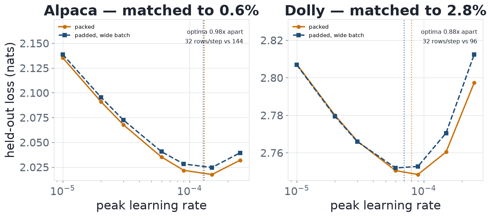

# Does Sequence Packing Change the Optimal Learning Rate?

---

## Abstract


Sequence packing is standard in supervised fine-tuning and is presented as an
efficiency change that leaves the model untouched. That identity holds per
example, not per optimizer step, and the literature nonetheless advises
inheriting the learning rate. We sweep it across thirteen settings, two corpora
and three model sizes spanning 17x, resolving with a 2x2 factorial a confound
that moves batch size and step count together at a fixed data budget.

Inheriting is expensive and more so as the model shrinks: retuning is worth
0.050 nats at 124M parameters, 0.110 at 30M and 0.172 at 7M. A control
identifies the mechanism -- a padded run whose accumulation is raised until it
matches a packed step finds the same optimum -- so packing acts on the learning
rate purely as a change of batch size. How large a change has no single answer:
as an exponent against the packing factor it runs 0.41 to 1.70, rising with the
scale of the run and as the model shrinks, while how well the base model was
pretrained moves both optima and not the distance between them. No fixed bracket
survives, so we give a range and a sweep instead. Six predictions were
registered before the deciding runs existed; five hold, one is reported
falsified, and four earlier findings are withdrawn after replication.


## 1. Introduction


Sequence packing -- concatenating several short training examples into one
fixed-length window, with attention masked at the boundaries so they cannot see
each other -- is standard practice in supervised fine-tuning. Its appeal is
arithmetic: instruction corpora are short relative to the context window, so a
padded batch spends most of its compute on padding. In the setting we study an
Alpaca example averages 113 tokens in a 512-token window and only ~58 are
supervised, so roughly 89% of every optimizer step is spent on positions that
contribute nothing to the loss, and packing recovers most of it: 4.40x the
supervised tokens per second at 1.02x the per-step cost.

Packing is usually presented as an efficiency change that leaves the model
untouched -- with the right masking and position ids, a packed example is
mathematically identical to the same example run alone. That identity holds per
example. It does not hold per optimizer step: a packed step here carries 4.5x
the supervised tokens of a padded one, which makes it a different step in
exactly the way a larger batch is a different step. Whether the learning rate
has to move with it is the question, and the practical literature says no.
Krell et al. (2021) advise against scaling the learning rate under packing,
reporting that it slowed convergence; their primary recommendation is to
*reduce* the computational batch size by the packing factor, which holds the
step's contents fixed and on our evidence needs no learning-rate change at all
(§6). Wang et al. (2025) state that "in packing mode, the batch size is no
longer directly proportional to the learning rate," and hold the rate at 1e-5
across padded and packed runs of LLaMA-3-8B and 70B. They do vary it once, in an
analysis that moves batch size and learning rate together along the linear rule
and finds the relationship holds under padding and breaks under packing -- which
points the same way as our result without saying where the optimum goes. Neither
paper sweeps the rate at a fixed batch to locate it, which is the measurement
that decides whether inheriting it is safe.

We sweep it. The measurement is complicated by a confound that is easy to miss
and that we ourselves initially missed: at a fixed data budget, packing changes
the number of optimizer steps in an epoch by the same factor it changes the
batch size, in the opposite direction, so any shift observed between "one packed
epoch" and "one padded epoch" is explained equally well by a rule with no
batch-size content. We resolve it with a 2x2 factorial that varies batch size
and step count independently, and then ask what the size of the resulting shift
is a function of. Beyond the sweep, we contribute a control that identifies the
mechanism (§4.4), a measurement of what the standard advice costs (§4.3), and
evidence that there is no exponent to report: it runs 0.412 to 1.695, rising
with the scale of the run and as the model shrinks (§4.6, §4.7) while being
indifferent to how well the base model was pretrained (§4.7.1, §4.7.2). Because
the scale reading was reached by elimination rather than by test, it was
committed to in advance on two corpora and at three model sizes.

## 2. Related work


**Sequence packing.** Krell et al. (2021) introduce packing without
cross-contamination for BERT, with the block-diagonal masking that makes a
packed example equivalent to an unpacked one, and address the hyperparameter
question in their Section 3.3: reduce the computational batch size by the packing
factor and otherwise change nothing; where the batch is kept, adjust LAMB's
decay parameters; and do not scale the learning rate, which reduced convergence
speed in their experiments. Their setting is BERT pretraining with LAMB, not
AdamW fine-tuning. Wang et al. (2025) study packing for supervised fine-tuning
at 8B and 70B over corpora from 69K to 1.2M conversations, keep the rate at 1e-5
in both arms, and report in their Section 5.3 that the linear relationship between
batch size and learning rate holds for padding and not for packing --
attributing this to packing not holding the number of conversations per batch
constant. That tests the linear rule along its own diagonal and points the same
way as our result; it does not locate the optimum at a fixed batch.

**Learning rate and batch size.** Smith et al. (2018) show that decaying the
learning rate and increasing the batch size produce the same learning curves, so
the two and the number of updates trade off against one another rather than
acting independently -- which is what makes the design in §3.2 necessary.
Shallue et al. (2019), over 35 workloads, find the batch-to-steps relationship
varies enormously between workloads rather than following one rule, and that
literature disagreements about batch size are largely explained by how
metaparameters were tuned at each batch size. For adaptive optimizers the rule
is contested: a square-root rule for Adam (Malladi et al., 2022), batch-size
invariance under linear scaling (Wang and Aitchison, 2024), and a non-monotone
optimum peaking at the gradient noise scale and reducing to square-root scaling
for `B << B_noise` (Li et al., 2024). The exponent is therefore already known to
depend on the optimizer and on where the batch sits relative to `B_noise`; this
paper's negative result is that it also depends on the scale of the run and the
size of the model. Our batch sizes -- 1,888 and 8,444 supervised tokens per step
-- sit in the regime where Li et al. predict square-root behaviour. We are not
aware of prior work measuring where the optimum sits when the batch size is
changed *by packing* rather than by the number of sequences, which is the case
where sequences per step and supervised tokens per step come apart.

## 3. Method


### 3.1 Setup


All runs fine-tune a 124M-parameter decoder-only transformer (RoPE, RMSNorm,
SwiGLU, 12 layers, width 768), pretrained from scratch on 2.46B tokens of
FineWeb-Edu, on Alpaca (50,868 training examples, 59 supervised tokens each) or
Dolly (13,756, 71). The held-out split is 2% of the corpus, drawn before the
over-length filter and seen by no run. Every run: window 512, micro-batch 8,
gradient accumulation 4, AdamW (b1 = 0.9, b2 = 0.95, weight decay 0.1), gradient
clipping at 1.0, fp16 autocast, cosine schedule from `max_lr` to `max_lr/10`
over a warmup of 6.25% of the schedule. Only the corpus, the packing flag, the
step count, the peak learning rate and the seed vary.

Packed batches use a block-diagonal attention mask keyed on per-example segment
ids and per-example RoPE positions restarting at zero; unit tests compare a
packed window's logits and *gradients* against the same examples run alone, and
they agree to 5e-7 relative. The objective is token-mean cross-entropy over
supervised positions, so packing changes the *number* of terms averaged and not
the scale of the gradient: it reduces gradient noise without altering step size,
which is what makes this a batch-size effect rather than a disguised change in
effective learning rate. Validation is computed on *unpacked* batches in both
arms, so one ruler covers the grid, and because every run completes a full cosine
cycle the endpoint is the comparable quantity.

**Seeds.** The script derives its held-out split by shuffling with the training
seed, so two seeds score on different validation examples. The offset is large
(~0.10 nats on Dolly) but shared by every learning rate within a seed, so it
cancels out of that seed's argmin and not out of a pointwise average. We solve
each seed's curve for its own optimum and report the geometric mean and spread
across seeds, never a seed-averaged loss. Appendix C gives the seed accounting
for every cell.

### 3.2 The confound, and the design that resolves it


Packing multiplies supervised tokens per optimizer step by the packing factor
`p` (here 4.47x, from 1,888 to 8,444 -- the ratio of *supervised tokens*, which
is what the batch effect is defined against, and slightly smaller than the 4.53x
ratio of windows). At a fixed budget of one epoch it also divides the number of
optimizer steps by about the same factor, from 1,600 padded to 350 packed. Two
rules therefore predict the same observed shift: **batch scaling**, under which
`lr*` tracks supervised tokens per step and should rise ~4.47x linearly or
~2.11x as a square root regardless of steps run, and the **schedule integral**,
under which `lr*` tracks 1/steps so that `max_lr x steps` is conserved
regardless of batch size. On the two cells historically run they are
indistinguishable -- both predict roughly 4.5x, and the values this project
originally measured fit both to within 10%.

They come apart off the diagonal, so we run the full factorial: padded and
packed, at 350 and at 1,600 steps. Batch scaling predicts the optimum depends on
the row only; the schedule integral predicts the column only. Holding the step
count fixed while varying batch size means the smaller batch sees proportionally
less data, which is not a defect but the definition of a larger batch; the
packed 1,600-step cell conversely runs 4.50 epochs, where overfitting rather
than the learning rate may set the minimum, and it is excluded from the headline
for that reason (Appendix B).

### 3.3 Grid


Learning rates {1.0, 2.0, 3.0, 6.0, 9.0, 15.0, 25.0} x 1e-5 in every cell —
seven points at 1.5-1.7x spacing over a 25x span, chosen so that both
hypotheses' predicted optima fall in the interior with room on either side. An
optimum landing on an edge is reported as unbracketed rather than as a value,
and the window is extended rather than the curve dropped wherever dropping it
would move the surviving estimate in a known direction (Appendix C). Each cell's
optimum is estimated by fitting a parabola in log(lr) through the grid argmin and
its two neighbours. The grid is first run at seed 1337 to locate the optima, then
repeated at two further seeds on the points bracketing each.

**How the shift is summarised.** We report each comparison as an exponent,
`alpha = log(shift) / log(p)`. This is the quantity a practitioner would raise
`p` to, and it is the natural summary -- but it is a *normalization*, not a
measured law, and where two settings have different `p`, comparing their
exponents compares the normalization along with the data. The scale series of
§4.6 and the model-size series of §4.7 hold `p` fixed to within 1%, so any
monotone rescaling leaves their ordering alone; the comparisons that do cross
`p` are §4.5's terciles and §4.6's two cross-corpus pairs, and Appendix G
repeats all three conclusions under two alternative normalizations.

### 3.4 The wide-batch control


The factorial changes the batch by packing in every cell, so it cannot say which
property of the larger batch the optimum responds to. One further cell does:
`wide`, which leaves packing off and raises gradient accumulation from 4 to 18
until an unpacked step carries the same supervised tokens as a packed one. At the
packed cell's step count it also matches on examples per step and on data seen,
so the two cells agree on every quantity a batch-size rule could be a function of
and differ only in representation. §4.4 reports it.

## 4. Results


### 4.1 The full factorial


Seven learning rates per cell; the full loss grids for both corpora are in
Appendix E. Every optimum is bracketed — an interior minimum with a rise on both
sides — including the packed 350-step cell, which this project had previously
swept only as far as 1.5e-4 and could not bracket. Interpolating in log(lr),
after seed replication (Appendix C):

| lr* | Alpaca, 350 steps | Alpaca, 1,600 | Dolly, 136 steps | Dolly, 430 |
| --- | ---: | ---: | ---: | ---: |
| **padded** | 5.00e-5 | 2.81e-5 | 4.89e-5 | 3.78e-5 |
| **packed** | 1.37e-4 | 2.35e-5 | 7.84e-5 | 2.44e-5 |

All eight optima are bracketed. The row structure is what batch scaling predicts
and the column structure is what the schedule integral predicts; the packed
column at the padded step count is the cell that separates them, and it moves
with the row.

The curves themselves are in Appendix E, beside the full loss grids.

### 4.2 The second corpus, and a prediction that failed


Dolly is the out-of-sample test: a different corpus at a packing factor of 2.92x
in supervised tokens per step. Before any Dolly run finished, the Alpaca batch
exponent as it then stood (0.673, and 0.670 after replication) was recorded as
predicting a Dolly batch effect of 2.92^0.673 = **2.06x**. The measured value is
**1.60x**, an exponent of **0.440** over three seeds.

The prediction fails, and in an informative direction: 1.60x is close to the
square-root rule's 1.71x, while Alpaca's 2.73x sits well above its own
square-root prediction of 2.11x. The failure is larger than the noise — both
cells were run at three seeds with spreads of 1.08x and 1.03x, about 1.09x
combined on their ratio, and the prediction misses by 1.28x, roughly 2.9 times
that spread. At a matched data budget the two corpora shift 4.86x and 2.07x, or
**1.055** and **0.681** as exponents; Appendix F has every comparison.

We therefore do not fit a shared power law. The
obvious reading is that the exponent is corpus-dependent; §4.5 tests that against
five settings and finds it wrong, and §4.6 supplies the reading that replaces it.
Either way, **the shift is real and large on both corpora, and it is not
described by one exponent.**

### 4.3 What the standard advice costs


Taking each corpus's padded optimum — 3e-5 on both — and applying it unchanged
to the packed run at the same data budget:

| | padded at its optimum | packed, inherited | packed at its optimum |
| --- | ---: | ---: | ---: |
| Alpaca | 2.0720 (3e-5) | 2.0678 (3e-5) | **2.0175** (1.5e-4) |
| Dolly | 2.7517 (3e-5) | 2.7662 (3e-5) | **2.7484** (9e-5) |

Retuning is worth **0.050 nats on Alpaca and 0.018 on Dolly** against
inheriting. Against the padded baseline instead, the packed run at its own
optimum wins on both corpora while the inherited-rate run wins on neither —
0.004 nats better on Alpaca, a wash at this scale, and 0.015 *worse* on Dolly.
A practitioner who turns packing on and changes nothing else collects, at best,
none of the quality packing had available.

**That gain does not transfer, and it reverses.** Registered before any of it
existed, the three conditions were re-run with checkpoints kept — reproducing
the losses above to 0.0000 nats — and scored on Dolly's held-out split, which
none of them saw. **The retuned run loses there by 0.087 nats, having won by
0.050 on Alpaca** (2.9739 against 2.8873, and 2.0175 against 2.0678): the
comparison reverses sign by more than the gain it reverses, and on Dolly the
*inherited* run ranks first of the three. The 0.050 nats is real and
reproduces; it is a gain on the corpus being tuned, which is what §5 says every
number here is. One seed, and Dolly is a second instruction corpus rather than a
downstream task. Appendix H has the rest, including the caution that the batch
effect, the step effect and the matched-budget shift are three views of the same
four optima.

### 4.4 Is it the batch, or is it the packing?


Everything so far treats packing as a way of changing the batch size. The
factorial cannot check that, because in all four cells the batch is changed by
packing and by nothing else. Packing moves two things a batch-size rule might key
on: it multiplies supervised tokens and examples per step by `p`, and it leaves
the number of forward-pass rows per step unchanged. Those come apart if the same
batch is assembled the other way.

The match is within 0.6% on Alpaca and 2.8% on Dolly (Appendix K). The two arms
differ only in whether those examples arrive packed into shared windows or padded
into their own — which costs the padded arm several times the forward-pass rows
for the same gradient, and is the entire reason packing exists.

| | packed lr* | wide lr* | ratio | batch rule predicts | rows rule predicts |
| --- | ---: | ---: | ---: | ---: | ---: |
| Alpaca | 1.30e-4 | 1.28e-4 | **0.98x** | 1.00x | 4.47x |
| Dolly | 7.98e-5 | 7.00e-5 | **0.88x** | 1.00x | 2.92x |

**The rows rule is dead on both corpora**, rejected by factors of 4.6 and 3.3.
**Packing's effect on the learning rate is a batch-size effect, and the identical
optimum is reachable without packing at all — by padding, at several times the
compute.**

The batch rule is matched closely but not exactly: Alpaca's 0.98x sits inside
that cell's seed spread of 1.11x, while Dolly's 0.88x sits outside its much
tighter 1.03x. The residual has a direction that makes the agreement look worse
than it is rather than better; we do not have an explanation for it, and two
candidates do not survive checking. Appendix K gives both, and the caveat that
each wide cell is a single seed.

### 4.5 What the exponent is not a function of


§4.2 leaves the exponent disagreeing between two corpora, and the obvious
reading is that it is corpus-dependent. Alpaca's length terciles separate that
from the packing ratio, which moves while the corpus does not, and neither
survives: two *different* corpora at similar ratios differ by 0.026 against a
combined bound of 0.282, and across the three terciles the exponent spans 0.191
against a bound of 0.268, or 0.7x its own noise. The tercile trend was a finding
until the terciles were replicated, and is reported as unsupported. Splitting by
length also cannot move the ratio alone, because the ratio *is* a function of
the lengths, which is why §4.6 changes scale instead. Appendix I gives the
table, the bounds and the behaviour under two alternative normalizations.

### 4.6 What it is a function of


The one comparison in §4.5 that clears its bound is between a corpus and a
third of itself. That was reached by elimination, so we tested it: before any
run existed we registered the prediction that a *random* third of Alpaca --
matched to the whole corpus on packing factor, on supervised tokens per padded
step and on length distribution, differing only in scale -- should land near
0.67 if scale governs and near 1.055 if it does not. It measures **0.670 ±
0.043** over three seeds, against a registered 0.67.

Extending to a third point, with everything but scale held, the exponent runs
**0.412 ± 0.136** over a random ninth of Alpaca (5,652 examples), **0.670 ±
0.043** over a random third (16,956) and **1.055 ± 0.128** over the whole
corpus (50,868), at packing factors of 4.53x, 4.51x and 4.47x. Appendix F
carries every comparison with its bound.

The exponent rises monotonically across a ninefold span of scale, and both steps
clear their combined bounds — 1.8x and 2.9x.



*Left: the exponent against the size of the run, with packing factor, padded
batch and length distribution held — on both corpora and, from §4.7, at all
three model sizes. Every series rises, and the smaller the model the higher it
sits, though only the 124M-to-7M span separates. Right: the exponent against the
packing factor across Alpaca's three length terciles, which hold the size of the
run fixed instead; without the error bars its three points look like a trend.*

**It replicates on the second corpus**, and that replication was registered in
advance and directional: a random third of Dolly should land below the whole
corpus by more than the combined bound. Dolly's whole corpus is 0.681 ± 0.099 and
its third is **0.456 ± 0.092**, a gap of 0.225 against a bound of 0.135. **It
also explains the prediction that failed in §4.2**, which assumed the two corpora
share an exponent: they differ in scale by 3.7x, and matched on scale the
disagreement goes away -- Alpaca's random third reads 0.670 against Dolly whole's
0.681, and Alpaca's ninth 0.385 against Dolly's third 0.456, agreement to 0.10x
and 0.27x of their own noise, while one corpus moved 3x in scale disagrees with
*itself* by 2.85x its bound. Those two pairs are worth more than the rest of this
section, for the reason §5 gives: every other scale comparison here is a corpus
against a nested subset of itself.

**A retraction worth reporting.** Before replication the three Alpaca points sat
exactly 3x apart in scale with exponent differences of +0.369 and +0.371 — a
straight line in log(scale) with residuals of ±0.0006. We declined to call it a
law at the time, on the grounds that residuals two orders of magnitude below the
seed bounds are coincidence rather than signal. Replication settles it: the
differences are now **+0.258 and +0.385** and the line is gone. What survives is
the monotone increase, at roughly 0.3 of exponent per tripling of scale, with no
functional form behind it.

### 4.7 Three model sizes


To test whether any of this survives a change of scale in the model rather than
in the data, we pretrained two more on the same corpus with the same
architecture: 30M (`small`) and 7M (`mini`). With the 124M model that is three
sizes about 4x apart, spanning 17x. Every hyperparameter that could confound a
size comparison is held at the 124M run's value and the window is fixed at 512 in
all three, so the packing factors, per-step token counts and cell step counts
carry over unchanged: the only thing that differs is the base model.

Repeating the scale series at each size puts the whole corpus at 1.055 ± 0.128,
1.300 ± 0.159 and **1.695 ± 0.261** across 124M, 30M and 7M, its random third
at 0.670, 0.768 and 0.905, and its random ninth at 0.385 and 0.456 for the two
sizes it was run at. Appendix F has the full table; the left panel of the figure
in §4.6 draws all three series together.

**The effect is not a 124M artefact, and it grows as the model shrinks.** One
packed epoch of Alpaca wants 4.86x the padded learning rate at 124M, 7.01x at 30M
and **12.66x** at 7M — the largest shift measured anywhere here, from 1.19e-4 to
1.51e-3. Retuning is worth 0.050 nats at 124M, 0.110 at 30M and **0.172** at 7M.

**The scale dependence replicates at every model size, and the first
replication was registered before it ran.** Within each model the whole corpus
sits above a third of it by more than the combined seed bound: 2.8x at 124M,
2.9x at 30M, 2.5x at 7M; against a ninth, 3.4x and 5.0x. The 30M case was
registered while the 30M pretraining run was still going, committing to
direction plus margin -- that Alpaca's exponent would exceed its third's by
more than 0.135. The measured gap is 0.531, and this is the
paper's most repeated result.

**Model size moves the exponent across the full span, but not between adjacent
sizes.** Every point estimate is ordered the same way — all six pairs put the
smaller model higher — and one comparison clears its bound: 1.695 against 1.055,
a gap of 0.640 against 0.291, or 2.2x across 17x of model size. The adjacent
steps are 1.2x and 1.3x of their bounds.

### 4.7.1 The pretraining budget is not what moves it


Both smaller models were trained about twice as heavily for their size as the
124M model, so we measured that axis rather than caveating it. **Halving the
pretraining budget does not move the exponent:** four pairs differ by 0.019,
0.002, 0.019 and 0.103 against combined bounds of 0.137, 0.198, 0.266 and 0.424,
the smallest differences anywhere in this paper. **It does move both optima, and
by the same factor**, leaving the distance between the arms untouched -- the
right-hand panel of the figure in §4.7.2 draws it. Appendix J has the table.

### 4.7.2 Model size, or model quality?


A smaller model trained on the same corpus is also a worse model, so *smaller*
and *worse* are confounded throughout §4.7, and the trend has a second reading in
which the exponent tracks not parameter count but how badly the base model models
language. The confound is separable because the 124M pretraining run
checkpointed every 500 steps and its perplexity trajectory passes through the
smaller models' final values. Fine-tuning the whole-Alpaca factorial from those
checkpoints gives 124M models *at the smaller models' quality*, with everything
else held: same architecture, window, 4.47x packing factor, two cells, estimator
and three seeds. The prediction was registered before any run of it existed, with
H1 — that the exponent tracks parameter count — as the prediction of record.

**The exponent tracks parameter count, not base-model quality.** At the 7M
model's perplexity and the 124M model's parameter count it reads 0.906: 0.789
below 7M's 1.695, or 2.7x the registered margin, and 0.149 from the fully
pretrained 124M model's own 1.055 against a combined bound of 0.241. Base-model
quality was moved by a factor of 4.6 in perplexity and the exponent did not
follow it. H1 is confirmed on the criterion named in advance, and the middle of
that range — `step_2500` at perplexity 39.4 — was registered separately and holds
too, at **1.133 ± 0.107** against a requirement to land below 1.178. It passes by
0.045 rather than by the extreme point's 2.7x, and the three estimates (1.055,
1.133, 0.906) are not monotone; no pair of them separates, at 0.46x to 0.98x of
their bounds, so what the axis establishes is flatness at this resolution rather
than a shape.

**It does move both optima, by three to four times** — the padded optimum rises
4.00x and the packed one 3.20x, with the midpoint between at 1.86x and 2.09x. That is §4.7.1's finding over a much longer
range, and the registration expected it and recorded in advance that it
discriminates nothing between the two hypotheses. It is the practical half: a
practitioner reading an *optimum* off this paper would be wrong by 4x if their
base model were as undertrained as this one, while reading the *shift* off it
would not.



*Left: the exponent against the base model's validation perplexity. The 124M
series stays flat across the whole quality range these three models cover, while
the 7M model sits at the same perplexity as its worst point and more than half an
exponent above it. Right: the optima themselves, which rise together as the base
model gets worse while the distance between them does not. Perplexities are read
from each model's own pretraining log.*

**What this does not settle**, all recorded in the registration before the
runs existed: an early checkpoint of a large model is not a converged small
one -- at step 500 of 20,000 the weights are 2.5% of the way through a cosine
schedule, so matching on perplexity matches one number and not the state,
which is the main reason to read this as evidence about the confound rather
than as its dissolution. Perplexity is also one axis of quality among several,
and this is one corpus at one packing factor.

## 5. Threats to validity


**Three model sizes, two source corpora, and a ratio axis built by subsetting
them.** The model-size axis is three points about 4x apart, which is a direction
rather than a curve: the ordering is consistent across all six pairwise
comparisons, but only the 17x extreme on the whole corpus separates from its seed
bound, and all three sizes are far below any model that would be fine-tuned in
practice. The packing-ratio axis covers eight settings from 2.73x to 7.84x, but
six are subsets of the same two corpora, so it is covered by re-slicing two
datasets rather than by eight, and a property shared by both sources would not
show up as variation anywhere in it. The model-size axis re-uses those same
subsets, so the two axes are not independent. That is still enough to rule the
corpus out and to establish the scale dependence on both corpora, because those
are comparisons *within* the nesting; two comparisons escape it -- Alpaca's third
against Dolly whole, and Alpaca's ninth against Dolly's third -- and they are the
only evidence here that survives the objection in full. Two pairs are not many,
and it is not enough to estimate a law.

**Model size was confounded with base-model quality**, and §4.7.1 and §4.7.2
rule that out across a doubling of the pretraining budget and a 4.6-fold change
in perplexity. What is left open is the shape rather than the direction: an
early checkpoint of a large model is not a converged small one, and matching on
perplexity matches one number and not the state of the weights.

**Small absolute batch, and three design confounds.** At 1,888 and 8,444
supervised tokens per step both arms sit well below the batch sizes at which
scaling rules are usually measured — the regime where Li et al. (2024) predict
square-root behaviour, which we assume rather than establish: our own attempt
puts the noise scale *below* both arms across five settings, though too spread
between settings that should agree to quote a value. Appendix M records three more: fp16 overflow at
the top of a grid, which every run log argues against; a warmup that is a fixed
*fraction* of the schedule, so the step effect is measured across cells warming
up over 22 steps and over 100; and a fixed-step comparison that necessarily
varies data seen. §4.3's losses are seed 1337
throughout and its sign turns on one grid point. Each held-out split shares a
distribution with its own training split, so the optimum here is not the optimum
for a downstream pipeline — which §4.3 measures rather than assumes, and which
bites harder than that phrasing suggests.

## 6. What to do about it


The result is not that packing is bad: packed and padded runs are equivalent per
example by construction, and at its own learning rate the packed run is the best
run on both corpora. The result is that the learning rate is not part of what
packing leaves alone.

**Krell et al.'s recipe is the safe one, and §4.4 is why.** Their recommendation
is not to inherit the rate at an unchanged batch; it is to *reduce the
computational batch size by the packing factor* and otherwise change nothing.
Under §4.4 that is exactly right, for a reason their paper does not need to
invoke: if the optimum tracks supervised tokens per step, then holding tokens per
step fixed holds the optimum fixed. The failure mode this paper documents is the
other practice — keep the batch, keep the rate, take the throughput — which is
what turning a `packing=True` flag on gives a practitioner by default. The two
recipes differ by a factor of `p` in supervised tokens per step, and that factor
is the entire effect, computed from supervised tokens per step and not from the
ratio of windows (4.47x against 4.53x on Alpaca).

**Retune, and sweep rather than scale.** An earlier draft offered a bracket:
look for the packed optimum inside `[lr_pad * sqrt(p), lr_pad * 1.2p]`. It held
on the five settings it was drawn from and fails on five of the thirteen now
measured, in the pattern the figure below shows: below the floor at the three
smallest-scale settings, where the exponent is under the 0.5 that `sqrt(p)`
assumes, and above the ceiling at the two smaller models on the largest corpus.
A bracket fixed in `p` cannot work when the exponent itself moves with the scale
of the run and the size of the model.



*The grey band is the proposed bracket, which in exponent terms is 0.5 at the
floor and log(1.2p)/log(p) -- about 1.12 to 1.17 here -- at the ceiling. The
dashed verticals are the range this section recommends instead. Error bars are
the seed bound of §4.5.*

What the measurements support instead is a range: across all thirteen settings
the exponent runs **0.412 to 1.695**, so the packed optimum sits somewhere in
`[lr_pad * p^0.4, lr_pad * p^1.7]`, a span of `p^1.3` that three to six points at
1.6x spacing cover. That spacing is coarse on purpose and how coarse it can be is
measured: the loss curve's curvature near its minimum is consistent across three
model sizes, both arms and a 13x range of optimal rate, so landing one 1.6x step
off the bottom costs 0.006 to 0.015 nats against the 0.050 to 0.172 that
inheriting costs, and a sweep this coarse captures 84% to 97% of what retuning is
worth (Appendix M). **Precision is cheap and being in the right neighbourhood is
not.** A larger run and a smaller model both push the exponent up, so
production-scale training should look in the upper half; how well the base model
was pretrained does not narrow it at all, so a practitioner cannot transfer our
`lr_pad`, only the distance from theirs.

**Do not tune this at a matched step count**, which is a different question — at a
matched step count the packed arm consumes `p` times the data and runs enough
epochs that the apparent optimum is set by which rate overfits least (Appendix B).
**And report which comparison you ran.** The reason the literature can assert that
the rate need not move, and the reason our own earlier reading of these corpora
called the shift linear batch scaling, is the same: at a fixed data budget packing
moves batch size and step count together, and a single ratio measured across that
diagonal is consistent with rules that disagree everywhere else.

## 7. Conclusion


Standard advice says packing is an efficiency change and the learning rate can
be inherited through it. It does not survive a sweep: the optimum moves by 1.7x
to 12.7x across the settings measured here, and on several of them a packed run
at the inherited rate does not beat the padded run it inherited from. What
packing is doing is settled as far as this evidence goes -- the same batch
assembled by padding, at several times the forward-pass cost, reaches the same
optimum -- which is why Krell et al.'s recipe needs no learning-rate change and
packing to make the step *bigger* is what is exposed. How much it moves is not
settled and we think not settleable as the question is usually asked: the
exponent runs 0.41 to 1.70, rises with the scale of the run and as the model
shrinks, and is indifferent to how well the base model was pretrained. A bracket
we proposed in an earlier draft fails on five of thirteen settings and is
retracted here rather than quietly dropped. Until then, the sweep in §6.

## References


- Goyal, Dollár, Girshick, Noordhuis, Wesolowski, Kyrola, Tulloch, Jia, He (2017). *Accurate, Large Minibatch SGD: Training ImageNet in 1 Hour.* arXiv:1706.02677
- Krell, Kosec, Perez, Fitzgibbon (2021). *Efficient Sequence Packing without Cross-contamination: Accelerating Large Language Models without Impacting Performance.* arXiv:2107.02027
- Li, Zhao, Zhang, Sun, Wu, Jiao, Wang, Liu, Fang, Xue, Tao, Cui, Wang (2024). *Surge Phenomenon in Optimal Learning Rate and Batch Size Scaling.* NeurIPS 2024. arXiv:2405.14578
- Malladi, Lyu, Panigrahi, Arora (2022). *On the SDEs and Scaling Rules for Adaptive Gradient Algorithms.* arXiv:2205.10287
- McCandlish, Kaplan, Amodei, OpenAI Dota Team (2018). *An Empirical Model of Large-Batch Training.* arXiv:1812.06162
- Shallue, Lee, Antognini, Sohl-Dickstein, Frostig, Dahl (2019). *Measuring the Effects of Data Parallelism on Neural Network Training.* JMLR 20(112):1-49. arXiv:1811.03600
- Smith, Kindermans, Ying, Le (2018). *Don't Decay the Learning Rate, Increase the Batch Size.* ICLR 2018. arXiv:1711.00489
- Wang, Aitchison (2024). *Batch size invariant Adam.* NeurIPS 2024. arXiv:2402.18824
- Wang, Wang, Wang, Li, Hovy, Guo (2025). *Packing Analysis: Packing Is More Appropriate for Large Models or Datasets in Supervised Fine-tuning.* Findings of ACL 2025, 2025.findings-acl.256. arXiv:2410.08081

*(Author lists, titles and venues checked against the arXiv, JMLR and ACL
Anthology records. The three claims attributed to Krell et al. in section 2 —
the advice against learning-rate scaling, the LAMB heuristic, and reducing the
computational batch size by the packing factor — are their section 3.3. The
three claims attributed to Wang et al. -- the quoted sentence, the 1e-5 held
across both arms, and the batch-size-and-learning-rate comparison -- are their
section 5.3 and their training-details table, checked against arXiv:2410.08081v3
on 2026-08-30. The
linear-scaling claim attributed to Wang and Aitchison, including their remark
that the linear and square-root rules are "not a contradiction: both are
correct in their respective setups", is their section 1; the square-root camp
they place it against is Granziol et al. (2022), Malladi et al. (2022) and
Hilton et al. (2022), of which we cite the second.)*
## Appendix

Material the argument rests on but does not need in
line: the check that the harness reproduces the measurement it replaces, the
methodological trap that shaped the design, the seed accounting behind every
optimum, and how to re-run all of it.

## A. The harness reproduces the original measurement


Nine of the grid's learning rates were run in this project before, under the
hand-written configs of section 10.6. Eight reproduce to four decimals and the
ninth differs by 0.0001:

| cell | 2.0e-5 | 3.0e-5 | 6.0e-5 | 9.0e-5 | 1.5e-4 |
| --- | ---: | ---: | ---: | ---: | ---: |
| packed, 350 steps — prior | 2.0912 | 2.0678 | 2.0352 | 2.0217 | 2.0175 |
| packed, 350 steps — here | 2.0911 | 2.0678 | 2.0352 | 2.0217 | 2.0175 |
| padded, 1,600 steps — prior | 2.0745 | 2.0720 | 2.0973 | — | — |
| padded, 1,600 steps — here | 2.0745 | 2.0720 | 2.0973 | — | — |

The sweep is therefore measuring the same quantity the original tables did, on
generated configs, and the two new cells are directly comparable to the two old
ones.

## B. The overfitting trap, and the metric it biases


Neither factorial decomposes cleanly. Read Alpaca's batch effect at 1,600 steps
rather than 350 and it is **0.83x** — the optimum moves the wrong way — and
Dolly's at 430 steps is **0.64x**. Both anomalies live in the same place: the
packed cell at the long step count, which runs 4.50 epochs on Alpaca and 2.92 on
Dolly.

Those cells overfit. Alpaca's best validation loss arrives at step 684–1368
rather than at the end, and it arrives earlier the higher the learning rate, so
the apparent optimum is set by which rate overfits least by the final step.
Scored on best-during-run instead of endpoint, Alpaca's packed 1,600 optimum
rises from 2.25e-5 to 3.61e-5 — both seed 1337, so that the two metrics are
compared on one curve — and the anomaly shrinks without disappearing.

How far this reaches is worth measuring rather than asserting, because the
choice of metric is otherwise invisible. Scoring every cell in the study both
ways — 17 cells at seed 1337, across five corpora, both packing modes, and the
wide-batch control:

| epochs the cell runs | cells | optimum under best-checkpoint scoring |
| --- | ---: | --- |
| 0.22 to 1.01 | 15 | unchanged, **1.00x in every one** |
| 2.92 (Dolly packed, 430 steps) | 1 | **1.29x** |
| 4.50 (Alpaca packed, 1,600 steps) | 1 | **1.60x** |

The threshold is sharp, and nothing in this study falls between 1.01 and 2.92
epochs to soften it. In all fifteen cells at or under one epoch no run peaks
before its final step, so the two metrics are not merely close — they are the
same measurement, and return the same optimum to the digit. At 1.01 epochs runs
do begin to peak early, but by 0.0005 nats, and the optimum still does not move.
Only past about three epochs does the choice of metric change the answer. How
far past matters: the 4.50-epoch cell's 1.60x exceeds every seed spread measured
anywhere in this study, including the 1.37x of Appendix C, while the 2.92-epoch
cell's 1.29x exceeds the worst spread among the 124M cells this table covers
(1.25x) but not that 1.37x. So the first is a metric effect larger than the
noise on any cell here and the second is at the edge of it, which is one more
reason to keep both out of the headline rather than to correct them.

The mechanism is specific, and it is why the bias has a direction rather than
being noise. The endpoint penalty — how much a run gives back after its own best
checkpoint — rises monotonically with the learning rate, from 0.0000 to 0.4269
nats across Alpaca's packed 1,600-step grid and from 0.0000 to 0.2962 across
Dolly's packed 430-step grid. The endpoint metric therefore charges the higher
learning rates for overfitting they did *after* already passing their own
minimum, and the argmin moves down for a reason that has nothing to do with step
size.

The general form is worth stating for anyone running this design: **at a matched
step count, an arm that runs many epochs reports an optimum depressed by
overfitting, and a factorial that ignores this attributes the depression to
whatever else that arm varied.** `scripts/analyze_lr_scaling.py` excludes cells
past 1.5 epochs from its headline for this reason, and
`scripts/analyze_metric_bias.py` reproduces the table above.

## C. Status of the evidence


Alpaca's four optima were re-run at seeds 1338 and 1339 on the three learning
rates bracketing each. Solving each seed's curve separately, as 3.1 requires,
the optima are 5.00e-5, 2.81e-5, 1.37e-4 and 2.35e-5, with max/min spreads
across seeds of 1.13x, 1.17x, 1.11x and 1.08x. The first three aggregate all
three seeds. The packed 1,600-step cell aggregates two: at seed 1339 its minimum
falls on the edge of the three points that were run for replication, so that
curve brackets nothing and we drop it rather than extrapolate from it. That cell
is excluded from the headline in any case (Appendix B). None of the effects in §4.2 or
§4.3 changes sign or materially in magnitude against the single-seed values.

Dolly's three cells that are not overfitting-contaminated were replicated the
same way, with spreads of 1.08x, 1.11x and 1.03x. That spread is the yardstick
§4.2 is measured against: it is what makes a 1.28x miss a failed prediction
rather than a noisy one.

The six subsets of §4.5 and §4.6 were replicated the same way, and every
exponent quoted from them carries the resulting bound. Worst-cell spreads run
1.06x to 1.25x: Alpaca's short, middle and long terciles at 1.08x, 1.20x and
1.25x, its random ninth and third at 1.19x and 1.06x, and Dolly's third at
1.10x. Every cell brackets its optimum at all three seeds.

That last sentence is newer than the rest of this appendix. The middle tercile
and the random ninth stood at two seeds each for most of this study, because in
each a third seed put its minimum on the edge of the replicated points and the
rule elsewhere is to drop such a curve rather than extrapolate from it. Both
have now been extended instead, one point each, and both bracket. The reason for
extending is the one §4.7.2's padded cell already established: dropping is only
neutral when the drop is not systematic, and neither of these was. The ninth's
dropped seed sat *above* its window and the tercile's *below* it, so dropping
them biased one exponent down and the other up. Alpaca's packed 1,600-step cell
was extended at the same time and now brackets too, which leaves **no curve
anywhere in this paper resting on fewer than three seeds, and none dropped**.

It moved two numbers, both inside their own bounds and both with the bound
roughly doubled, because the curve that had been dropped was in each case the
one furthest from the other two. The middle tercile went from 0.686 ± 0.067 to
**0.651 ± 0.133** and the random ninth from 0.385 ± 0.100 to **0.412 ± 0.136**.
The ninth is one end of the range §6 recommends, so the paper's headline span is
now 0.412 to 1.695 rather than 0.385 to 1.695, and the first step of §4.6's
scale series clears its combined bound by 1.8x where it previously cleared it by
2.6x. Nothing changes sign and no conclusion turns, but the scale series is
measurably weaker at its small end than the earlier version of this appendix
claimed, and that is the direction an honest replication is expected to move in.

Two earlier replications had already changed a number this paper reported, and
both are recorded where they were claimed. The random third moved from 0.685 to
0.670 — *toward* the value registered for it, not away. The random ninth moved
from 0.316 to 0.385, which dissolved the straight line §4.6 had already flagged
as too regular to be real, and has now moved again to 0.412 for the reason
above. Neither reverses a conclusion; the second retires an artefact, and §4.6
reports it as the caution being borne out rather than quietly restating the
table.

The loss tables in §4.1 and the inherit-versus-retune table in §4.3 are seed 1337
throughout. They have to be: a seed changes which examples are held out, so
losses are comparable down a column within one seed and not across seeds. Only
the optima are aggregated across seeds, and only after each seed is solved on
its own curve. One consequence is worth stating plainly: the replication seeds
were run on the points bracketing each optimum, which does not include the
inherited rate, so §4.3's comparison has no cross-seed check behind it. That is
the reason §4.3 leans on the inherit-to-retune distance rather than on the sign
of the inherit-to-padding difference.

The three cells of §4.7 and §4.7.1 that are not at 124M were replicated the
same way, and here the replication is cleaner than at 124M: all fourteen cells
across the 30M, 7M and matched-budget-30M ledgers bracket their optimum at all
three seeds, with none dropped. Their spreads run 1.06x to 1.37x — 30M's six
cells at 1.06x to 1.23x, the matched-budget 30M's four at 1.09x to 1.17x, and
7M's four at 1.20x to 1.37x. The 7M packed 350-step cell's 1.37x is the widest
spread among them, which is why §4.7's bounds are widest at 7M and
why the model-size claim is stated only at the 17x span: the smallest model is
also the noisiest, and the bounds carry that through rather than around it.

Two cells there were bracketed only after the fact, and the sequence is worth
recording because it is the same trap §3.3 warns about. On the 7M model the
replication seeds were first run on the three learning rates bracketing seed
1337's optimum, and on three of the eight cells a replication seed put its
minimum on the *edge* of that window — twice at the top and once at the bottom.
Dropping those curves, as we do elsewhere, would have left the 7M random third
resting on a single seed with a ±0.006 bound that reflected nothing. But the
drops were not symmetric — two of the three fell above their window — so
dropping them would have biased the surviving estimate downward rather than
merely widening it. We extended the window instead, at four more runs, and all
three then bracketed. The bound on that cell went from ±0.006 to ±0.174, which
is the honest number and is nearly forty times larger.

The two ledgers added last — §4.7.1's 7M matched-budget control and §4.7.2's
quality control — were replicated the same way, and needed the window extended
twice more. All four cells of the 7M matched-budget ledger now bracket at three
seeds, with spreads of 1.15x, 1.23x, 1.25x and 1.62x; the last of these, its
padded whole-corpus cell, is the widest spread anywhere in this study and is why
§4.7.1 calls that pair the weakest of its four even though it agrees with them.
Both of §4.7.2's cells bracket at three seeds, at 1.22x and 1.26x.

Three curves across those two ledgers first put their minimum on the edge of the
replicated window — two at the top, one at the bottom — and in each case
dropping the curve, which is the rule everywhere above, would have moved the
surviving estimate in a known direction rather than merely widening it. The
window was extended instead, as it was for the 7M random third: six more runs.
The case worth stating is §4.7.2's, because it ran against the hypothesis being
tested. Its padded cell's unbracketed seed sat above the other two, so dropping
it would have pulled that arm down and pushed the exponent *up*, toward the
quality reading its registered prediction argued against. On two seeds that
exponent read 0.946; on three it reads 0.906. Both confirm H1 and the difference
is well inside the bound either way, but the drop would not have been neutral,
and reporting the two-seed number as though it were would have been wrong.

Everything in §4.1 through §4.6 is one model size (124M) on two corpora at one
window length; §4.7 adds two more sizes, §4.7.1 a second pretraining budget at
two of them, and §4.7.2 a base model matched on quality rather than on size, all
of them on Alpaca only.

## D. Reproducibility


Every number in this paper comes from one of seven ledgers, one per base model,
each a row per run — dataset, cell, learning rate, seed, final and best
validation loss, the step the best arrived at, and wall time. The sweep is
resumable and skips rows already present, so each file is both the output and
the ledger.

| ledger | base model | sections |
| --- | --- | --- |
| `results/lr_scaling_sweep.csv` | 124M | §4.1–§4.6 |
| `results/lr_scaling_small.csv` | 30M, 39.4 tokens/param | §4.7 |
| `results/lr_scaling_mini.csv` | 7M, 39.5 tokens/param | §4.7 |
| `results/lr_scaling_small9k.csv` | 30M, 19.7 tokens/param | §4.7.1 |
| `results/lr_scaling_mini2k.csv` | 7M, 18.0 tokens/param | §4.7.1 |
| `results/lr_scaling_quality.csv` | 124M, perplexity 107.0 | §4.7.2 |
| `results/lr_scaling_ckpt.csv` | 124M, grid extension | Appendix E |

They are separate files rather than one file with a model column because they
were not always: `run_id` is (dataset, cell, learning rate, seed) and says
nothing about the base model, so the first 30M sweep appended its curves to the
124M runs' log files and its `best_val_loss` picked up 124M minima. Logs,
configs and checkpoints are now namespaced per ledger, and that ledger was
discarded and re-run.

```
# the two factorials (28 runs each, seed 1337)
python scripts/sweep_lr_packing.py --gpus 0 1
python scripts/sweep_lr_packing.py --dataset dolly --gpus 0 1

# seed replication, on the three learning rates bracketing each optimum
python scripts/sweep_lr_packing.py --seeds 1338 1339 --lrs <three points>

# packing factors in supervised tokens per step, measured not assumed
python scripts/benchmark_packing.py --data data/sft/alpaca.jsonl
python scripts/benchmark_packing.py --data data/sft/dolly.jsonl

# the wide-batch control of 4.4: an unpacked step with the packed step's batch
python scripts/sweep_lr_packing.py --cells wide_350 --gpus 0 1
python scripts/sweep_lr_packing.py --dataset dolly --cells wide_136 --gpus 0 1

# the other model sizes of 4.7, and the matched-budget checkpoint of 4.7.1.
# --model-config and --init-from are what keep a ledger to one base model.
python scripts/sweep_lr_packing.py --dataset alpaca_third \
    --model-config configs/model/mini.yaml \
    --init-from checkpoints/mini/step_4400.pt \
    --results results/lr_scaling_mini.csv --gpus 0 1
python scripts/sweep_lr_packing.py --dataset alpaca \
    --model-config configs/model/small.yaml \
    --init-from checkpoints/small/step_9000.pt \
    --results results/lr_scaling_small9k.csv --gpus 0 1

# the tables in 4.2, the optima, and the headline ratios in 4.3
python scripts/analyze_lr_scaling.py --dataset alpaca
python scripts/analyze_lr_scaling.py --dataset dolly

# every exponent in 4.5 through 4.7.1, across all five ledgers, as one table
python scripts/export_exponents.py          # -> results/exponents.csv

# the fp16 claim in section 5, over every run log rather than a sample
python scripts/check_numerical_stability.py

# Appendix G: every conclusion under two other normalizations of the shift
python scripts/check_normalization_robustness.py

# how sharp the optima are, which is what section 6's sweep spacing rests on
python scripts/analyze_optimum_sharpness.py

# the figures in 4.1, 4.4 and 4.6
python scripts/plot_results.py --only lr-scaling
```

`scripts/analyze_metric_bias.py` reports the endpoint-versus-best-checkpoint
comparison, and `scripts/analyze_packing_series.py` the packing-ratio series.

`scripts/analyze_lr_scaling.py` is the single place the optima are solved: it
fits the parabola of 3.3, keeps each seed's curve separate for the reason in
3.1, drops a seed whose curve brackets no minimum, and excludes cells past 1.5
epochs from the headline for the reason in Appendix B. The tables in §4.1 and the
ratios in §4.2 are its output rather than transcriptions of it.

Hardware is a single RTX 2080 Ti per run, and the whole grid is
<!--compute-->about 70 GPU-hours (measured across the 672 runs that recorded wall time; 2 rows carry no wall time, having been harvested from earlier runs of the same configs)<!--/compute-->. One caveat for anyone reproducing the schedule estimate rather than the science:
the second card in this machine thermally throttles under sustained load and
takes about 2.5x as long per step, which the sweep's planner accounts for and a
naive divide-by-GPU-count does not.


## E. The full loss grids



*Held-out loss against peak learning rate, seed 1337, minima marked. Dashed is
padded, solid is packed. The figure is one seed because the held-out split is
seeded with the training seed (§3.1); the optima in the tables are aggregated
across seeds, each solved on its own curve.*


Final validation loss at every learning rate in the grid, seed 1337, for the two
whole corpora. Section 4.1 reports the optima these are interpolated from; the
grids themselves are here because what matters in the text is where each curve
turns, not the fifty-six numbers it turns among.

**Alpaca.** One packed epoch is 350 steps and one padded epoch is 1,600.

| cell | 1e-5 | 2e-5 | 3e-5 | 6e-5 | 9e-5 | 1.5e-4 | 2.5e-4 |
| --- | ---: | ---: | ---: | ---: | ---: | ---: | ---: |
| padded, 350 | 2.1885 | 2.1539 | 2.1397 | **2.1338** | 2.1466 | 2.1907 | 2.2770 |
| padded, 1,600 | 2.0973 | 2.0745 | **2.0720** | 2.0973 | 2.1335 | 2.2091 | 2.3149 |
| packed, 350 | 2.1353 | 2.0911 | 2.0678 | 2.0352 | 2.0217 | **2.0175** | 2.0319 |
| packed, 1,600 | 2.0421 | **2.0171** | 2.0197 | 2.0845 | 2.1789 | 2.3616 | 2.5703 |

The packed 1,600-step cell ran at 2.5e-4 only after the rest of the grid was
complete; its absence could not have moved that cell's optimum, which sits at
the opposite end of the grid.

**Dolly.** One packed epoch is 136 steps and one padded epoch is 430.

| cell | 1e-5 | 2e-5 | 3e-5 | 6e-5 | 9e-5 | 1.5e-4 | 2.5e-4 |
| --- | ---: | ---: | ---: | ---: | ---: | ---: | ---: |
| padded, 136 | 2.8277 | 2.8043 | 2.7931 | **2.7868** | 2.7978 | 2.8372 | 2.9178 |
| padded, 430 | 2.7801 | 2.7588 | **2.7517** | 2.7567 | 2.7765 | 2.8253 | 2.9180 |
| packed, 136 | 2.8071 | 2.7799 | 2.7662 | 2.7505 | **2.7484** | 2.7604 | 2.7973 |
| packed, 430 | 2.7596 | **2.7429** | 2.7430 | 2.7824 | 2.8433 | 2.9742 | 3.1525 |

Every optimum in both grids is bracketed — an interior minimum with a rise on
both sides — including the packed short-step cell, which section 10.6 of this
project's own write-up swept only as far as 1.5e-4 and could not bracket.

## F. Every comparison in one table


The paper's central claim is that the exponent has no single value, and that
claim is spread across §4.5 to §4.7.2 a few settings at a time. This is all of
it at once, so that the spread can be read rather than taken on the text's word.

Every row is a matched-budget comparison: one epoch padded against one epoch
packed, each arm solved for its own optimum on its own seed's curve, aggregated
across seeds as §3.1 requires. `p` is the ratio of supervised tokens per
optimizer step, measured rather than assumed. The exponent is
`log(shift) / log(p)`, and the bound carries both cells' max/min seed ranges
through that ratio, so it is a range and not a standard error (§4.5).

<!--exponents-->
| base model | corpus | examples | `p` | lr* padded | lr* packed | shift | exponent | seeds |
| --- | --- | ---: | ---: | ---: | ---: | ---: | ---: | ---: |
| 124M | Alpaca, random ninth | 5,652 | 4.53x | 5.83e-05 | 1.09e-04 | 1.86x | **0.412 ± 0.136** | 3 |
| 124M | Alpaca, short tercile | 16,956 | 7.84x | 4.80e-05 | 1.39e-04 | 2.90x | **0.517 ± 0.042** | 3 |
| 124M | Alpaca, middle tercile | 16,956 | 4.87x | 4.48e-05 | 1.26e-04 | 2.80x | **0.651 ± 0.133** | 3 |
| 124M | Alpaca, long tercile | 16,956 | 2.73x | 6.73e-05 | 1.37e-04 | 2.03x | **0.707 ± 0.265** | 3 |
| 124M | Alpaca, random third | 16,956 | 4.51x | 4.59e-05 | 1.26e-04 | 2.74x | **0.670 ± 0.043** | 3 |
| 124M | Alpaca, whole | 50,868 | 4.47x | 2.81e-05 | 1.37e-04 | 4.86x | **1.055 ± 0.128** | 3 |
| 124M | Dolly, random third | 4,585 | 3.14x | 4.66e-05 | 7.87e-05 | 1.69x | **0.456 ± 0.092** | 3 |
| 124M | Dolly, whole | 13,756 | 2.92x | 3.78e-05 | 7.84e-05 | 2.07x | **0.681 ± 0.099** | 3 |
| 30M | Alpaca, random ninth | 5,652 | 4.53x | 8.23e-05 | 1.64e-04 | 1.99x | **0.456 ± 0.059** | 3 |
| 30M | Alpaca, random third | 16,956 | 4.51x | 6.31e-05 | 2.01e-04 | 3.18x | **0.768 ± 0.094** | 3 |
| 30M | Alpaca, whole | 50,868 | 4.47x | 3.50e-05 | 2.45e-04 | 7.01x | **1.300 ± 0.159** | 3 |
| 7M | Alpaca, random third | 16,956 | 4.51x | 1.89e-04 | 7.39e-04 | 3.91x | **0.905 ± 0.174** | 3 |
| 7M | Alpaca, whole | 50,868 | 4.47x | 1.19e-04 | 1.51e-03 | 12.66x | **1.695 ± 0.261** | 3 |
| 30M @ 19.7 tok/param | Alpaca, random third | 16,956 | 4.51x | 9.19e-05 | 3.01e-04 | 3.27x | **0.787 ± 0.100** | 3 |
| 30M @ 19.7 tok/param | Alpaca, whole | 50,868 | 4.47x | 5.06e-05 | 3.56e-04 | 7.03x | **1.302 ± 0.119** | 3 |
| 7M @ 18.0 tok/param | Alpaca, random third | 16,956 | 4.51x | 2.73e-04 | 1.04e-03 | 3.80x | **0.886 ± 0.201** | 3 |
| 7M @ 18.0 tok/param | Alpaca, whole | 50,868 | 4.47x | 2.19e-04 | 2.38e-03 | 10.85x | **1.592 ± 0.333** | 3 |
| 124M @ perplexity 39.4 | Alpaca, whole | 50,868 | 4.47x | 5.22e-05 | 2.85e-04 | 5.46x | **1.133 ± 0.107** | 3 |
| 124M @ perplexity 107 | Alpaca, whole | 50,868 | 4.47x | 1.12e-04 | 4.36e-04 | 3.88x | **0.906 ± 0.204** | 3 |
<!--/exponents-->

Read down a group and the scale dependence of §4.6 is the trend; read the same
corpus across groups and the model-size dependence of §4.7 is the trend. The
last three groups are not further model sizes but controls. The two
`tok/param` groups are §4.7.1's, the same 30M and 7M architectures pretrained
on about half the token budget: their exponents sit on top of the fully
pretrained ones — the four differences are 0.019, 0.002, 0.019 and 0.103,
every one inside its bound — while their learning rates sit 1.4x to 1.8x above
them, in both arms. The final row is §4.7.2's, 124M weights from an early
pretraining checkpoint at the 7M model's perplexity: its learning rates are
three to four times the fully pretrained 124M model's, and its exponent stays
with 124M's own rather than moving to 7M's.

The table is regenerated from `results/exponents.csv` by
`scripts/update_paper_counts.py` rather than transcribed, so it cannot drift
from the estimator in `scripts/analyze_lr_scaling.py` that produced it.

## G. Is it the data, or is it the normalization?


§3.3 flags that the exponent is a choice of summary. This appendix measures how
much each conclusion depends on it, by recomputing all three under two
alternatives:

| | statistic | what it assumes |
| --- | --- | --- |
| `power` | `log(shift) / log(p)` | the shift is a power of `p` — what we report |
| `linear` | `(shift - 1) / (p - 1)` | the shift is linear in `p` |
| `sqrtrel` | `shift / sqrt(p)` | the residual against the square-root rule |

Seed bounds are propagated exactly rather than by a delta approximation: the
ledger's bound is converted back to the multiplicative factor it implies on the
shift, each statistic is evaluated at both ends, and the half-width of that
interval is taken. The intervals are asymmetric under the two non-log forms,
which is why the approximation is avoided.

| conclusion | `power` | `linear` | `sqrtrel` | verdict |
| --- | ---: | ---: | ---: | --- |
| Scale moves it (whole vs third, 124M) | 2.85x | 2.24x | 2.23x | **clears under all three** |
| The tercile ratio trend is unsupported | 0.71x | **1.01x** | 0.57x | holds, but only just under `linear` |
| Alpaca third and Dolly whole agree | 0.10x | 0.50x | 0.51x | **agree under all three** |
| Alpaca ninth and Dolly third agree | 0.27x | 0.55x | 0.37x | **agree under all three** |

Each number is the gap between the two settings as a multiple of their combined
seed bound, under that normalization.

**The central claim is not an artefact of the summary.** Scale clears its bound
under every normalization tried, which is what §3.3 predicts: that comparison
holds `p` to within 1%, so it is really a statement that the raw shift moves
from 1.86x to 2.74x to 4.86x, and no monotone rescaling of a ratio can undo
that. The same argument covers the model-size series of §4.7, whose `p` is
identical across the three sizes to four significant figures.

**The one that is exposed is the tercile null**, and it is exposed in the
direction of the retraction rather than against it. Under `power` the three
terciles span 0.71x their noise and under `sqrtrel` 0.57x, and under `sqrtrel`
they are not even monotone; under `linear` the spread is 1.01x its noise — equal
to it, which is not evidence of a trend but is close enough that we say so
rather than lean on the 0.71x. §4.5 reports the packing-ratio trend as
unsupported, and that verdict is the same under all three; what changes is how
comfortably.

**The cross-corpus agreement survives, but it is tightest under the
normalization we report.** Alpaca's third and Dolly agree to 0.10x of their
bound as exponents and to 0.50x and 0.51x under the alternatives. All three are
agreement within noise, so the conclusion of §4.6 stands whichever is used, but
the striking closeness of the exponents is partly a property of the exponent.
Read the other way this is mild evidence *for* the power-law summary — a
normalization that removes `p`-dependence should make settings at matched scale
and different `p` agree, and this one does so better than the alternatives — but
on two pairs that is a remark and not a result.

**What none of this addresses.** Every form here is a one-parameter rescaling of
a ratio. If the optimum depends on the packing factor in a way none of these
capture — non-monotonically, as Li et al. (2024) report for batch size, or with
a threshold — all three would be wrong together and this table would not show
it. The paper's `p` never exceeds 7.84x, which is too narrow a span to test a
functional form against.

## H. What the standard advice costs, in full

*The unabridged section 4.3.*


Three things hold on both corpora.

**The optimum moves a long way at a matched data budget** — 4.86x on Alpaca and
2.07x on Dolly, against packing factors of 4.47x and 2.92x. Neither is close to
the 1.0x that inheriting a learning rate assumes, and both are many times the
seed spread.

**Inheriting the learning rate gives up most of what packing offers.** Taking
each corpus's padded optimum — 3e-5 on both — and applying it unchanged to the
packed run at the same data budget:

| | padded at its optimum | packed, inherited | packed at its optimum |
| --- | ---: | ---: | ---: |
| Alpaca | 2.0720 (3e-5) | 2.0678 (3e-5) | **2.0175** (1.5e-4) |
| Dolly | 2.7517 (3e-5) | 2.7662 (3e-5) | **2.7484** (9e-5) |

Retuning is worth **0.050 nats on Alpaca and 0.018 on Dolly** against
inheriting. Measured against the padded baseline instead, the packed run at its
own optimum wins on both corpora — by 0.054 and 0.003 nats — while the packed
run at the inherited rate wins on neither: 0.004 nats better than padding on
Alpaca, which at this scale is a wash, and 0.015 nats *worse* on Dolly. A
practitioner who turns packing on and changes nothing else buys throughput and
collects, at best, none of the quality packing had available; on one of the two
corpora they pay for it.

The Alpaca column is where this effect is easiest to overstate, so it is worth
reading closely. One grid point below the inherited rate, at 2e-5, the packed
run scores 2.0911 against padding's 2.0745 — a clear regression. The sign of
the inherit-versus-padding comparison therefore turns over between two adjacent
grid points, which is why we call it a wash on Alpaca rather than a regression,
and why the claim we would defend is the 0.050 nats that retuning recovers and
not the sign of a difference an order of magnitude smaller. For a change
routinely described as pure throughput, that is still the result: packing's
quality effect has the sign of its learning rate, not of packing.

One caution about how to read those three numbers together. The batch effect,
the step effect and the matched-budget shift are three views of the same four
optima, not three independent measurements. At a fixed data budget the step
count is the corpus size over the batch size, so the budget shift is fixed once
the other two are known — in logs it is their weighted sum, with the weight
being the step ratio over the token ratio. Their agreeing with each other is
arithmetic and not corroboration, and only the seed replication in Appendix C speaks to
whether any of them is more than noise.

**Step count matters independently of batch size.** Holding the padded batch
fixed and changing only the number of optimizer steps moves the optimum 1.78x
(Alpaca) and 1.29x (Dolly). Whatever the right functional form, the shift a
practitioner sees when turning packing on is not attributable to batch size
alone, because packing changes both.


## I. What the exponent is not a function of, in full

*The unabridged section 4.5.*


§4.2 leaves the exponent disagreeing between two corpora, and the obvious
reading is that it is corpus-dependent. Two corpora cannot support that: Alpaca
and Dolly differ in packing ratio and in everything else about them at once, so
"depends on the corpus" and "depends on the packing ratio" fit the same two
numbers equally well. Separating them needs a packing ratio that moves while the
corpus does not.

Splitting one corpus by length gives that. Sorted by encoded length, Alpaca's
terciles are an exact partition — 3 x 17,302 = 51,906 usable examples — and pack
at 7.85x, 4.87x and 2.73x against the whole corpus's 4.53x. Each tercile holds
the same 16,956 training examples and runs the same 530 padded steps, and every
cell is one epoch by construction, so each row is the same confound-free
matched-budget comparison as §4.3's.

| corpus | packing factor | lr* padded | lr* packed | shift | exponent |
| --- | ---: | ---: | ---: | ---: | ---: |
| Alpaca short third | 7.84x | 4.80e-5 | 1.39e-4 | 2.90x | **0.517 ± 0.042** |
| Alpaca middle third | 4.87x | 4.48e-5 | 1.33e-4 | 2.96x | **0.651 ± 0.133** |
| Alpaca long third | 2.73x | 6.73e-5 | 1.37e-4 | 2.03x | **0.707 ± 0.265** |
| Alpaca, whole | 4.47x | 2.81e-5 | 1.37e-4 | 4.86x | **1.055 ± 0.128** |
| Dolly | 2.92x | 3.78e-5 | 7.84e-5 | 2.07x | **0.681 ± 0.099** |

Each bound carries both cells' seed spreads through the ratio. It is built from
max/min ranges rather than standard errors, so with three seeds it is roughly
1.7 standard deviations and deliberately conservative. Reporting it changes what
this table supports, and we state the comparisons against it rather than against
the point estimates.

**The corpus is not it.** Two *different* corpora at similar packing ratios —
the long tercile at 2.73x and Dolly at 2.92x — differ by 0.026 against a
combined bound of 0.282. They are indistinguishable. That is the wrong way round
for corpus identity setting the exponent, though it is weak evidence: the pair
is matched on nothing else either, and the long tercile's bound is wide enough
to hide a real difference.

**The packing ratio is not established as it either.** Across the three terciles
the exponent spans 0.191, from 0.517 to 0.707. The combined bound on those two
ends is 0.268, so the spread is 0.7x its own noise. This is the one comparison
in the paper whose verdict moves appreciably with how the shift is summarised,
because it is the one that spans the widest range of packing factors — 2.87x
(§3.3). Under a linear normalization the same spread is 1.01x its noise rather
than 0.71x, and under a square-root-relative one it is 0.57x and not monotone.
Unsupported under all three, then, but only just under one, and we report the
weakest of them rather than the most convenient (Appendix G). The point estimates fall in
a tidy monotone order — the exponent decreasing as the packing ratio rises — and
that order does not survive the seed spread. We report the trend as unsupported
rather than as a finding, and note that it *was* a finding until the terciles
were replicated.

Splitting by length also cannot move the packing ratio alone, because the ratio
*is* a function of the lengths: across the three terciles the padded step
carries 411, 1,334 and 3,709 supervised tokens, a ninefold range, and the mean
response length runs 13 to 116 tokens. The task changes with the ratio, which is
why the next section changes scale instead, holding composition fixed.


## J. The pretraining budget control, in full

*The unabridged section 4.7.1.*


The budget error above leaves every size comparison confounded, so we measured
the confound rather than arguing about it. The 30M run checkpointed every 500
steps, and step 9,000 — 590M tokens, 19.7 per parameter against the 124M run's
19.9 — is the same model at the budget the comparison was meant to use. It is a
visibly worse base model than the one at step 18,000: validation perplexity 43.9
against 38.0. The 7M run gives the same control at a second size: its step 2,000
is 18.0 tokens per parameter against the final checkpoint's 39.5, at perplexity
142.4 against 115.2. Repeating both comparisons from both, three seeds each:

| base model | corpus | lr* padded | lr* packed | shift | exponent |
| --- | --- | ---: | ---: | ---: | ---: |
| 30M, 39.4 tokens/param | Alpaca third | 6.31e-5 | 2.01e-4 | 3.18x | 0.768 ± 0.094 |
| 30M, 19.7 tokens/param | Alpaca third | 9.19e-5 | 3.01e-4 | 3.27x | 0.787 ± 0.100 |
| 30M, 39.4 tokens/param | Alpaca whole | 3.50e-5 | 2.45e-4 | 7.01x | 1.300 ± 0.159 |
| 30M, 19.7 tokens/param | Alpaca whole | 5.06e-5 | 3.56e-4 | 7.03x | 1.302 ± 0.119 |
| 7M, 39.5 tokens/param | Alpaca third | 1.89e-4 | 7.39e-4 | 3.91x | 0.905 ± 0.174 |
| 7M, 18.0 tokens/param | Alpaca third | 2.73e-4 | 1.04e-3 | 3.80x | 0.886 ± 0.201 |
| 7M, 39.5 tokens/param | Alpaca whole | 1.19e-4 | 1.51e-3 | 12.66x | 1.695 ± 0.261 |
| 7M, 18.0 tokens/param | Alpaca whole | 2.19e-4 | 2.38e-3 | 10.85x | 1.592 ± 0.333 |

**Halving the pretraining budget does not move the exponent.** The four pairs
differ by 0.019, 0.002, 0.019 and 0.103 against combined bounds of 0.137, 0.198,
0.266 and 0.424 — between 0.0x and 0.2x of their own noise, and the smallest
differences anywhere in this paper. Doubling how heavily the base model is
trained for its size leaves how far packing moves the optimum where it was, and
it does so at both model sizes this could be checked at.

**It does move both optima, and by the same factor.** All eight learning rates
rise when the base model is the less-trained one, and within each pair they rise
together: 1.46x and 1.50x on the 30M third, 1.45x and 1.45x on the 30M whole
corpus, 1.44x and 1.40x on the 7M third, 1.84x and 1.57x on the 7M whole
corpus. A less-pretrained
model wants a larger fine-tuning step in both arms, and the *distance* between
the arms — the only quantity this paper measures — is untouched. The exponent is
therefore not inherited from how well the base model was trained, which is what
makes §4.7's size comparison a comparison of sizes rather than of budgets in
disguise. It also means a practitioner cannot read their own optimum off ours:
where the optimum sits depends on the base model, while how far it moves does
not.

The scale dependence survives at both checkpoints too — 0.787 against 1.302 is a
gap of 0.515 against a bound of 0.155, or 3.3x, and 0.886 against 1.592 is 0.706
against 0.389, or 1.8x — which makes it five base models in a row (§4.6, §4.7) on
which a third of the corpus wants a smaller exponent than the whole of it.

What this does not settle is the shape of the budget axis. It is two model
sizes, each at two budgets about a factor of two apart, all four far below where
a model of that size would be trained in practice; it establishes that the
exponent is flat across those intervals and not that it is flat everywhere. The
7M whole-corpus pair is also the widest-bounded comparison in the paper — its
padded cell spreads 1.62x across seeds, the largest anywhere — so it is the
weakest of the four even though it agrees with them.


## K. The wide-batch control, in full

*What section 4.4 matched, and the residual it leaves.*



*The same batch, assembled by packing (solid) and by gradient accumulation
(dashed), on both corpora. Dotted verticals mark each cell's interpolated
optimum. Seed 1337, the seed the two cells share.*

| cell | supervised tokens/step | examples/step | rows/step | data seen |
| --- | ---: | ---: | ---: | ---: |
| Alpaca `packed_350` | 8,444 | 143 | 32 | 0.98 epoch |
| Alpaca `wide_350` (accum 18) | 8,496 | 144 | **144** | 0.99 epoch |
| Dolly `packed_136` | 6,632 | 93 | 32 | 0.92 epoch |
| Dolly `wide_136` (accum 12) | 6,816 | 96 | **96** | 0.95 epoch |


The batch rule is matched closely but not exactly. Alpaca's 0.98x sits inside
that cell's seed spread of 1.11x; Dolly's 0.88x sits outside its much tighter
1.03x, and Dolly's 2.8% batch mismatch runs the wrong way to explain it. The
residual has a visible shape — the padded arm's loss relative to the packed arm
rises with the learning rate on both corpora — and a penalty that grows with the
rate pushes the padded optimum down, which is the direction of both deviations. We
do not have an explanation for it; two candidates, the loss normalization and an
ordering effect from bin packing, do not survive checking. The effect is small,
and its direction makes the agreement look worse than it is rather than better.
Each wide cell is a single seed: the control was run to settle a question whose
hypotheses differ by a factor of three to four and a half, not to resolve a 12%
residual.


## L. The exponent decomposed into a batch term and a step term

The exponent rises monotonically across a ninefold span of scale, and both steps
clear their combined bounds — 1.8x and 2.9x. So does each of the two terms it
decomposes into: at a fixed data budget the exponent is a batch term plus a step
term, and running the padded arm at the *packed* step count isolates the first.
Both fall at smaller scale and the step term falls faster — to 0.48 and 0.16 of
their whole-corpus values. **The scale effect is not localised in the batch
term**, which is what a rule about batch size alone would have predicted.


## M. Numerical stability, design confounds, and how coarse a sweep can be

**fp16 dynamic range.** All runs use fp16 autocast with a gradient scaler, so a
rise in validation loss at the top of a grid could in principle be overflow
rather than too large a step — a concern that grows once the 7M grids run to
2.5e-3. Across every run log in every ledger there is no NaN and no infinity in
either training or validation loss, at any rate. The only steps anywhere that
jump more than 50% above their run's running minimum are seven in one cell, six
of them at the same step at every learning rate in that cell, which is a property
of which examples that batch holds rather than of the numerics. What this does
not rule out is the scaler silently skipping occasional overflowing steps, since
the skip count is not logged.

**Design choices that cannot be separated here.** Warmup is 6.25% of the schedule
in every cell, which keeps the schedule's shape identical across the grid but
means the step effect is measured across cells warming up over 22 steps and over
100; no available choice removes that confound. The fixed-step batch comparison
necessarily varies data seen, and the size of that residual scales with the
packing factor, which differs between our corpora — so some unknown part of
§4.2's gap is a property of the design rather than of the models. §4.3's losses
are seed 1337 throughout and its sign turns on one grid point; the robust
quantity is the distance between the inherited and the retuned rate. And each
corpus's held-out split shares a distribution with its own training split, so the
optimum reported here is the optimum for held-out validation loss on the same
corpus, which is the right target for a scaling question and not the same as the
optimum for a downstream pipeline.


That spacing is coarse on purpose, and how coarse it can be is measurable:
near its minimum the loss curve is locally quadratic and its curvature is
strikingly consistent across everything measured here — 0.027 to 0.066 nats per
log(lr) squared, over three model sizes, both arms and a 13x range of optimal
rate. Landing one 1.6x step off the bottom costs 0.006 to 0.015 nats, against the
0.050 to 0.172 that inheriting costs, so a sweep this coarse captures 84% to 97%
of what retuning is worth. **Precision is cheap and being in the right
neighbourhood is not.**


